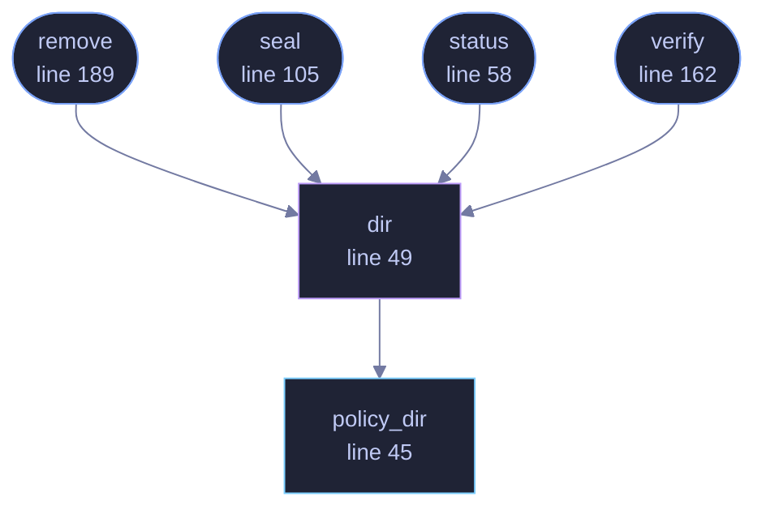

<!-- GENERATED by tools/docs/generate.py from the doc comments in the source. Do not edit: edit the .rs file and run the generator. -->


# `crates/veilvoice-cli/src/policy.rs`

[[veilvoice-cli|Crate-veilvoice-cli]] &middot; 243 lines &middot; [read the source](https://github.com/tilas01/veilvoice/blob/main/crates/veilvoice-cli/src/policy.rs)

## Contents

- [Where the policy lives](#where-the-policy-lives)
- [Why remove needs no passphrase](#why-remove-needs-no-passphrase)
- [In plain words](#in-plain-words)
  - [What calls what](#what-calls-what)
  - [Items](#items)

`veilvoice policy` -- settings that can only be tightened.

The command-line front end to `veilvoice_policy`. That crate holds the
logic and the honest account of what a sealed policy is worth; this file
decides where the two files live and prints them.

# Where the policy lives

```text
<config>/veilvoice/policy/policy.txt     read at every launch, no passphrase
<config>/veilvoice/policy/policy.sealed  the same policy under a passphrase
```

Per-user, beside everything else this program keeps. **Not** a machine-wide
location: writing to one would need administrator rights, and a policy this
program applies to itself does not become enforcement by living somewhere
only root can write. What it would become is a thing that looks like
enforcement, which is worse than the honest version.

# Why `remove` needs no passphrase

Because it could not meaningfully require one. Anybody who can run this
command can delete the two files with the file manager, and a program that
pretends otherwise is teaching its user something false. `--yes` is there so
it is not done by accident, and the message says plainly what the
passphrase is and is not for.

# In plain words

The command line for settings that can only be tightened.

It shows what is currently required, and what a job would actually run with
once those requirements are applied, so a value shown is a value used.

## What this file contains

243 lines defining **6 functions** (5 public), **0 types** and **0 constants**. Everything below is read out of the source, so it cannot disagree with the code.

**What happens when it runs.** These are the ways in: public, and nothing else in this file calls them, so they are what an outside caller reaches first.

- `status` (line 58) -- What is in force, and what is known about the seal.
  - reaches: `dir`, `policy_dir`
- `seal` (line 105) -- Write a policy and seal it.
  - reaches: `dir`, `policy_dir`
- `verify` (line 162) -- Check the plain policy against its sealed copy.
  - reaches: `dir`, `policy_dir`
- `remove` (line 189) -- Delete both files.
  - reaches: `dir`, `policy_dir`

## What calls what

_Colour key: **entry** -- a way in: public, and nothing in this file calls it; **api** -- public, and also used inside this file; **helper** -- private to this file._

<p align="center">
  
</p>

<details>
<summary>The same graph as Mermaid source</summary>



</details>

## Items

| Item | Line | Documentation |
|---|---:|---|
| `policy_dir` <sub>pub fn</sub> | [45](https://github.com/tilas01/veilvoice/blob/main/crates/veilvoice-cli/src/policy.rs#L45) | Where the policy files live. |
| `dir` <sub>fn</sub> | [49](https://github.com/tilas01/veilvoice/blob/main/crates/veilvoice-cli/src/policy.rs#L49) |  |
| `status` <sub>pub fn</sub> | [58](https://github.com/tilas01/veilvoice/blob/main/crates/veilvoice-cli/src/policy.rs#L58) | What is in force, and what is known about the seal. |
| `seal` <sub>pub fn</sub> | [105](https://github.com/tilas01/veilvoice/blob/main/crates/veilvoice-cli/src/policy.rs#L105) | Write a policy and seal it. |
| `verify` <sub>pub fn</sub> | [162](https://github.com/tilas01/veilvoice/blob/main/crates/veilvoice-cli/src/policy.rs#L162) | Check the plain policy against its sealed copy. |
| `remove` <sub>pub fn</sub> | [189](https://github.com/tilas01/veilvoice/blob/main/crates/veilvoice-cli/src/policy.rs#L189) | Delete both files. |
