<!-- GENERATED by tools/docs/generate.py from the doc comments in the source. Do not edit: edit the .rs file and run the generator. -->

# `crates/veilvoice-cli/src/priv_mode.rs`

[[veilvoice-cli|Crate-veilvoice-cli]] &middot; 46 lines &middot; [read the source](https://github.com/tilas01/veilvoice/blob/main/crates/veilvoice-cli/src/priv_mode.rs)

## Contents

- [In plain words](#in-plain-words)
  - [What calls what](#what-calls-what)
  - [Items](#items)

`veilvoice privilege` — what VeilVoice is running with, and what it can see.

# In plain words

Most of VeilVoice needs no special permissions. The parts that watch your
machine see more when it is run as an administrator, and this says which of
those you are getting. It will not raise its own privileges for you — it
prints the command and you decide.

## What this file contains

46 lines defining **1 function** (1 public), **0 types** and **0 constants**. Everything below is read out of the source, so it cannot disagree with the code.

**What happens when it runs.** These are the ways in: public, and nothing else in this file calls them, so they are what an outside caller reaches first.

- `show` (line 14) -- Report the privilege level and what it means.

## What calls what

_Colour key: **entry** -- a way in: public, and nothing in this file calls it._

  

The same graph as Mermaid source

```mermaid
%%{init: {"theme":"base","themeVariables":{"background":"#1a1b26","primaryColor":"#1f2335","primaryTextColor":"#c0caf5","primaryBorderColor":"#7aa2f7","secondaryColor":"#16161e","tertiaryColor":"#16161e","lineColor":"#737aa2","textColor":"#c0caf5","mainBkg":"#1f2335","nodeBorder":"#7aa2f7","clusterBkg":"#16161e","clusterBorder":"#2f3549","fontFamily":"ui-monospace, SFMono-Regular, Consolas, monospace","fontSize":"14px"}}}%%
flowchart TD
    n_show(["show<br/>line 14"])
    click n_show href "https://github.com/tilas01/veilvoice/blob/main/crates/veilvoice-cli/src/priv_mode.rs#L14" "open the source"
    classDef entry fill:#1f2335,stroke:#7aa2f7,color:#c0caf5
    class n_show entry
```

## Items

| Item | Line | Documentation |
|---|---:|---|
| `show` pub fn | [14](https://github.com/tilas01/veilvoice/blob/main/crates/veilvoice-cli/src/priv_mode.rs#L14) | Report the privilege level and what it means. |
