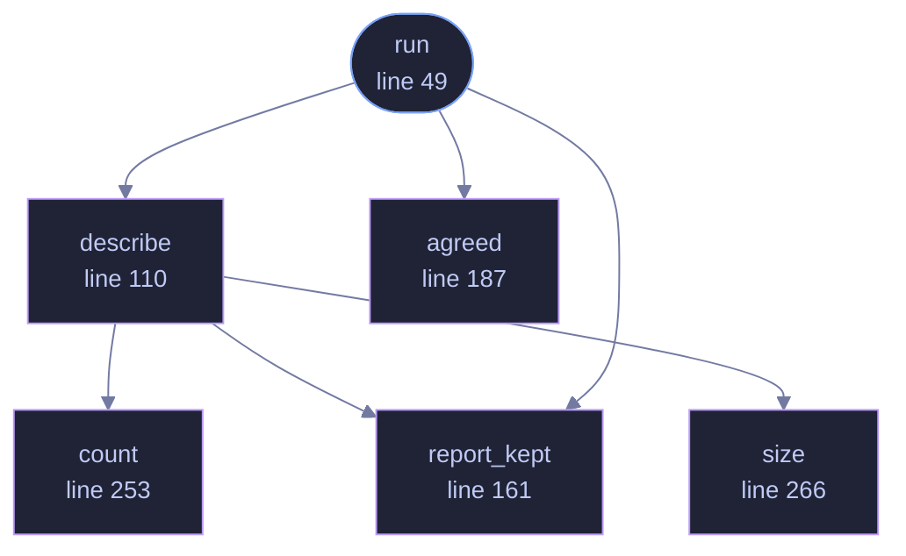

<!-- GENERATED by tools/docs/generate.py from the doc comments in the source. Do not edit: edit the .rs file and run the generator. -->

# `crates/veilvoice-cli/src/reset.rs`

[[veilvoice-cli|Crate-veilvoice-cli]] &middot; 405 lines &middot; [read the source](https://github.com/tilas01/veilvoice/blob/main/crates/veilvoice-cli/src/reset.rs)

## Contents

- [Why it is here as well as in the window](#why-it-is-here-as-well-as-in-the-window)
- [Nothing is removed until it has been read](#nothing-is-removed-until-it-has-been-read)
- [In plain words](#in-plain-words)
  - [What calls what](#what-calls-what)
  - [Items](#items)

`veilvoice reset`: putting this machine back to a new install.

# Why it is here as well as in the window

A policy or a mandate set from the command line has to be removable from the
command line. Somebody who fixed a machine with `veilvoice policy` should not
have to open a window to undo it, and a machine that has no display -- a
server, a container, somebody's headless box -- has no window to open.

The deciding and the removing are `veilvoice_crypto::reset`'s, so this and
the window remove the same things, in the same order, and describe them in
the same words. This module is the part that prints, asks and counts.

# Nothing is removed until it has been read

The plan is printed first, every time, with a line per thing and the size of
it. Then:

- `--dry-run` prints and stops. The default for somebody who wants to look.
- `--yes` is enough where nothing in the plan is irreplaceable.
- Where something is, the word `RESET` has to be typed, exactly as
`veilvoice shred` asks for `DESTROY`. `--yes` is deliberately not accepted
in its place: a flag is what somebody leaves in a script and forgets, and
this is the one command where forgetting costs recordings.
- `--confirm RESET` is that typed word, for a machine with nothing to type
into. A server being rebuilt has no terminal and still has to be
resettable. It is a separate flag carrying the word itself rather than a
second meaning for `--yes`, so it cannot be arrived at by copying the
flags off another command.

# In plain words

Puts VeilVoice back to how it was the day you installed it. It shows you
what it is about to remove before it removes anything, and `--keep-keys`
leaves your password and the key to your recordings alone.

## What this file contains

405 lines defining **6 functions** (1 public), **0 types** and **1 constant**. Everything below is read out of the source, so it cannot disagree with the code.

**What happens when it runs.** These are the ways in: public, and nothing else in this file calls them, so they are what an outside caller reaches first.

- `run` (line 49) -- Run the reset.
  - reaches: `agreed`, `describe`, `report_kept`, `count`, `size`

## What calls what

_Colour key: **entry** -- a way in: public, and nothing in this file calls it; **helper** -- private to this file._

  

The same graph as Mermaid source

## Items

| Item | Line | Documentation |
|---|---:|---|
| `TYPED` pub const | [46](https://github.com/tilas01/veilvoice/blob/main/crates/veilvoice-cli/src/reset.rs#L46) | The word somebody types where the plan cannot be undone. |
| `run` pub fn | [49](https://github.com/tilas01/veilvoice/blob/main/crates/veilvoice-cli/src/reset.rs#L49) | Run the reset. |
| `describe` fn | [110](https://github.com/tilas01/veilvoice/blob/main/crates/veilvoice-cli/src/reset.rs#L110) | Print the plan: a line per thing, and what it adds up to. |
| `report_kept` fn | [161](https://github.com/tilas01/veilvoice/blob/main/crates/veilvoice-cli/src/reset.rs#L161) | Print what stays, when anything does. |
| `agreed` fn | [187](https://github.com/tilas01/veilvoice/blob/main/crates/veilvoice-cli/src/reset.rs#L187) | Whether to go ahead: a flag where that is enough, a typed word where it is not. |
| `count` fn | [253](https://github.com/tilas01/veilvoice/blob/main/crates/veilvoice-cli/src/reset.rs#L253) | "one file" or "nine files". |
| `size` fn | [266](https://github.com/tilas01/veilvoice/blob/main/crates/veilvoice-cli/src/reset.rs#L266) | A size somebody can judge at a glance. |
