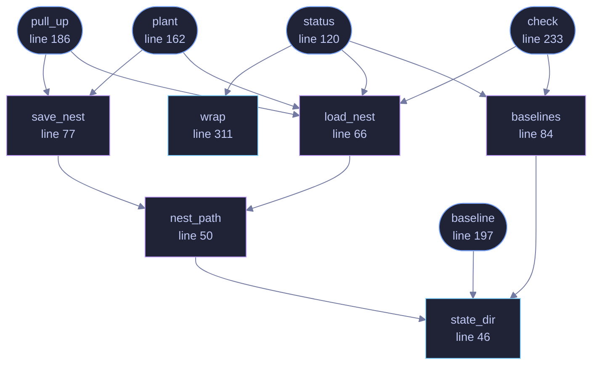

<!-- GENERATED by tools/docs/generate.py from the doc comments in the source. Do not edit: edit the .rs file and run the generator. -->


# `crates/veilvoice-cli/src/sentry.rs`

[[veilvoice-cli|Crate-veilvoice-cli]] &middot; 376 lines &middot; [read the source](https://github.com/tilas01/veilvoice/blob/main/crates/veilvoice-cli/src/sentry.rs)

## Contents

- [Where the state lives](#where-the-state-lives)
- [The exit code answers one question and not the other](#the-exit-code-answers-one-question-and-not-the-other)
- [This detects, and stops nothing](#this-detects-and-stops-nothing)
  - [What calls what](#what-calls-what)
  - [Items](#items)

`veilvoice sentry` -- canaries, baselines, and what changed since.

The command-line front end to `veilvoice_sentry`. All of the logic is in
that crate; this file decides where the state lives, prints it, and chooses
an exit code.

# Where the state lives

Beside the app lock, under the platform's usual per-user configuration
directory:

```text
<config>/veilvoice/sentry/nest.txt      the planted canaries
<config>/veilvoice/sentry/<16 hex>.txt  one baseline per watched directory
```

Baselines are named from a digest of the directory they describe, so two
directories cannot silently overwrite each other's baseline and the state
directory's listing does not say what somebody is watching. Each file
records its own root, so `check` reads them rather than needing an index.

# The exit code answers one question and not the other

`veilvoice sentry check` exits non-zero when **a canary tripped**, because
that is a fact: a file nothing uses was changed, moved or removed. It exits
zero for churn at any level, however high, because churn is a question --
a backup restore produces the same numbers as anything else, and a command
that fails a scheduled task every time somebody copies a folder is a
command somebody removes from the scheduled task.

# This detects, and stops nothing

`veilvoice_sentry::SCOPE` is printed by `status` rather than paraphrased
here, so there is one wording and the tests guard it.

## What this file contains

376 lines defining **11 functions** (7 public), **0 types** and **0 constants**. Everything below is read out of the source, so it cannot disagree with the code.

**What happens when it runs.** These are the ways in: public, and nothing else in this file calls them, so they are what an outside caller reaches first.

- `status` (line 120) -- What is planted, what is watched, and what this is worth.
  - reaches: `baselines`, `load_nest`, `wrap`, `state_dir`, `nest_path`
- `plant` (line 162) -- Put a canary in dir.
  - reaches: `load_nest`, `save_nest`, `nest_path`, `state_dir`
- `pull_up` (line 186) -- Stop watching a canary, and delete it.
  - reaches: `load_nest`, `save_nest`, `nest_path`, `state_dir`
- `baseline` (line 197) -- Record what dir holds now, as the thing to compare against later.
  - reaches: `state_dir`
- `check` (line 233) -- Look at every canary and every baseline.
  - reaches: `baselines`, `load_nest`, `state_dir`, `nest_path`

## What calls what

_Colour key: **entry** -- a way in: public, and nothing in this file calls it; **api** -- public, and also used inside this file; **helper** -- private to this file._



## Items

| Item | Line | Documentation |
|---|---:|---|
| `state_dir` <sub>pub fn</sub> | [46](https://github.com/tilas01/veilvoice/blob/main/crates/veilvoice-cli/src/sentry.rs#L46) | Where the canaries and baselines are kept. |
| `nest_path` <sub>fn</sub> | [50](https://github.com/tilas01/veilvoice/blob/main/crates/veilvoice-cli/src/sentry.rs#L50) |  |
| `load_nest` <sub>fn</sub> | [66](https://github.com/tilas01/veilvoice/blob/main/crates/veilvoice-cli/src/sentry.rs#L66) | Read the nest, treating "no file yet" as "nothing planted". |
| `save_nest` <sub>fn</sub> | [77](https://github.com/tilas01/veilvoice/blob/main/crates/veilvoice-cli/src/sentry.rs#L77) |  |
| `baselines` <sub>fn</sub> | [84](https://github.com/tilas01/veilvoice/blob/main/crates/veilvoice-cli/src/sentry.rs#L84) | Every saved baseline, with the path it came from. |
| `status` <sub>pub fn</sub> | [120](https://github.com/tilas01/veilvoice/blob/main/crates/veilvoice-cli/src/sentry.rs#L120) | What is planted, what is watched, and what this is worth. |
| `plant` <sub>pub fn</sub> | [162](https://github.com/tilas01/veilvoice/blob/main/crates/veilvoice-cli/src/sentry.rs#L162) | Put a canary in dir. |
| `pull_up` <sub>pub fn</sub> | [186](https://github.com/tilas01/veilvoice/blob/main/crates/veilvoice-cli/src/sentry.rs#L186) | Stop watching a canary, and delete it. |
| `baseline` <sub>pub fn</sub> | [197](https://github.com/tilas01/veilvoice/blob/main/crates/veilvoice-cli/src/sentry.rs#L197) | Record what dir holds now, as the thing to compare against later. |
| `check` <sub>pub fn</sub> | [233](https://github.com/tilas01/veilvoice/blob/main/crates/veilvoice-cli/src/sentry.rs#L233) | Look at every canary and every baseline. |
| `wrap` <sub>pub fn</sub> | [311](https://github.com/tilas01/veilvoice/blob/main/crates/veilvoice-cli/src/sentry.rs#L311) | Wrap text to width columns on spaces, for the scope note. |
