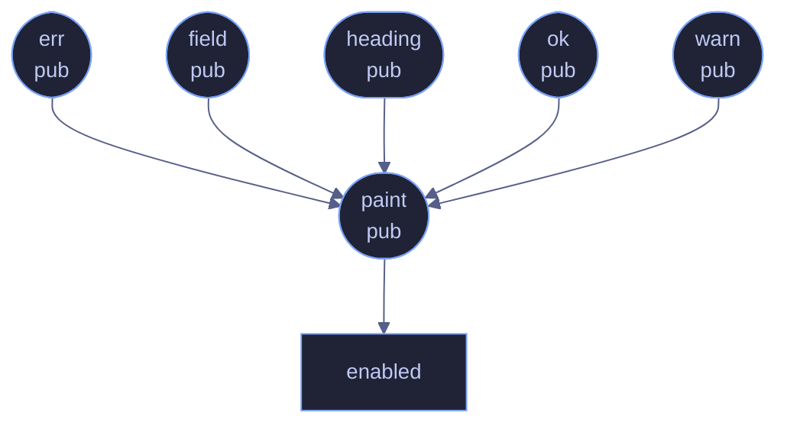

# `crates/veilvoice-cli/src/theme.rs`

[[veilvoice-cli|Crate-veilvoice-cli]] &middot; 135 lines &middot; [read the source](https://github.com/tilas01/veilvoice/blob/main/crates/veilvoice-cli/src/theme.rs)

## Contents

- [Why a command-line tool has a palette at all](#why-a-command-line-tool-has-a-palette-at-all)
- [Colour is suppressed rather than assumed](#colour-is-suppressed-rather-than-assumed)
  - [What calls what](#what-calls-what)
  - [Items](#items)

Tokyo Night colouring for the terminal.

The same palette the GUI uses, so the two halves of VeilVoice look like one
program. Colour is suppressed when the output is not a terminal, when
`NO_COLOR` is set (the widely-honoured convention), or when `TERM=dumb`, so
piping to a file or a log never produces escape-code soup.

# Why a command-line tool has a palette at all

Because the two front-ends are one program. Somebody who uses the desktop
application and then runs the binary over SSH should recognise what they are
looking at, and the colours carry meaning consistently in both: green for a
result, amber for a caveat, red for a refusal, muted for the scope notes
that qualify a claim.

# Colour is suppressed rather than assumed

Three independent conditions turn it off, and all three are checked:
output that is not a terminal, `NO_COLOR` set to anything at all (the
widely-honoured convention), and `TERM=dumb`. The check runs once through a
`std::sync::OnceLock` rather than per call, because this is used inside
loops that print a line per file.

Escape sequences in a log file are worse than no colour: they survive into
bug reports, pasted output and issue trackers, where they are noise that
obscures the message somebody was trying to show you.

## What calls what

## Items

| Item | Line | Documentation |
|---|---:|---|
| `colour` pub mod | [40](https://github.com/tilas01/veilvoice/blob/main/crates/veilvoice-cli/src/theme.rs#L40) | Tokyo Night, as 24-bit foreground escape sequences. |
| `enabled` fn | [59](https://github.com/tilas01/veilvoice/blob/main/crates/veilvoice-cli/src/theme.rs#L59) |  |
| `paint` pub fn | [73](https://github.com/tilas01/veilvoice/blob/main/crates/veilvoice-cli/src/theme.rs#L73) | Wrap text in colour, or return it unchanged when colour is off. |
| `ok` pub fn | [82](https://github.com/tilas01/veilvoice/blob/main/crates/veilvoice-cli/src/theme.rs#L82) | A success line. |
| `warn` pub fn | [87](https://github.com/tilas01/veilvoice/blob/main/crates/veilvoice-cli/src/theme.rs#L87) | A warning line. |
| `err` pub fn | [92](https://github.com/tilas01/veilvoice/blob/main/crates/veilvoice-cli/src/theme.rs#L92) | An error line. |
| `heading` pub fn | [97](https://github.com/tilas01/veilvoice/blob/main/crates/veilvoice-cli/src/theme.rs#L97) | A section heading. |
| `field` pub fn | [102](https://github.com/tilas01/veilvoice/blob/main/crates/veilvoice-cli/src/theme.rs#L102) | A label: value line with the value highlighted. |
