<!-- GENERATED by tools/docs/generate.py from the doc comments in the source. Do not edit: edit the .rs file and run the generator. -->

# `crates/veilvoice-conversation/src/edit.rs`

[[veilvoice-conversation|Crate-veilvoice-conversation]] &middot; 657 lines &middot; [read the source](https://github.com/tilas01/veilvoice/blob/main/crates/veilvoice-conversation/src/edit.rs)

## Contents

- [Why a plan needs correcting at all](#why-a-plan-needs-correcting-at-all)
- [What can be corrected](#what-can-be-corrected)
- [Nothing half-applies](#nothing-half-applies)
- [In plain words](#in-plain-words)
  - [What calls what](#what-calls-what)
  - [Items](#items)

Correcting a plan: who is speaking when, what they are called, and in what
colour.

# Why a plan needs correcting at all

A plan says which speaker each span of a recording belongs to, and something
had to decide that. Splitting a multi-track recording by channel is exact.
Everything else is a guess: a person listening and typing timestamps
mis-hears, a plan written from a meeting tool's own speaker labels inherits
that tool's mistakes, and two people talking over each other defeat both.

A wrong span is the one mistake in this program that **cannot be heard in
the result**. Both voices are unfamiliar by construction, so a listener has
nothing to compare against: thirty seconds of Ada rendered in Grace's voice
sounds exactly like Grace talking. Nobody notices, which is why the
correction has to happen before the render and why it has to be easy.

# What can be corrected

Every operation here works on a plan somebody already has, and none of them
touches the audio:

1. **Reassign** a span to a different speaker, by index or by naming a
moment inside it. This is the wrong-voice fix.
2. **Split** a span at a moment, for when one span turns out to hold two
people, which is what a missed hand-over looks like.
3. **Merge** two neighbouring spans belonging to the same speaker, for when
a split was wrong or a detector chopped one sentence into three.
4. **Move** a span's edges, for a hand-over caught a second late.
5. **Rename** a speaker, and give them **a colour**.

# Nothing half-applies

Every operation checks everything before it changes anything, so a refusal
leaves the plan exactly as it was. A half-applied edit to a plan is worse
than a refused one: it is a plan that looks fine and renders somebody in the
wrong voice, which is the failure this whole module exists to prevent.

# In plain words

Fixing a plan before you render it.

If a stretch of the recording has been given to the wrong person, this is
how you move it. You can also cut one stretch in two where the hand-over was
missed, join two back together, nudge where one starts or ends, and change
what somebody is called and what colour they are.

This matters more than it sounds. If the wrong person is on a stretch of
audio, the finished recording will not sound wrong to anybody, because every
voice in it is a voice nobody has heard before. There is nothing to notice.
So it has to be right before you render, and that means it has to be easy to
correct.

## What this file contains

657 lines defining **12 functions** (11 public), **0 types** and **0 constants**. Everything below is read out of the source, so it cannot disagree with the code.

**What happens when it runs.** These are the ways in: public, and nothing else in this file calls them, so they are what an outside caller reaches first.

- `check_colour` (line 63) -- A colour a speaker can be given, as #rrggbb.
- `Conversation::turns_at` (line 88) -- Every span covering secs, earliest first.
- `Conversation::reassign_at` (line 120) -- Give the span covering secs to a different speaker.
  - reaches: `nearest_hint`, `reassign`, `turn_at`
- `Conversation::split_at` (line 143) -- Cut the span covering secs in two at that moment.
  - reaches: `nearest_hint`, `turn_at`
- `Conversation::merge` (line 190) -- Join two spans of the same speaker into one.
  - reaches: `turn_at`
- `Conversation::move_edges` (line 254) -- Move a span's edges, keeping its speaker and its text.
- `Conversation::set_name` (line 281) -- Rename one speaker.
- `Conversation::set_colour` (line 309) -- Give a speaker a colour, or take it away again.
- `speaker_with_colour` (line 346) -- A speaker with a colour, for building one in a front end.

## What calls what

_Colour key: **entry** -- a way in: public, and nothing in this file calls it; **api** -- public, and also used inside this file; **helper** -- private to this file._

  

The same graph as Mermaid source

```mermaid
%%{init: {"theme":"base","themeVariables":{"background":"#1a1b26","primaryColor":"#1f2335","primaryTextColor":"#c0caf5","primaryBorderColor":"#7aa2f7","secondaryColor":"#16161e","tertiaryColor":"#16161e","lineColor":"#737aa2","textColor":"#c0caf5","mainBkg":"#1f2335","nodeBorder":"#7aa2f7","clusterBkg":"#16161e","clusterBorder":"#2f3549","fontFamily":"ui-monospace, SFMono-Regular, Consolas, monospace","fontSize":"14px"}}}%%
flowchart TD
    n_check_colour(["check_colour<br/>line 63"])
    n_turn_at["Conversation::turn_at<br/>line 81"]
    n_turns_at(["Conversation::turns_at<br/>line 88"])
    n_reassign["Conversation::reassign<br/>line 101"]
    n_reassign_at(["Conversation::reassign_at<br/>line 120"])
    n_split_at(["Conversation::split_at<br/>line 143"])
    n_merge(["Conversation::merge<br/>line 190"])
    n_move_edges(["Conversation::move_edges<br/>line 254"])
    n_set_name(["Conversation::set_name<br/>line 281"])
    n_set_colour(["Conversation::set_colour<br/>line 309"])
    n_nearest_hint["Conversation::nearest_hint<br/>line 327"]
    n_speaker_with_colour(["speaker_with_colour<br/>line 346"])
    n_merge --> n_turn_at
    n_reassign_at --> n_nearest_hint
    n_reassign_at --> n_reassign
    n_reassign_at --> n_turn_at
    n_split_at --> n_nearest_hint
    n_split_at --> n_turn_at
    click n_check_colour href "https://github.com/tilas01/veilvoice/blob/main/crates/veilvoice-conversation/src/edit.rs#L63" "open the source"
    click n_turn_at href "https://github.com/tilas01/veilvoice/blob/main/crates/veilvoice-conversation/src/edit.rs#L81" "open the source"
    click n_turns_at href "https://github.com/tilas01/veilvoice/blob/main/crates/veilvoice-conversation/src/edit.rs#L88" "open the source"
    click n_reassign href "https://github.com/tilas01/veilvoice/blob/main/crates/veilvoice-conversation/src/edit.rs#L101" "open the source"
    click n_reassign_at href "https://github.com/tilas01/veilvoice/blob/main/crates/veilvoice-conversation/src/edit.rs#L120" "open the source"
    click n_split_at href "https://github.com/tilas01/veilvoice/blob/main/crates/veilvoice-conversation/src/edit.rs#L143" "open the source"
    click n_merge href "https://github.com/tilas01/veilvoice/blob/main/crates/veilvoice-conversation/src/edit.rs#L190" "open the source"
    click n_move_edges href "https://github.com/tilas01/veilvoice/blob/main/crates/veilvoice-conversation/src/edit.rs#L254" "open the source"
    click n_set_name href "https://github.com/tilas01/veilvoice/blob/main/crates/veilvoice-conversation/src/edit.rs#L281" "open the source"
    click n_set_colour href "https://github.com/tilas01/veilvoice/blob/main/crates/veilvoice-conversation/src/edit.rs#L309" "open the source"
    click n_nearest_hint href "https://github.com/tilas01/veilvoice/blob/main/crates/veilvoice-conversation/src/edit.rs#L327" "open the source"
    click n_speaker_with_colour href "https://github.com/tilas01/veilvoice/blob/main/crates/veilvoice-conversation/src/edit.rs#L346" "open the source"
    classDef entry fill:#1f2335,stroke:#7aa2f7,color:#c0caf5
    class n_check_colour,n_turns_at,n_reassign_at,n_split_at,n_merge,n_move_edges,n_set_name,n_set_colour,n_speaker_with_colour entry
    classDef api fill:#1f2335,stroke:#7dcfff,color:#c0caf5
    class n_turn_at,n_reassign api
    classDef helper fill:#1f2335,stroke:#bb9af7,color:#c0caf5
    class n_nearest_hint helper
```

## Items

| Item | Line | Documentation |
|---|---:|---|
| `check_colour` pub fn | [63](https://github.com/tilas01/veilvoice/blob/main/crates/veilvoice-conversation/src/edit.rs#L63) | A colour a speaker can be given, as #rrggbb. |
| `Conversation::turn_at` pub fn | [81](https://github.com/tilas01/veilvoice/blob/main/crates/veilvoice-conversation/src/edit.rs#L81) | Which span covers secs, if any. |
| `Conversation::turns_at` pub fn | [88](https://github.com/tilas01/veilvoice/blob/main/crates/veilvoice-conversation/src/edit.rs#L88) | Every span covering secs, earliest first. |
| `Conversation::reassign` pub fn | [101](https://github.com/tilas01/veilvoice/blob/main/crates/veilvoice-conversation/src/edit.rs#L101) | Give a span to a different speaker. |
| `Conversation::reassign_at` pub fn | [120](https://github.com/tilas01/veilvoice/blob/main/crates/veilvoice-conversation/src/edit.rs#L120) | Give the span covering secs to a different speaker. |
| `Conversation::split_at` pub fn | [143](https://github.com/tilas01/veilvoice/blob/main/crates/veilvoice-conversation/src/edit.rs#L143) | Cut the span covering secs in two at that moment. |
| `Conversation::merge` pub fn | [190](https://github.com/tilas01/veilvoice/blob/main/crates/veilvoice-conversation/src/edit.rs#L190) | Join two spans of the same speaker into one. |
| `Conversation::move_edges` pub fn | [254](https://github.com/tilas01/veilvoice/blob/main/crates/veilvoice-conversation/src/edit.rs#L254) | Move a span's edges, keeping its speaker and its text. |
| `Conversation::set_name` pub fn | [281](https://github.com/tilas01/veilvoice/blob/main/crates/veilvoice-conversation/src/edit.rs#L281) | Rename one speaker. |
| `Conversation::set_colour` pub fn | [309](https://github.com/tilas01/veilvoice/blob/main/crates/veilvoice-conversation/src/edit.rs#L309) | Give a speaker a colour, or take it away again. |
| `Conversation::nearest_hint` fn | [327](https://github.com/tilas01/veilvoice/blob/main/crates/veilvoice-conversation/src/edit.rs#L327) | Where to look, for a timestamp that landed in no span. |
| `speaker_with_colour` pub fn | [346](https://github.com/tilas01/veilvoice/blob/main/crates/veilvoice-conversation/src/edit.rs#L346) | A speaker with a colour, for building one in a front end. |
