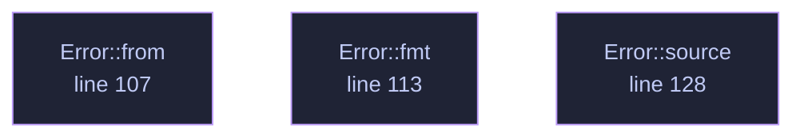

<!-- GENERATED by tools/docs/generate.py from the doc comments in the source. Do not edit: edit the .rs file and run the generator. -->

# `crates/veilvoice-conversation/src/lib.rs`

[[veilvoice-conversation|Crate-veilvoice-conversation]] &middot; 178 lines &middot; [read the source](https://github.com/tilas01/veilvoice/blob/main/crates/veilvoice-conversation/src/lib.rs)

## Contents

  - [Why this exists](#why-this-exists)
  - [What a conversation costs, said plainly](#what-a-conversation-costs-said-plainly)
  - [VeilVoice does not decide who is talking](#veilvoice-does-not-decide-who-is-talking)
  - [The modules](#the-modules)
- [In plain words](#in-plain-words)
  - [What calls what](#what-calls-what)
  - [Items](#items)

Several people in one recording: a plan of who spoke when, a distinct
destination voice for each of them, and subtitles that carry their names.

## Why this exists

VeilVoice's whole argument is that every speaker is mapped onto **one**
canonical voice, so many inputs give one output and there is no inverse to
compute. Run an interview through it and both people come out as the same
voice — which is perfectly private and completely unusable, because a
listener cannot tell a question from its answer.

This crate keeps the property and fixes the usability. Each speaker is
assigned a **slot**, each slot has its own canonical destination
(`veilvoice_core::voices`), and every speaker in a slot is normalised onto
that destination exactly as thoroughly as a lone speaker is normalised onto
the default one. There are ten buckets instead of one; each is still
many-to-one.

## What a conversation costs, said plainly

* **The number of speakers survives.** Three voices in the output means
three people were in the room.
* **The turn-taking survives.** Who spoke when, for how long, who
interrupted whom, the rhythm of the exchange. That is preserved on
purpose — it is what makes the result worth listening to — and it is
information about the conversation.
* **Names are whatever you type.** A subtitle saying "Alex" contains the
string "Alex". The audio is veiled; a caption is not, and this crate
cannot veil a name for you.
* **The voiceprints do not survive.** Each speaker is destroyed as
thoroughly as in single-speaker mode.

## VeilVoice does not decide who is talking

Working that out from audio alone is speaker diarisation and needs a trained
model. There is no model here, there is no server to ask, and guessing would
be worse than not offering it: a wrong guess either merges two people or
invents a third, and neither would be visible in the output. So the plan
comes from the user — a channel per person, or a list of turns. See
`plan`.

## The modules

| Module | What it owns |
|---|---|
| `plan` | Who is in the recording, when they speak, and the text format |
| `render` | One engine per speaker, spliced back onto the timeline |
| `subtitles` | WebVTT and SubRip, from the same plan |

# In plain words

This is for a recording with more than one person in it.

Given a note of who speaks when, it gives each person a different voice --
every one of them just as thoroughly disguised as a single speaker would be --
and writes subtitles saying who said what.

It will not guess who is talking. Working that out needs a trained model, and
this project ships none, so it is told: either one microphone per person, or a
list of turns. Any part of the recording nobody claims is silenced rather than
passed through, because audio nobody claimed has not been disguised.

## What this file contains

178 lines defining **3 functions** (0 public), **1 type** and **2 constants**. Everything below is read out of the source, so it cannot disagree with the code.

**The types it owns.**

- `enum Error` (line 93) -- Everything that can go wrong in this crate.

## What calls what

_Colour key: **helper** -- private to this file._

  

The same graph as Mermaid source

## Items

| Item | Line | Documentation |
|---|---:|---|
| `VERSION` pub const | [75](https://github.com/tilas01/veilvoice/blob/main/crates/veilvoice-conversation/src/lib.rs#L75) | Crate version string, surfaced in the About panel. |
| `SCOPE` pub const | [81](https://github.com/tilas01/veilvoice/blob/main/crates/veilvoice-conversation/src/lib.rs#L81) | What this crate does to a recording, in the words a front end should show. |
| `Error` pub enum | [93](https://github.com/tilas01/veilvoice/blob/main/crates/veilvoice-conversation/src/lib.rs#L93) | Everything that can go wrong in this crate. |
| `Error::from` fn | [107](https://github.com/tilas01/veilvoice/blob/main/crates/veilvoice-conversation/src/lib.rs#L107) |  |
| `Error::fmt` fn | [113](https://github.com/tilas01/veilvoice/blob/main/crates/veilvoice-conversation/src/lib.rs#L113) |  |
| `Error::source` fn | [128](https://github.com/tilas01/veilvoice/blob/main/crates/veilvoice-conversation/src/lib.rs#L128) |  |
