<!-- GENERATED by tools/docs/generate.py from the doc comments in the source. Do not edit: edit the .rs file and run the generator. -->

# `crates/veilvoice-conversation/src/mode.rs`

[[veilvoice-conversation|Crate-veilvoice-conversation]] &middot; 271 lines &middot; [read the source](https://github.com/tilas01/veilvoice/blob/main/crates/veilvoice-conversation/src/mode.rs)

## Contents

- [The limit is measured, not chosen](#the-limit-is-measured-not-chosen)
- [Two ways to be told apart, and the second one is safer](#two-ways-to-be-told-apart-and-the-second-one-is-safer)
  - [What calls what](#what-calls-what)
  - [Items](#items)

How many voices a group gets, and the trade between the two answers.

# The limit is measured, not chosen

The engine holds ten destination voices and all ten are different. Only
**eight** are far enough apart that somebody following a conversation can
tell which is which: adding the ninth brings the closest pair to 1.1842 --
two voices with exactly the same rendered pitch and vocal tracts 18 % apart
-- and that is under the three-semitone floor a listener needs when the two
voices are half a minute apart rather than side by side.

`veilvoice_core::voices::clear_voices` computes it from the configuration
in force, because a coarser frame grid collapses registers onto each other
and eight stops being true.

# Two ways to be told apart, and the second one is safer

`VoiceMode::Distinct` gives each speaker their own voice. It is the
obvious arrangement and it is what most recordings want, and it is capped at
the measured limit, because handing two people voices nobody can separate
produces a recording in which two speakers sound like one — discovered only
after the recording exists.

`VoiceMode::Uniform` gives **everybody the same voice**, and the speakers
are told apart by their names in the subtitles and by which circle lights up
in the picture. That has two consequences worth stating plainly, one of each
kind:

* **It is more private.** In distinct mode the output carries one bit of
structure the input had: *this is speaker three*. Anybody who obtains two
recordings of the same group can align them by voice slot. Uniform mode
does not have that structure to leak — every speaker is the same voice, so
there is nothing to align.
* **It is harder to follow by ear alone.** A listener with no subtitles and
no picture cannot tell who is speaking. That is the price, and it is why
this is not the default.

Uniform mode has **no speaker limit** from voices, because there is no
second voice to collide with. The plan's own ten-speaker limit still
applies, because ten names is already a great deal to follow.

## What this file contains

271 lines defining **6 functions** (5 public), **2 types** and **0 constants**. Everything below is read out of the source, so it cannot disagree with the code.

**The types it owns.**

- `enum VoiceMode` (line 48) -- Whether speakers get different voices or one voice between them.
- `enum TooMany` (line 113) -- Why a group cannot be rendered as asked.

**What happens when it runs.** These are the ways in: public, and nothing else in this file calls them, so they are what an outside caller reaches first.

- `VoiceMode::label` (line 59) -- A short name, for a picker.
- `VoiceMode::speaker_limit` (line 71) -- The most speakers this mode can carry under config.
- `VoiceMode::voice_for` (line 84) -- The voice a slot gets in this mode.
- `VoiceMode::note` (line 92) -- What this mode costs and buys, in the words a front end should show.
- `check` (line 153) -- Whether this many speakers can be rendered in this mode.

## What calls what

_Colour key: **entry** -- a way in: public, and nothing in this file calls it; **helper** -- private to this file._

  

The same graph as Mermaid source

```mermaid
%%{init: {"theme":"base","themeVariables":{"background":"#1a1b26","primaryColor":"#1f2335","primaryTextColor":"#c0caf5","primaryBorderColor":"#7aa2f7","secondaryColor":"#16161e","tertiaryColor":"#16161e","lineColor":"#737aa2","textColor":"#c0caf5","mainBkg":"#1f2335","nodeBorder":"#7aa2f7","clusterBkg":"#16161e","clusterBorder":"#2f3549","fontFamily":"ui-monospace, SFMono-Regular, Consolas, monospace","fontSize":"14px"}}}%%
flowchart TD
    n_label(["VoiceMode::label<br/>line 59"])
    n_speaker_limit(["VoiceMode::speaker_limit<br/>line 71"])
    n_voice_for(["VoiceMode::voice_for<br/>line 84"])
    n_note(["VoiceMode::note<br/>line 92"])
    n_fmt["TooMany::fmt<br/>line 131"]
    n_check(["check<br/>line 153"])
    click n_label href "https://github.com/tilas01/veilvoice/blob/main/crates/veilvoice-conversation/src/mode.rs#L59" "open the source"
    click n_speaker_limit href "https://github.com/tilas01/veilvoice/blob/main/crates/veilvoice-conversation/src/mode.rs#L71" "open the source"
    click n_voice_for href "https://github.com/tilas01/veilvoice/blob/main/crates/veilvoice-conversation/src/mode.rs#L84" "open the source"
    click n_note href "https://github.com/tilas01/veilvoice/blob/main/crates/veilvoice-conversation/src/mode.rs#L92" "open the source"
    click n_fmt href "https://github.com/tilas01/veilvoice/blob/main/crates/veilvoice-conversation/src/mode.rs#L131" "open the source"
    click n_check href "https://github.com/tilas01/veilvoice/blob/main/crates/veilvoice-conversation/src/mode.rs#L153" "open the source"
    classDef entry fill:#1f2335,stroke:#7aa2f7,color:#c0caf5
    class n_label,n_speaker_limit,n_voice_for,n_note,n_check entry
    classDef helper fill:#1f2335,stroke:#bb9af7,color:#c0caf5
    class n_fmt helper
```

## Items

| Item | Line | Documentation |
|---|---:|---|
| `VoiceMode` pub enum | [48](https://github.com/tilas01/veilvoice/blob/main/crates/veilvoice-conversation/src/mode.rs#L48) | Whether speakers get different voices or one voice between them. |
| `VoiceMode::label` pub fn | [59](https://github.com/tilas01/veilvoice/blob/main/crates/veilvoice-conversation/src/mode.rs#L59) | A short name, for a picker. |
| `VoiceMode::speaker_limit` pub fn | [71](https://github.com/tilas01/veilvoice/blob/main/crates/veilvoice-conversation/src/mode.rs#L71) | The most speakers this mode can carry under config. |
| `VoiceMode::voice_for` pub fn | [84](https://github.com/tilas01/veilvoice/blob/main/crates/veilvoice-conversation/src/mode.rs#L84) | The voice a slot gets in this mode. |
| `VoiceMode::note` pub fn | [92](https://github.com/tilas01/veilvoice/blob/main/crates/veilvoice-conversation/src/mode.rs#L92) | What this mode costs and buys, in the words a front end should show. |
| `TooMany` pub enum | [113](https://github.com/tilas01/veilvoice/blob/main/crates/veilvoice-conversation/src/mode.rs#L113) | Why a group cannot be rendered as asked. |
| `TooMany::fmt` fn | [131](https://github.com/tilas01/veilvoice/blob/main/crates/veilvoice-conversation/src/mode.rs#L131) |  |
| `check` pub fn | [153](https://github.com/tilas01/veilvoice/blob/main/crates/veilvoice-conversation/src/mode.rs#L153) | Whether this many speakers can be rendered in this mode. |
