<!-- GENERATED by tools/docs/generate.py from the doc comments in the source. Do not edit: edit the .rs file and run the generator. -->

# `crates/veilvoice-conversation/src/render.rs`

[[veilvoice-conversation|Crate-veilvoice-conversation]] &middot; 1111 lines &middot; [read the source](https://github.com/tilas01/veilvoice/blob/main/crates/veilvoice-conversation/src/render.rs)

## Contents

- [One engine each, and why that is not merely convenient](#one-engine-each-and-why-that-is-not-merely-convenient)
- [A speaker needs a few seconds before they arrive at their voice](#a-speaker-needs-a-few-seconds-before-they-arrive-at-their-voice)
- [Audio nobody claimed is silenced, and the amount is reported](#audio-nobody-claimed-is-silenced-and-the-amount-is-reported)
- [Latency is removed, so a turn lands where the plan said](#latency-is-removed-so-a-turn-lands-where-the-plan-said)
- [Boundaries are faded, because a splice is a click](#boundaries-are-faded-because-a-splice-is-a-click)
- [Every speaker renders at the same time](#every-speaker-renders-at-the-same-time)
- [Overlaps are mixed, and the mixing is admitted](#overlaps-are-mixed-and-the-mixing-is-admitted)
- [In plain words](#in-plain-words)
  - [What calls what](#what-calls-what)
  - [Items](#items)

Turning a plan and a recording into veiled audio, one engine per speaker.

# One engine each, and why that is not merely convenient

Every speaker gets their own `veilvoice_core::Deidentifier`, built with
their slot's destination voice and **its own seed**. Three consequences,
and all three are the point:

* Each speaker arrives at their own canonical register and vocal tract, so
the output is followable.
* Each speaker's modulation stream is independent, so the ratchet in one
voice tells an adversary nothing about another.
* Each speaker's engine keeps its state **across their own turns**. The
accent neutraliser needs a few seconds to measure a speaker before its
corrections reach full strength; carrying that across the turns of one
person means it converges once, rather than warming up again every time
they take a breath.

# A speaker needs a few seconds before they arrive at their voice

The accent neutraliser ramps its corrections in over
`veilvoice_core::WARMUP_S` of **voiced** audio, from nothing. Until it has
finished, a speaker is only partly moved toward their destination register --
so a slot that should sound like 187 Hz sounds like something between the
original speaker and 187 Hz.

This was found by measuring the fundamental of a rendered file rather than
by reading the code: ten slots given one second each came out at three
distinct pitches, and the same ten given five seconds each came out at four,
exactly where the table says. Nothing was wrong with the table the second
time; the first measurement was of the ramp.

Keeping one engine per speaker across all of their turns is what makes this
bearable -- the ramp happens **once per speaker for the whole recording**
rather than once per turn. A speaker whose total time is shorter than the
ramp never finishes it, so `Rendered::notes` says so by name.

What is **not** affected: the phase discard and the CSPRNG modulation are
unconditional and full strength from the first frame. Those are the two
reasons the transform is one-way. The ramp weakens the *normalisation onto a
canonical register* early on, which costs distinguishability between
speakers, and leaves some of the original pitch contour in the first couple
of seconds.

# Audio nobody claimed is silenced, and the amount is reported

A gap between turns is a span the plan does not assign to anybody. It is
**silenced**, never passed through.

That is the one decision in this file that is not a trade-off. Passing
unassigned audio through unveiled would put somebody's real voice into a
file whose entire purpose is that it contains no real voice, because of a
gap in a text file, silently, in the middle of an otherwise veiled
recording. Silence loses content and can be seen; a raw voice cannot be
unheard.

`Rendered::unassigned_secs` says how much went, so a plan with a hole in
it is a thing you find out about rather than a thing you notice later.

# Latency is removed, so a turn lands where the plan said

The engine has a fixed algorithmic latency, because the STFT cannot emit a sample
until it has a frame around it. Each span is therefore processed with a tail
of silence and the first `latency_samples` of output are dropped, which puts
the veiled audio back exactly where the original was. Without this every
turn would drift later than the subtitle describing it, by about 16 ms at
the default frame size, and a subtitle 16 ms late is a subtitle that looks
wrong.

# Boundaries are faded, because a splice is a click

Cutting audio at an arbitrary sample and starting different audio there
produces a step, and a step is broadband noise. Each rendered span is faded
in and out over a few milliseconds. Short enough not to swallow a syllable,
long enough to remove the click.

# Every speaker renders at the same time

Speakers are independent by construction, with a separate engine, a separate
seed and a separate destination, so there is nothing to share between them and
nothing to lock. Each one is given a thread and they all run at once, which
on an ordinary machine turns a four-person recording into roughly the work
of one.

`std::thread::scope` rather than a pool or an async runtime. The number of
threads is bounded by `veilvoice_core::MAX_VOICES`, which is ten, so
there is nothing for a pool to schedule; and a scoped thread can borrow the
input slice directly, so nothing is copied to hand it over. It also needs no
dependency, which for this project is not a small consideration: the
`offline` CI job that checks what is in the dependency graph is part of what
the front page is claiming.

Each thread writes into its own buffer and the merge happens afterwards, in
slot order. That is what makes the result **identical to the sequential one,
bit for bit**, because floating-point addition is not associative, so a merge in
completion order would give a different file on every run and the render
would stop being reproducible from its seeds. A test holds it.

# Overlaps are mixed, and the mixing is admitted

Two people talking at once is two engines writing into the same samples, so
their outputs are summed. A sum can exceed full scale; when it does, the
whole output is scaled down by one factor and `Rendered::gain_applied`
records it. One factor for the whole file rather than a limiter that acts
only where it clipped, because a limiter changes the relative loudness of
the speakers and this crate has just spent considerable effort making them
distinguishable.

# In plain words

This takes a recording and a plan of who speaks when, and produces the veiled
version with each person in a different voice.

Each speaker gets their own separate copy of the engine, with its own settings
and its own stream of randomness. That is not just tidiness: it means nothing
carries across from one person to another, so there is nothing shared that
could be used to line two speakers up or work out that they came from the same
recording.

Any moment the plan does not account for comes out silent, rather than being
passed through as it was. A missing line in the plan should cost you a gap, not
somebody's real voice.

## What this file contains

1111 lines defining **16 functions** (9 public), **4 types** and **0 constants**. Everything below is read out of the source, so it cannot disagree with the code.

**The types it owns.**

- `struct Settings` (line 138) -- How to render.
- `struct Progress` (line 178) -- What a render has done so far, readable while it is still running.
- `struct SpeakerProgress` (line 184) -- One speaker's share of a running render.
- `struct Rendered` (line 293) -- What came back.

**What happens when it runs.** These are the ways in: public, and nothing else in this file calls them, so they are what an outside caller reaches first.

- `Progress::for_speakers` (line 198) -- Room for a render of speakers people.
- `Progress::len` (line 205) -- How many speakers this was made for.
- `Progress::is_empty` (line 210) -- Whether it was made for none, which is what a default one is.
- `Progress::levels` (line 220) -- What the most recently finished turn for slot measured: the peak that went in and the peak that came out, both in 0, 1.
- `Progress::done` (line 233) -- How far through this speaker's turns the render is, in 0, 1.
- `Progress::seconds` (line 245) -- How many seconds of this speaker's audio have been rendered.
- `Rendered::has_unassigned` (line 315) -- Whether some of the recording was silenced because no turn claimed it.
- `render` (line 326) -- Render input according to plan.
  - reaches: `render_watched`, `fade_ends`, `peak`, `process_span`, `seconds_to_index`

## What calls what

_Colour key: **entry** -- a way in: public, and nothing in this file calls it; **api** -- public, and also used inside this file; **helper** -- private to this file._

  

The same graph as Mermaid source

```mermaid
%%{init: {"theme":"base","themeVariables":{"background":"#1a1b26","primaryColor":"#1f2335","primaryTextColor":"#c0caf5","primaryBorderColor":"#7aa2f7","secondaryColor":"#16161e","tertiaryColor":"#16161e","lineColor":"#737aa2","textColor":"#c0caf5","mainBkg":"#1f2335","nodeBorder":"#7aa2f7","clusterBkg":"#16161e","clusterBorder":"#2f3549","fontFamily":"ui-monospace, SFMono-Regular, Consolas, monospace","fontSize":"14px"}}}%%
flowchart TD
    n_default["Settings::default<br/>line 150"]
    n_for_speakers(["Progress::for_speakers<br/>line 198"])
    n_len(["Progress::len<br/>line 205"])
    n_is_empty(["Progress::is_empty<br/>line 210"])
    n_levels(["Progress::levels<br/>line 220"])
    n_done(["Progress::done<br/>line 233"])
    n_seconds(["Progress::seconds<br/>line 245"])
    n_expect["Progress::expect<br/>line 253"]
    n_finished["Progress::finished<br/>line 260"]
    n_peak["peak<br/>line 284"]
    n_has_unassigned(["Rendered::has_unassigned<br/>line 315"])
    n_render(["render<br/>line 326"])
    n_render_watched["render_watched<br/>line 344"]
    n_seconds_to_index["seconds_to_index<br/>line 535"]
    n_process_span["process_span<br/>line 552"]
    n_fade_ends["fade_ends<br/>line 567"]
    n_render --> n_render_watched
    n_render_watched --> n_fade_ends
    n_render_watched --> n_peak
    n_render_watched --> n_process_span
    n_render_watched --> n_seconds_to_index
    click n_default href "https://github.com/tilas01/veilvoice/blob/main/crates/veilvoice-conversation/src/render.rs#L150" "open the source"
    click n_for_speakers href "https://github.com/tilas01/veilvoice/blob/main/crates/veilvoice-conversation/src/render.rs#L198" "open the source"
    click n_len href "https://github.com/tilas01/veilvoice/blob/main/crates/veilvoice-conversation/src/render.rs#L205" "open the source"
    click n_is_empty href "https://github.com/tilas01/veilvoice/blob/main/crates/veilvoice-conversation/src/render.rs#L210" "open the source"
    click n_levels href "https://github.com/tilas01/veilvoice/blob/main/crates/veilvoice-conversation/src/render.rs#L220" "open the source"
    click n_done href "https://github.com/tilas01/veilvoice/blob/main/crates/veilvoice-conversation/src/render.rs#L233" "open the source"
    click n_seconds href "https://github.com/tilas01/veilvoice/blob/main/crates/veilvoice-conversation/src/render.rs#L245" "open the source"
    click n_expect href "https://github.com/tilas01/veilvoice/blob/main/crates/veilvoice-conversation/src/render.rs#L253" "open the source"
    click n_finished href "https://github.com/tilas01/veilvoice/blob/main/crates/veilvoice-conversation/src/render.rs#L260" "open the source"
    click n_peak href "https://github.com/tilas01/veilvoice/blob/main/crates/veilvoice-conversation/src/render.rs#L284" "open the source"
    click n_has_unassigned href "https://github.com/tilas01/veilvoice/blob/main/crates/veilvoice-conversation/src/render.rs#L315" "open the source"
    click n_render href "https://github.com/tilas01/veilvoice/blob/main/crates/veilvoice-conversation/src/render.rs#L326" "open the source"
    click n_render_watched href "https://github.com/tilas01/veilvoice/blob/main/crates/veilvoice-conversation/src/render.rs#L344" "open the source"
    click n_seconds_to_index href "https://github.com/tilas01/veilvoice/blob/main/crates/veilvoice-conversation/src/render.rs#L535" "open the source"
    click n_process_span href "https://github.com/tilas01/veilvoice/blob/main/crates/veilvoice-conversation/src/render.rs#L552" "open the source"
    click n_fade_ends href "https://github.com/tilas01/veilvoice/blob/main/crates/veilvoice-conversation/src/render.rs#L567" "open the source"
    classDef entry fill:#1f2335,stroke:#7aa2f7,color:#c0caf5
    class n_for_speakers,n_len,n_is_empty,n_levels,n_done,n_seconds,n_has_unassigned,n_render entry
    classDef api fill:#1f2335,stroke:#7dcfff,color:#c0caf5
    class n_render_watched api
    classDef helper fill:#1f2335,stroke:#bb9af7,color:#c0caf5
    class n_default,n_expect,n_finished,n_peak,n_seconds_to_index,n_process_span,n_fade_ends helper
```

## Items

| Item | Line | Documentation |
|---|---:|---|
| `SpeakerSpans` type | [134](https://github.com/tilas01/veilvoice/blob/main/crates/veilvoice-conversation/src/render.rs#L134) | One speaker's finished spans: where each starts, and the veiled samples. |
| `Settings` pub struct | [138](https://github.com/tilas01/veilvoice/blob/main/crates/veilvoice-conversation/src/render.rs#L138) | How to render. |
| `Settings::default` fn | [150](https://github.com/tilas01/veilvoice/blob/main/crates/veilvoice-conversation/src/render.rs#L150) |  |
| `Progress` pub struct | [178](https://github.com/tilas01/veilvoice/blob/main/crates/veilvoice-conversation/src/render.rs#L178) | What a render has done so far, readable while it is still running. |
| `SpeakerProgress` struct | [184](https://github.com/tilas01/veilvoice/blob/main/crates/veilvoice-conversation/src/render.rs#L184) | One speaker's share of a running render. |
| `Progress::for_speakers` pub fn | [198](https://github.com/tilas01/veilvoice/blob/main/crates/veilvoice-conversation/src/render.rs#L198) | Room for a render of speakers people. |
| `Progress::len` pub fn | [205](https://github.com/tilas01/veilvoice/blob/main/crates/veilvoice-conversation/src/render.rs#L205) | How many speakers this was made for. |
| `Progress::is_empty` pub fn | [210](https://github.com/tilas01/veilvoice/blob/main/crates/veilvoice-conversation/src/render.rs#L210) | Whether it was made for none, which is what a default one is. |
| `Progress::levels` pub fn | [220](https://github.com/tilas01/veilvoice/blob/main/crates/veilvoice-conversation/src/render.rs#L220) | What the most recently finished turn for slot measured: the peak that went in and the peak that came out, both in 0, 1. |
| `Progress::done` pub fn | [233](https://github.com/tilas01/veilvoice/blob/main/crates/veilvoice-conversation/src/render.rs#L233) | How far through this speaker's turns the render is, in 0, 1. |
| `Progress::seconds` pub fn | [245](https://github.com/tilas01/veilvoice/blob/main/crates/veilvoice-conversation/src/render.rs#L245) | How many seconds of this speaker's audio have been rendered. |
| `Progress::expect` fn | [253](https://github.com/tilas01/veilvoice/blob/main/crates/veilvoice-conversation/src/render.rs#L253) | Say how many turns a speaker has, before any of them is rendered. |
| `Progress::finished` fn | [260](https://github.com/tilas01/veilvoice/blob/main/crates/veilvoice-conversation/src/render.rs#L260) | Record a finished turn. |
| `peak` fn | [284](https://github.com/tilas01/veilvoice/blob/main/crates/veilvoice-conversation/src/render.rs#L284) | The loudest sample in a span, as a peak in 0, 1. |
| `Rendered` pub struct | [293](https://github.com/tilas01/veilvoice/blob/main/crates/veilvoice-conversation/src/render.rs#L293) | What came back. |
| `Rendered::has_unassigned` pub fn | [315](https://github.com/tilas01/veilvoice/blob/main/crates/veilvoice-conversation/src/render.rs#L315) | Whether some of the recording was silenced because no turn claimed it. |
| `render` pub fn | [326](https://github.com/tilas01/veilvoice/blob/main/crates/veilvoice-conversation/src/render.rs#L326) | Render input according to plan. |
| `render_watched` pub fn | [344](https://github.com/tilas01/veilvoice/blob/main/crates/veilvoice-conversation/src/render.rs#L344) | render, with somewhere to report what it is doing as it does it. |
| `seconds_to_index` fn | [535](https://github.com/tilas01/veilvoice/blob/main/crates/veilvoice-conversation/src/render.rs#L535) | A time in seconds as a sample index, clamped into the recording. |
| `process_span` fn | [552](https://github.com/tilas01/veilvoice/blob/main/crates/veilvoice-conversation/src/render.rs#L552) | Run one span through one engine and give back audio aligned with the input. |
| `fade_ends` fn | [567](https://github.com/tilas01/veilvoice/blob/main/crates/veilvoice-conversation/src/render.rs#L567) | Fade the first and last fade samples, so a splice is not a click. |
