<!-- GENERATED by tools/docs/generate.py from the doc comments in the source. Do not edit: edit the .rs file and run the generator. -->

# `crates/veilvoice-core/src/chain.rs`

[[veilvoice-core|Crate-veilvoice-core]] &middot; 856 lines &middot; [read the source](https://github.com/tilas01/veilvoice/blob/main/crates/veilvoice-core/src/chain.rs)

## Contents

- [The signal path](#the-signal-path)
- [Why it is one-way, in one paragraph](#why-it-is-one-way-in-one-paragraph)
- [Forward secrecy, and what reseedsecs is really for](#forward-secrecy-and-what-reseedsecs-is-really-for)
- [Real-time constraints](#real-time-constraints)
- [Configuration is validated in one place](#configuration-is-validated-in-one-place)
  - [What calls what](#what-calls-what)
  - [Items](#items)

The assembled de-identification chain and its live performance statistics.

Every other module in this crate does one job. This is the file that puts
them in order and decides what happens to a block of samples, so it is the
one to read first if you want to know what VeilVoice actually *does* to
audio.

# The signal path

`Deidentifier::process` takes a block of input and writes an equal-length
block of output. Everything below happens inside it, per STFT frame:

1. **Roll the modulation stream** if this frame is the one where the
ratchet fires. See "forward secrecy" below.
2. **Draw this frame's modulation** from the CSPRNG -- a pitch ratio and a
formant ratio, glided toward fresh random targets rather than jumped, so
the scrambling is inaudible as scrambling.
3. **Track the fundamental** from the newest hop of *time-domain* samples.
This cannot be done in the frequency domain: at any frame size with
usable latency, the FFT's bin spacing cannot tell 100 Hz from 140 Hz.
The tracker keeps its own longer history and is fed only what is new.
4. **Let the accent neutraliser observe** that estimate, so its long-term
picture of the speaker stays current.
5. **Transform the spectrum** -- this is the irreversible step, and it lives
in `crate::spectral`. Measured phase is discarded and resynthesised;
pitch, vocal-tract scale and spectral tilt are mapped onto canonical
values.

Then, once per block rather than per frame, a short time-domain tail: soft
clip, chorus, reverb. Those are cosmetic. **They are not what makes the
output unlinkable** and nothing here should be read as though they were.

# Why it is one-way, in one paragraph

Two independent reasons, and both are needed:

* **The mapping is many-to-one.** Every speaker is pushed toward the same
pitch register, the same vocal-tract scale and the same long-term
spectrum. Many different inputs produce the same output, so there is no
inverse to compute -- not "an inverse that is hard to find", none.
* **The phase is gone.** The measured phase of every frame is discarded and
replaced. Phase carries the precise waveform and a speaker's
micro-timing; it is never stored, so nothing downstream can restore it.

The CSPRNG modulation on top means there is not even one fixed transform to
characterise. That is a third reason, and it is the weakest of the three:
randomness alone would be reversible by anyone holding the seed. The seed
never leaves the process and is zeroized on drop, but the argument does not
rest on that.

# Forward secrecy, and what `reseed_secs` is really for

The modulation stream rolls onto a fresh seed every `DeidConfig::reseed_secs`
(two seconds by default), drawing the new seed from the stream it replaces.
ChaCha20 cannot be run backwards, so obtaining the current state tells an
adversary nothing about the modulation that drove any earlier segment: a
long recording is a chain of short independently-sealed streams rather than
one long one.

**This is forward secrecy, not irreversibility.** Rolling more often does
not make the output harder to invert -- the phase discard and the
many-to-one mapping already did that, and they do not depend on the ratchet
at all. Setting `reseed_secs` to `0.0` keeps one stream for the session and
the output is exactly as unlinkable as before.

The roll is deliberately cheap: no syscall, no allocation, no lock. It has
to be, because it happens inside an audio callback.

# Real-time constraints

`Deidentifier::process` is allocation-free and safe to call from an audio
callback. That is a property of this file and it is easy to lose: a `Vec`
grown inside the per-frame closure, a lock taken, or a log line written
would each turn a working live path into audible dropouts on somebody
else's machine and not on yours.

`Deidentifier::process_vec` is the convenience form that *does* allocate.
It is for offline processing; do not reach for it in a callback.

`ProcessStats` records what each block cost -- last, worst, and an
exponential moving average -- so a front-end can show a real-time factor
instead of guessing. `worst_block_ms` is the one that matters for live use:
the average being comfortable says nothing about whether the worst block
missed its deadline.

# Configuration is validated in one place

`DeidConfig::checked` is the single funnel, and nothing should bypass it.
Two shipped defects are the reason it exists in that shape: a configuration
value once made every output sample silently `NaN` (F-10), and parameters
read from a file and handed to a library without a bound killed the process
(F-2, F-3). The engine keeps persistent state, so a bad value is not one bad
block -- it is every block from then on.

## What this file contains

856 lines defining **16 functions** (12 public), **3 types** and **2 constants**. Everything below is read out of the source, so it cannot disagree with the code.

**The types it owns.**

- `struct DeidConfig` (line 106) -- User-facing configuration for the de-identifier.
- `struct ProcessStats` (line 300) -- Rolling performance statistics, surfaced live to the UI.
- `struct Deidentifier` (line 350) -- The complete, irreversible voice de-identification chain.

**What happens when it runs.** These are the ways in: public, and nothing else in this file calls them, so they are what an outside caller reaches first.

- `DeidConfig::checked` (line 216) -- Validate and normalise; returns an error string on impossible values.
  - reaches: `clamp_ratio_bounds`
- `ProcessStats::last_block_ms` (line 321) -- Most recent block processing time in milliseconds.
- `ProcessStats::worst_block_ms` (line 325) -- Worst block processing time in milliseconds.
- `ProcessStats::ema_block_ms` (line 329) -- Smoothed block processing time in milliseconds.
- `ProcessStats::last_realtime_factor` (line 334) -- Processing time divided by the block's real-time duration.
- `Deidentifier::new` (line 371) -- Build with a fresh, unpredictable seed from the OS CSPRNG.
  - reaches: `from_seed`
- `Deidentifier::latency_samples` (line 436) -- Fixed algorithmic latency in samples.
- `Deidentifier::stats` (line 441) -- Live performance statistics (copy).
- `Deidentifier::accent_stats` (line 446) -- Live accent-neutralisation read-out (detected f0, applied ratios).
- `Deidentifier::process_vec` (line 511) -- Convenience: process a whole buffer and return a new Vec.
  - reaches: `process`

## What calls what

_Colour key: **entry** -- a way in: public, and nothing in this file calls it; **api** -- public, and also used inside this file; **helper** -- private to this file._

```mermaid
%%{init: {"theme":"base","themeVariables":{"background":"#1a1b26","primaryColor":"#1f2335","primaryTextColor":"#c0caf5","primaryBorderColor":"#7aa2f7","secondaryColor":"#16161e","tertiaryColor":"#16161e","lineColor":"#737aa2","textColor":"#c0caf5","mainBkg":"#1f2335","nodeBorder":"#7aa2f7","clusterBkg":"#16161e","clusterBorder":"#2f3549","fontFamily":"ui-monospace, SFMono-Regular, Consolas, monospace","fontSize":"14px"}}}%%
flowchart TD
    n_default["DeidConfig::default<br/>line 150"]
    n_hop["DeidConfig::hop<br/>line 172"]
    n_scaled["DeidConfig::scaled<br/>line 177"]
    n_checked(["DeidConfig::checked<br/>line 216"])
    n_clamp_ratio_bounds["clamp_ratio_bounds<br/>line 286"]
    n_last_block_ms(["ProcessStats::last_block_ms<br/>line 321"])
    n_worst_block_ms(["ProcessStats::worst_block_ms<br/>line 325"])
    n_ema_block_ms(["ProcessStats::ema_block_ms<br/>line 329"])
    n_last_realtime_factor(["ProcessStats::last_realtime_f…<br/>line 334"])
    n_new(["Deidentifier::new<br/>line 371"])
    n_from_seed["Deidentifier::from_seed<br/>line 378"]
    n_latency_samples(["Deidentifier::latency_samples<br/>line 436"])
    n_stats(["Deidentifier::stats<br/>line 441"])
    n_accent_stats(["Deidentifier::accent_stats<br/>line 446"])
    n_process["Deidentifier::process<br/>line 452"]
    n_process_vec(["Deidentifier::process_vec<br/>line 511"])
    n_checked --> n_clamp_ratio_bounds
    n_new --> n_from_seed
    n_process_vec --> n_process
    classDef entry fill:#1f2335,stroke:#7aa2f7,color:#c0caf5
    class n_checked,n_last_block_ms,n_worst_block_ms,n_ema_block_ms,n_last_realtime_factor,n_new,n_latency_samples,n_stats,n_accent_stats,n_process_vec entry
    classDef api fill:#1f2335,stroke:#7dcfff,color:#c0caf5
    class n_from_seed,n_process api
    classDef helper fill:#1f2335,stroke:#bb9af7,color:#c0caf5
    class n_default,n_hop,n_scaled,n_clamp_ratio_bounds helper
```

## Items

| Item | Line | Documentation |
|---|---:|---|
| `DeidConfig` pub struct | [106](https://github.com/tilas01/veilvoice/blob/main/crates/veilvoice-core/src/chain.rs#L106) | User-facing configuration for the de-identifier. |
| `DeidConfig::default` fn | [150](https://github.com/tilas01/veilvoice/blob/main/crates/veilvoice-core/src/chain.rs#L150) |  |
| `DeidConfig::hop` fn | [172](https://github.com/tilas01/veilvoice/blob/main/crates/veilvoice-core/src/chain.rs#L172) |  |
| `DeidConfig::scaled` fn | [177](https://github.com/tilas01/veilvoice/blob/main/crates/veilvoice-core/src/chain.rs#L177) | Scale a (lo, hi) ratio range toward 1.0 by intensity. |
| `DeidConfig::MAX_SAMPLE_RATE` pub const | [197](https://github.com/tilas01/veilvoice/blob/main/crates/veilvoice-core/src/chain.rs#L197) | The largest sample rate this engine will build for, in Hz. |
| `DeidConfig::MAX_FRAME_SIZE` pub const | [205](https://github.com/tilas01/veilvoice/blob/main/crates/veilvoice-core/src/chain.rs#L205) | The largest FFT size this engine will build for. |
| `DeidConfig::checked` pub fn | [216](https://github.com/tilas01/veilvoice/blob/main/crates/veilvoice-core/src/chain.rs#L216) | Validate and normalise; returns an error string on impossible values. |
| `clamp_ratio_bounds` fn | [286](https://github.com/tilas01/veilvoice/blob/main/crates/veilvoice-core/src/chain.rs#L286) | Keep a (lo, hi) ratio pair inside a range a resampler can act on, and in the right order. |
| `ProcessStats` pub struct | [300](https://github.com/tilas01/veilvoice/blob/main/crates/veilvoice-core/src/chain.rs#L300) | Rolling performance statistics, surfaced live to the UI. |
| `ProcessStats::last_block_ms` pub fn | [321](https://github.com/tilas01/veilvoice/blob/main/crates/veilvoice-core/src/chain.rs#L321) | Most recent block processing time in milliseconds. |
| `ProcessStats::worst_block_ms` pub fn | [325](https://github.com/tilas01/veilvoice/blob/main/crates/veilvoice-core/src/chain.rs#L325) | Worst block processing time in milliseconds. |
| `ProcessStats::ema_block_ms` pub fn | [329](https://github.com/tilas01/veilvoice/blob/main/crates/veilvoice-core/src/chain.rs#L329) | Smoothed block processing time in milliseconds. |
| `ProcessStats::last_realtime_factor` pub fn | [334](https://github.com/tilas01/veilvoice/blob/main/crates/veilvoice-core/src/chain.rs#L334) | Processing time divided by the block's real-time duration. |
| `Deidentifier` pub struct | [350](https://github.com/tilas01/veilvoice/blob/main/crates/veilvoice-core/src/chain.rs#L350) | The complete, irreversible voice de-identification chain. |
| `Deidentifier::new` pub fn | [371](https://github.com/tilas01/veilvoice/blob/main/crates/veilvoice-core/src/chain.rs#L371) | Build with a fresh, unpredictable seed from the OS CSPRNG. |
| `Deidentifier::from_seed` pub fn | [378](https://github.com/tilas01/veilvoice/blob/main/crates/veilvoice-core/src/chain.rs#L378) | Build with an explicit seed (deterministic; for tests or seed-from-key). |
| `Deidentifier::latency_samples` pub fn | [436](https://github.com/tilas01/veilvoice/blob/main/crates/veilvoice-core/src/chain.rs#L436) | Fixed algorithmic latency in samples. |
| `Deidentifier::stats` pub fn | [441](https://github.com/tilas01/veilvoice/blob/main/crates/veilvoice-core/src/chain.rs#L441) | Live performance statistics (copy). |
| `Deidentifier::accent_stats` pub fn | [446](https://github.com/tilas01/veilvoice/blob/main/crates/veilvoice-core/src/chain.rs#L446) | Live accent-neutralisation read-out (detected f0, applied ratios). |
| `Deidentifier::process` pub fn | [452](https://github.com/tilas01/veilvoice/blob/main/crates/veilvoice-core/src/chain.rs#L452) | Process input into output (equal length). |
| `Deidentifier::process_vec` pub fn | [511](https://github.com/tilas01/veilvoice/blob/main/crates/veilvoice-core/src/chain.rs#L511) | Convenience: process a whole buffer and return a new Vec. |
