# `crates/veilvoice-core/src/chain.rs`

[[veilvoice-core|Crate-veilvoice-core]] &middot; 764 lines &middot; [read the source](https://github.com/tilas01/veilvoice/blob/main/crates/veilvoice-core/src/chain.rs)

## Contents

- [What calls what](#what-calls-what)
- [Items](#items)

The assembled de-identification chain and its live performance statistics.

## What calls what

```mermaid
%%{init: {"theme":"base","themeVariables":{"background":"#1a1b26","primaryColor":"#1f2335","primaryTextColor":"#c0caf5","primaryBorderColor":"#7aa2f7","secondaryColor":"#16161e","tertiaryColor":"#16161e","lineColor":"#565f89","textColor":"#c0caf5","mainBkg":"#1f2335","nodeBorder":"#7aa2f7","clusterBkg":"#16161e","clusterBorder":"#2f3549","fontFamily":"ui-monospace, SFMono-Regular, Consolas, monospace","fontSize":"14px"}}}%%
flowchart TD
    n_default["DeidConfig::default"]
    n_hop["DeidConfig::hop"]
    n_scaled["DeidConfig::scaled"]
    n_checked(["DeidConfig::checked<br/>pub"])
    n_clamp_ratio_bounds["clamp_ratio_bounds"]
    n_last_block_ms(["ProcessStats::last_block_ms<br/>pub"])
    n_worst_block_ms(["ProcessStats::worst_block_ms<br/>pub"])
    n_ema_block_ms(["ProcessStats::ema_block_ms<br/>pub"])
    n_last_realtime_factor(["ProcessStats::last_realtime_f…<br/>pub"])
    n_new(["Deidentifier::new<br/>pub"])
    n_from_seed(["Deidentifier::from_seed<br/>pub"])
    n_latency_samples(["Deidentifier::latency_samples<br/>pub"])
    n_stats(["Deidentifier::stats<br/>pub"])
    n_accent_stats(["Deidentifier::accent_stats<br/>pub"])
    n_process(["Deidentifier::process<br/>pub"])
    n_process_vec(["Deidentifier::process_vec<br/>pub"])
    n_checked --> n_clamp_ratio_bounds
    n_new --> n_from_seed
    n_process_vec --> n_process
```

## Items

| Item | Line | Documentation |
|---|---:|---|
| `DeidConfig` pub struct | [14](https://github.com/tilas01/veilvoice/blob/main/crates/veilvoice-core/src/chain.rs#L14) | User-facing configuration for the de-identifier. |
| `DeidConfig::default` fn | [58](https://github.com/tilas01/veilvoice/blob/main/crates/veilvoice-core/src/chain.rs#L58) |  |
| `DeidConfig::hop` fn | [80](https://github.com/tilas01/veilvoice/blob/main/crates/veilvoice-core/src/chain.rs#L80) |  |
| `DeidConfig::scaled` fn | [85](https://github.com/tilas01/veilvoice/blob/main/crates/veilvoice-core/src/chain.rs#L85) | Scale a (lo, hi) ratio range toward 1.0 by intensity. |
| `DeidConfig::MAX_SAMPLE_RATE` pub const | [105](https://github.com/tilas01/veilvoice/blob/main/crates/veilvoice-core/src/chain.rs#L105) | The largest sample rate this engine will build for, in Hz. |
| `DeidConfig::MAX_FRAME_SIZE` pub const | [113](https://github.com/tilas01/veilvoice/blob/main/crates/veilvoice-core/src/chain.rs#L113) | The largest FFT size this engine will build for. |
| `DeidConfig::checked` pub fn | [124](https://github.com/tilas01/veilvoice/blob/main/crates/veilvoice-core/src/chain.rs#L124) | Validate and normalise; returns an error string on impossible values. |
| `clamp_ratio_bounds` fn | [194](https://github.com/tilas01/veilvoice/blob/main/crates/veilvoice-core/src/chain.rs#L194) | Keep a (lo, hi) ratio pair inside a range a resampler can act on, and in the right order. |
| `ProcessStats` pub struct | [208](https://github.com/tilas01/veilvoice/blob/main/crates/veilvoice-core/src/chain.rs#L208) | Rolling performance statistics, surfaced live to the UI. |
| `ProcessStats::last_block_ms` pub fn | [229](https://github.com/tilas01/veilvoice/blob/main/crates/veilvoice-core/src/chain.rs#L229) | Most recent block processing time in milliseconds. |
| `ProcessStats::worst_block_ms` pub fn | [233](https://github.com/tilas01/veilvoice/blob/main/crates/veilvoice-core/src/chain.rs#L233) | Worst block processing time in milliseconds. |
| `ProcessStats::ema_block_ms` pub fn | [237](https://github.com/tilas01/veilvoice/blob/main/crates/veilvoice-core/src/chain.rs#L237) | Smoothed block processing time in milliseconds. |
| `ProcessStats::last_realtime_factor` pub fn | [242](https://github.com/tilas01/veilvoice/blob/main/crates/veilvoice-core/src/chain.rs#L242) | Processing time divided by the block's real-time duration. |
| `Deidentifier` pub struct | [258](https://github.com/tilas01/veilvoice/blob/main/crates/veilvoice-core/src/chain.rs#L258) | The complete, irreversible voice de-identification chain. |
| `Deidentifier::new` pub fn | [279](https://github.com/tilas01/veilvoice/blob/main/crates/veilvoice-core/src/chain.rs#L279) | Build with a fresh, unpredictable seed from the OS CSPRNG. |
| `Deidentifier::from_seed` pub fn | [286](https://github.com/tilas01/veilvoice/blob/main/crates/veilvoice-core/src/chain.rs#L286) | Build with an explicit seed (deterministic; for tests or seed-from-key). |
| `Deidentifier::latency_samples` pub fn | [344](https://github.com/tilas01/veilvoice/blob/main/crates/veilvoice-core/src/chain.rs#L344) | Fixed algorithmic latency in samples. |
| `Deidentifier::stats` pub fn | [349](https://github.com/tilas01/veilvoice/blob/main/crates/veilvoice-core/src/chain.rs#L349) | Live performance statistics (copy). |
| `Deidentifier::accent_stats` pub fn | [354](https://github.com/tilas01/veilvoice/blob/main/crates/veilvoice-core/src/chain.rs#L354) | Live accent-neutralisation read-out (detected f0, applied ratios). |
| `Deidentifier::process` pub fn | [360](https://github.com/tilas01/veilvoice/blob/main/crates/veilvoice-core/src/chain.rs#L360) | Process input into output (equal length). |
| `Deidentifier::process_vec` pub fn | [419](https://github.com/tilas01/veilvoice/blob/main/crates/veilvoice-core/src/chain.rs#L419) | Convenience: process a whole buffer and return a new Vec. |
