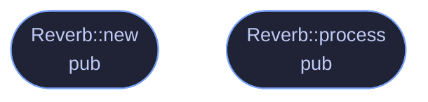

# `crates/veilvoice-core/src/effects.rs`

[[veilvoice-core|Crate-veilvoice-core]] &middot; 177 lines &middot; [read the source](https://github.com/tilas01/veilvoice/blob/main/crates/veilvoice-core/src/effects.rs)

## Contents

- [What calls what](#what-calls-what)
- [Items](#items)

Light time-domain effects applied after resynthesis.

These run on the continuous output stream (not per FFT frame) and exist to
(a) further decorrelate the signal from the original, and (b) add a few
detuned "voices" so the spectrogram is densely filled rather than showing a
clean harmonic stack — without harming intelligibility, so every mix defaults
low. None of them are invertible in a way that recovers the source voice.

## What calls what

## Items

| Item | Line | Documentation |
|---|---:|---|
| `SoftClip` pub struct | [14](https://github.com/tilas01/veilvoice/blob/main/crates/veilvoice-core/src/effects.rs#L14) | Symmetric soft-clip (tanh) waveshaper. |
| `SoftClip::new` pub fn | [21](https://github.com/tilas01/veilvoice/blob/main/crates/veilvoice-core/src/effects.rs#L21) |  |
| `SoftClip::process` pub fn | [30](https://github.com/tilas01/veilvoice/blob/main/crates/veilvoice-core/src/effects.rs#L30) |  |
| `DelayVoice` struct | [38](https://github.com/tilas01/veilvoice/blob/main/crates/veilvoice-core/src/effects.rs#L38) | A single modulated delay line, summed into a small ensemble to create the impression of several slightly different voices. |
| `DelayVoice::new` fn | [48](https://github.com/tilas01/veilvoice/blob/main/crates/veilvoice-core/src/effects.rs#L48) |  |
| `DelayVoice::process` fn | [62](https://github.com/tilas01/veilvoice/blob/main/crates/veilvoice-core/src/effects.rs#L62) |  |
| `Chorus` pub struct | [79](https://github.com/tilas01/veilvoice/blob/main/crates/veilvoice-core/src/effects.rs#L79) | Detuned chorus ensemble. |
| `Chorus::new` pub fn | [85](https://github.com/tilas01/veilvoice/blob/main/crates/veilvoice-core/src/effects.rs#L85) |  |
| `Chorus::process` pub fn | [98](https://github.com/tilas01/veilvoice/blob/main/crates/veilvoice-core/src/effects.rs#L98) |  |
| `Reverb` pub struct | [110](https://github.com/tilas01/veilvoice/blob/main/crates/veilvoice-core/src/effects.rs#L110) | Minimal Schroeder-style reverb: one feedback comb + one all-pass. |
| `Reverb::new` pub fn | [121](https://github.com/tilas01/veilvoice/blob/main/crates/veilvoice-core/src/effects.rs#L121) |  |
| `Reverb::process` pub fn | [135](https://github.com/tilas01/veilvoice/blob/main/crates/veilvoice-core/src/effects.rs#L135) |  |
