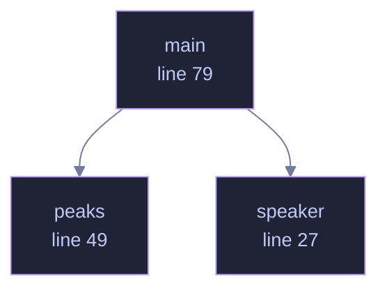

<!-- GENERATED by tools/docs/generate.py from the doc comments in the source. Do not edit: edit the .rs file and run the generator. -->

# `crates/veilvoice-core/examples/spectrum_report.rs`

[[veilvoice-core|Crate-veilvoice-core]] &middot; 107 lines &middot; [read the source](https://github.com/tilas01/veilvoice/blob/main/crates/veilvoice-core/examples/spectrum_report.rs)

## Contents

- [In plain words](#in-plain-words)
  - [What calls what](#what-calls-what)
  - [Items](#items)

Where do the output partials actually land?

Prints the strongest partials of a synthetic speaker before and after
processing, as multiples of the STFT bin grid. It is the quickest way to see
the two synthesis modes described in `spectral.rs`:

* **accent off**, the legacy channel-vocoder path. Each harmonic smears into
a cluster of neighbouring grid frequencies (187.5 *and* 234.4 Hz around one
partial), which is what makes it sound metallic.
* **accent on**, an exact harmonic series at the canonical register
(140.6 Hz and its multiples), whatever pitch went in.

Run with `cargo run -p veilvoice-core --example diag_spectrum`.

# In plain words

A small program that runs the engine over a recording and prints what changed
about its frequencies.

It is here so that the claims about what VeilVoice does to a voice can be
checked by anybody, rather than taken on trust from a paragraph of prose.

## What this file contains

107 lines defining **3 functions** (0 public), **0 types** and **0 constants**. Everything below is read out of the source, so it cannot disagree with the code.

## What calls what

_Colour key: **helper** -- private to this file._

  

The same graph as Mermaid source

## Items

| Item | Line | Documentation |
|---|---:|---|
| `speaker` fn | [27](https://github.com/tilas01/veilvoice/blob/main/crates/veilvoice-core/examples/spectrum_report.rs#L27) |  |
| `peaks` fn | [49](https://github.com/tilas01/veilvoice/blob/main/crates/veilvoice-core/examples/spectrum_report.rs#L49) |  |
| `main` fn | [79](https://github.com/tilas01/veilvoice/blob/main/crates/veilvoice-core/examples/spectrum_report.rs#L79) |  |
