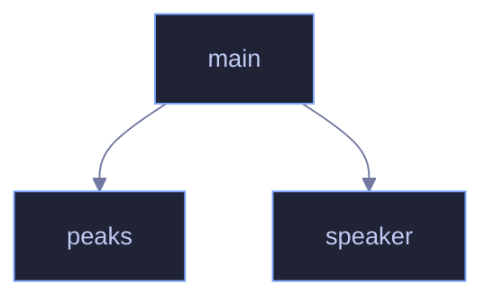

<!-- GENERATED by tools/docs/generate.py from the doc comments in the source. Do not edit: edit the .rs file and run the generator. -->

# `crates/veilvoice-core/examples/spectrum_report.rs`

[[veilvoice-core|Crate-veilvoice-core]] &middot; 99 lines &middot; [read the source](https://github.com/tilas01/veilvoice/blob/main/crates/veilvoice-core/examples/spectrum_report.rs)

## Contents

- [What calls what](#what-calls-what)
- [Items](#items)

Where do the output partials actually land?

Prints the strongest partials of a synthetic speaker before and after
processing, as multiples of the STFT bin grid. It is the quickest way to see
the two synthesis modes described in `spectral.rs`:

* **accent off** — the legacy channel-vocoder path. Each harmonic smears into
a cluster of neighbouring grid frequencies (187.5 *and* 234.4 Hz around one
partial), which is what makes it sound metallic.
* **accent on** — an exact harmonic series at the canonical register
(140.6 Hz and its multiples), whatever pitch went in.

Run with `cargo run -p veilvoice-core --example diag_spectrum`.

## What calls what

## Items

| Item | Line | Documentation |
|---|---:|---|
| `speaker` fn | [19](https://github.com/tilas01/veilvoice/blob/main/crates/veilvoice-core/examples/spectrum_report.rs#L19) |  |
| `peaks` fn | [41](https://github.com/tilas01/veilvoice/blob/main/crates/veilvoice-core/examples/spectrum_report.rs#L41) |  |
| `main` fn | [71](https://github.com/tilas01/veilvoice/blob/main/crates/veilvoice-core/examples/spectrum_report.rs#L71) |  |
