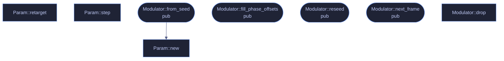

# `crates/veilvoice-core/src/modulation.rs`

[[veilvoice-core|Crate-veilvoice-core]] &middot; 280 lines &middot; [read the source](https://github.com/tilas01/veilvoice/blob/main/crates/veilvoice-core/src/modulation.rs)

## Contents

- [What calls what](#what-calls-what)
- [Items](#items)

Cryptographically-seeded modulation of the effect parameters.

The pitch and formant ratios are never constant: a ChaCha20 CSPRNG picks a
new random target every `frames_per_target` STFT frames, and a one-pole
filter glides continuously toward it. Because the transform is therefore
non-stationary and unpredictable, an attacker cannot "undo" it by assuming a
single fixed shift — there is no single shift to undo, and the target
sequence is unknowable without the seed (which never leaves the process and
is zeroized on drop).

The seed does not stay put either. It is rolled forward every couple of
seconds by default (see `Modulator::reseed`), so the stream driving any
given stretch of audio is closed off permanently once that stretch is past.

## What calls what

## Items

| Item | Line | Documentation |
|---|---:|---|
| `Param` struct | [23](https://github.com/tilas01/veilvoice/blob/main/crates/veilvoice-core/src/modulation.rs#L23) | One smoothly-varying parameter bounded to lo, hi. |
| `Param::new` fn | [32](https://github.com/tilas01/veilvoice/blob/main/crates/veilvoice-core/src/modulation.rs#L32) |  |
| `Param::retarget` fn | [42](https://github.com/tilas01/veilvoice/blob/main/crates/veilvoice-core/src/modulation.rs#L42) |  |
| `Param::step` fn | [45](https://github.com/tilas01/veilvoice/blob/main/crates/veilvoice-core/src/modulation.rs#L45) |  |
| `ModValues` pub struct | [53](https://github.com/tilas01/veilvoice/blob/main/crates/veilvoice-core/src/modulation.rs#L53) | The values handed to the spectral transform for one frame. |
| `Modulator` pub struct | [61](https://github.com/tilas01/veilvoice/blob/main/crates/veilvoice-core/src/modulation.rs#L61) | Non-stationary parameter generator. |
| `Modulator::from_seed` pub fn | [73](https://github.com/tilas01/veilvoice/blob/main/crates/veilvoice-core/src/modulation.rs#L73) | Build from an explicit 32-byte seed (deterministic; used by tests and by session-key-derived seeding). |
| `Modulator::fill_phase_offsets` pub fn | [92](https://github.com/tilas01/veilvoice/blob/main/crates/veilvoice-core/src/modulation.rs#L92) | The 32 fixed per-bin phase offsets consumer needs are derived from the same stream; expose a helper that fills out with values in [0, 2π). |
| `Modulator::reseed` pub fn | [120](https://github.com/tilas01/veilvoice/blob/main/crates/veilvoice-core/src/modulation.rs#L120) | Roll onto a fresh seed, drawn from the current stream. |
| `Modulator::next_frame` pub fn | [131](https://github.com/tilas01/veilvoice/blob/main/crates/veilvoice-core/src/modulation.rs#L131) | Advance one STFT frame and return the parameters to apply. |
| `Modulator::drop` fn | [145](https://github.com/tilas01/veilvoice/blob/main/crates/veilvoice-core/src/modulation.rs#L145) |  |
