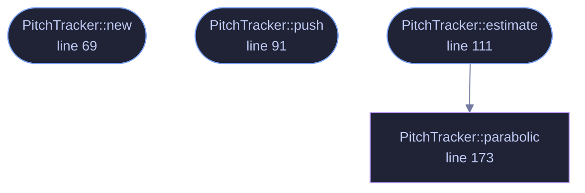

<!-- GENERATED by tools/docs/generate.py from the doc comments in the source. Do not edit: edit the .rs file and run the generator. -->

# `crates/veilvoice-core/src/pitch.rs`

[[veilvoice-core|Crate-veilvoice-core]] &middot; 274 lines &middot; [read the source](https://github.com/tilas01/veilvoice/blob/main/crates/veilvoice-core/src/pitch.rs)

## Contents

- [What calls what](#what-calls-what)
- [Items](#items)

Monophonic fundamental-frequency tracker (decimated YIN).

Accent neutralisation needs to know the speaker's *current* f0 so the
intonation contour can be replaced with a canonical one (see `crate::accent`).

Two constraints shape this implementation:

* **The STFT frame is too short to resolve f0 directly.** At the default
1024-point FFT / 48 kHz the bin spacing is ~47 Hz, so a spectral peak-pick
cannot tell 100 Hz from 140 Hz. This tracker therefore works in the time
domain over its own rolling history, which may be longer than one STFT
frame without adding any output latency — the window still *ends* at the
current frame, so it stays causal.
* **It must be cheap enough for an audio callback.** The signal is decimated
to ~8 kHz first (pitch lives in the low harmonics), which cuts the
difference-function cost by the square of the decimation factor. At the
default settings it costs on the order of 8 M flops/s — well under 1 % of
one core — and allocates nothing after construction.

The algorithm is YIN's cumulative mean normalised difference function
(de Cheveigné & Kawahara, 2002) with parabolic interpolation, minus the
optimisations that only matter for offline accuracy.

## What this file contains

274 lines defining **4 functions** (3 public), **2 types** and **6 constants**. Everything below is read out of the source, so it cannot disagree with the code.

**The types it owns.**

- `struct PitchEstimate` (line 41) -- One f0 measurement.
- `struct PitchTracker` (line 51) -- Rolling, allocation-free f0 tracker.

**What happens when it runs.** These are the ways in: public, and nothing else in this file calls them, so they are what an outside caller reaches first.

- `PitchTracker::new` (line 69) -- Build a tracker for input at sample_rate hertz.
- `PitchTracker::push` (line 91) -- Feed new input samples (anti-aliased and decimated internally).
- `PitchTracker::estimate` (line 111) -- Estimate f0 over the newest history.
  - reaches: `parabolic`

## What calls what

_Colour key: **entry** -- a way in: public, and nothing in this file calls it; **helper** -- private to this file._

## Items

| Item | Line | Documentation |
|---|---:|---|
| `F0_MIN_HZ` const | [26](https://github.com/tilas01/veilvoice/blob/main/crates/veilvoice-core/src/pitch.rs#L26) | Lowest fundamental the tracker will report, in hertz. |
| `F0_MAX_HZ` const | [28](https://github.com/tilas01/veilvoice/blob/main/crates/veilvoice-core/src/pitch.rs#L28) | Highest fundamental the tracker will report, in hertz. |
| `DECIMATED_HZ` const | [30](https://github.com/tilas01/veilvoice/blob/main/crates/veilvoice-core/src/pitch.rs#L30) | Target sample rate after decimation, in hertz. |
| `WINDOW` const | [33](https://github.com/tilas01/veilvoice/blob/main/crates/veilvoice-core/src/pitch.rs#L33) | Analysis window length in decimated samples (~40 ms at 8 kHz — at least two periods of the lowest supported f0). |
| `YIN_THRESHOLD` const | [35](https://github.com/tilas01/veilvoice/blob/main/crates/veilvoice-core/src/pitch.rs#L35) | d'(tau) below this counts as a confident voiced period. |
| `SILENCE_RMS` const | [37](https://github.com/tilas01/veilvoice/blob/main/crates/veilvoice-core/src/pitch.rs#L37) | Frames quieter than this (RMS) are treated as unvoiced regardless. |
| `PitchEstimate` pub struct | [41](https://github.com/tilas01/veilvoice/blob/main/crates/veilvoice-core/src/pitch.rs#L41) | One f0 measurement. |
| `PitchTracker` pub struct | [51](https://github.com/tilas01/veilvoice/blob/main/crates/veilvoice-core/src/pitch.rs#L51) | Rolling, allocation-free f0 tracker. |
| `PitchTracker::new` pub fn | [69](https://github.com/tilas01/veilvoice/blob/main/crates/veilvoice-core/src/pitch.rs#L69) | Build a tracker for input at sample_rate hertz. |
| `PitchTracker::push` pub fn | [91](https://github.com/tilas01/veilvoice/blob/main/crates/veilvoice-core/src/pitch.rs#L91) | Feed new input samples (anti-aliased and decimated internally). |
| `PitchTracker::estimate` pub fn | [111](https://github.com/tilas01/veilvoice/blob/main/crates/veilvoice-core/src/pitch.rs#L111) | Estimate f0 over the newest history. |
| `PitchTracker::parabolic` fn | [173](https://github.com/tilas01/veilvoice/blob/main/crates/veilvoice-core/src/pitch.rs#L173) | Sub-sample refinement of the minimum at tau by fitting a parabola through its two neighbours. |
