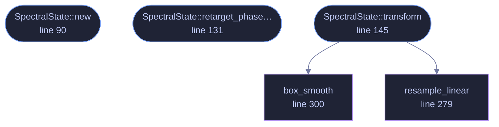

<!-- GENERATED by tools/docs/generate.py from the doc comments in the source. Do not edit: edit the .rs file and run the generator. -->

# `crates/veilvoice-core/src/spectral.rs`

[[veilvoice-core|Crate-veilvoice-core]] &middot; 428 lines &middot; [read the source](https://github.com/tilas01/veilvoice/blob/main/crates/veilvoice-core/src/spectral.rs)

## Contents

- [Voiced frames: an explicit harmonic comb](#voiced-frames-an-explicit-harmonic-comb)
- [What calls what](#what-calls-what)
- [Items](#items)

Frequency-domain de-identification transform.

For every STFT frame we:
1. take the magnitude spectrum and **discard the measured phase** — this is
the irreversible step, it permanently erases the speaker's waveform /
micro-timing;
2. estimate a smooth spectral **envelope** (the vocal-tract / formant
structure, i.e. the biometric identity) and the **excitation** residual
(glottal source + phonetic detail that carries the words);
3. shift the excitation by a cryptographically-modulated *pitch* ratio and
warp the envelope by an independent *formant* ratio, so the identity is
moved somewhere it never was while the phonemes stay legible;
4. resynthesise a fresh phase, plus a fixed random per-bin offset.

## Voiced frames: an explicit harmonic comb

Step 4 has two modes. On **unvoiced** frames each bin accumulates its own
centre frequency — the classic channel-vocoder phase, exactly right for
fricatives and noise.

On **voiced** frames that alone is not enough, and it is audible. Bin centres
are multiples of `sample_rate / n` (46.875 Hz at the default settings), and a
harmonic peak spans several bins, so a plain channel vocoder turns each
partial into a cluster of independent grid-frequency sinusoids with unrelated
phases. A 210 Hz voice comes out beating around 187.5 and 234.4 Hz: metallic,
and with a pitch that cannot be steered, which would make the canonical
register `crate::accent` aims for unreachable.

So when the frame is voiced and accent neutralisation is active, the
excitation is not resampled at all — it is **replaced** by an ideal harmonic
comb at the canonical fundamental, quantised to the nearest whole bin. This
is the textbook source-filter model of voiced speech (an impulse train
through the vocal-tract filter), and because every comb line then sits
exactly on a bin centre, the existing per-bin phase advance is precisely the
right advance for it: successive frames overlap-add coherently and each
harmonic emerges as one clean partial. The envelope still supplies the
formants, so the vowels are untouched.

Snapping to the bin grid is what buys that coherence, and it costs pitch
resolution — the grid step is coarse. That is not a problem for the default
configuration, which maps every speaker onto a *single constant* register
that need only be snapped once; it does mean any residual intonation
(`prosody_flatten` below 1.0) is quantised to the same grid. Lifting that
restriction needs window-kernel synthesis, noted as future work in the
project roadmap.

None of this weakens irreversibility. The measured phase is still discarded
in full, and pinning the output to one canonical fundamental destroys *more*
pitch information than randomising it would — a constant carries nothing.

Between steps 2 and 4 the optional `crate::accent` neutraliser folds in its
long-term corrections: it reads the unwarped envelope to measure the
speaker's vocal-tract scale, contributes extra pitch and formant ratios, and
rotates the warped envelope toward a canonical spectral tilt.

The measured phase is never reused, so no amount of downstream processing can
reconstruct the original excitation phase — the transform is one-way.

## What this file contains

428 lines defining **5 functions** (3 public), **1 type** and **0 constants**. Everything below is read out of the source, so it cannot disagree with the code.

**The types it owns.**

- `struct SpectralState` (line 66) -- Persistent per-instance state for the spectral transform.

**What happens when it runs.** These are the ways in: public, and nothing else in this file calls them, so they are what an outside caller reaches first.

- `SpectralState::new` (line 90) -- n = FFT size, hop = analysis/synthesis hop, rand_phase = fixed per-bin phase offsets in radians (length n/2+1) drawn from the CSPRNG.
- `SpectralState::retarget_phase_offsets` (line 131) -- Aim the per-bin phase offsets at fresh values.
- `SpectralState::transform` (line 145) -- Rewrite spec (length n/2+1) in place, given the current modulation.
  - reaches: `box_smooth`, `resample_linear`

## What calls what

_Colour key: **entry** -- a way in: public, and nothing in this file calls it; **helper** -- private to this file._

  

The same graph as Mermaid source

## Items

| Item | Line | Documentation |
|---|---:|---|
| `SpectralState` pub struct | [66](https://github.com/tilas01/veilvoice/blob/main/crates/veilvoice-core/src/spectral.rs#L66) | Persistent per-instance state for the spectral transform. |
| `SpectralState::new` pub fn | [90](https://github.com/tilas01/veilvoice/blob/main/crates/veilvoice-core/src/spectral.rs#L90) | n = FFT size, hop = analysis/synthesis hop, rand_phase = fixed per-bin phase offsets in radians (length n/2+1) drawn from the CSPRNG. |
| `SpectralState::retarget_phase_offsets` pub fn | [131](https://github.com/tilas01/veilvoice/blob/main/crates/veilvoice-core/src/spectral.rs#L131) | Aim the per-bin phase offsets at fresh values. |
| `SpectralState::transform` pub fn | [145](https://github.com/tilas01/veilvoice/blob/main/crates/veilvoice-core/src/spectral.rs#L145) | Rewrite spec (length n/2+1) in place, given the current modulation. |
| `resample_linear` fn | [279](https://github.com/tilas01/veilvoice/blob/main/crates/veilvoice-core/src/spectral.rs#L279) | Linear resampling of a non-negative spectral function. |
| `box_smooth` pub(crate) fn | [300](https://github.com/tilas01/veilvoice/blob/main/crates/veilvoice-core/src/spectral.rs#L300) | In-place-ish box smoother using a running sum. |
