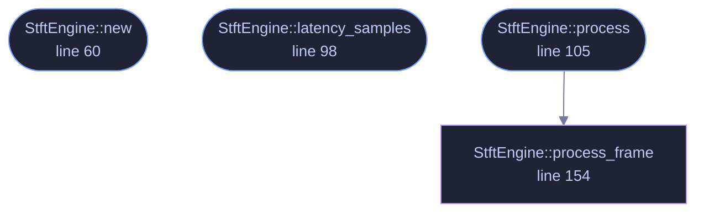

<!-- GENERATED by tools/docs/generate.py from the doc comments in the source. Do not edit: edit the .rs file and run the generator. -->

# `crates/veilvoice-core/src/stft.rs`

[[veilvoice-core|Crate-veilvoice-core]] &middot; 259 lines &middot; [read the source](https://github.com/tilas01/veilvoice/blob/main/crates/veilvoice-core/src/stft.rs)

## Contents

- [In plain words](#in-plain-words)
  - [What calls what](#what-calls-what)
  - [Items](#items)

Streaming short-time Fourier transform with overlap-add resynthesis.

Structure follows the classic FIFO/overlap-add pipeline (as popularised by
Bernsee's SMB pitch shifter): samples flow in and out one-for-one with a
fixed latency of `n - hop` samples, and a full frame is analysed/synthesised
every `hop` input samples. The caller supplies a closure that rewrites the
complex spectrum in place, keeping the FFT plumbing and the de-identification
maths cleanly separated.

The closure also receives the raw (unwindowed) analysis frame. Accent
neutralisation needs a time-domain view to track f0 — the FFT resolution at
useful frame sizes is far too coarse for that — and handing over the frame
that produced the spectrum keeps the two perfectly aligned. Its newest `hop`
samples are the tail.

# In plain words

Sound arrives as a long stream of numbers. To change a voice you have to look
at it in terms of pitch and tone rather than raw numbers, and this is the part
that converts back and forth.

It takes a short slice of sound, works out which frequencies are in it, hands
that picture to the code that alters it, and turns the result back into sound.
The slices overlap and are faded together, so the joins cannot be heard.

Everything else in the engine is written in terms of those pictures. This file
is the door between the two ways of looking at the same thing.

## What this file contains

259 lines defining **4 functions** (3 public), **1 type** and **0 constants**. Everything below is read out of the source, so it cannot disagree with the code.

**The types it owns.**

- `struct StftEngine` (line 36) -- Reusable streaming STFT engine (single channel).

**What happens when it runs.** These are the ways in: public, and nothing else in this file calls them, so they are what an outside caller reaches first.

- `StftEngine::new` (line 60) -- n must be even; hop must divide evenly for constant overlap-add (typical: hop = n/4).
- `StftEngine::latency_samples` (line 98) -- End-to-end algorithmic latency (group delay) in samples.
- `StftEngine::process` (line 105) -- Process input into output (equal length).
  - reaches: `process_frame`

## What calls what

_Colour key: **entry** -- a way in: public, and nothing in this file calls it; **helper** -- private to this file._

  

The same graph as Mermaid source

## Items

| Item | Line | Documentation |
|---|---:|---|
| `StftEngine` pub struct | [36](https://github.com/tilas01/veilvoice/blob/main/crates/veilvoice-core/src/stft.rs#L36) | Reusable streaming STFT engine (single channel). |
| `StftEngine::new` pub fn | [60](https://github.com/tilas01/veilvoice/blob/main/crates/veilvoice-core/src/stft.rs#L60) | n must be even; hop must divide evenly for constant overlap-add (typical: hop = n/4). |
| `StftEngine::latency_samples` pub fn | [98](https://github.com/tilas01/veilvoice/blob/main/crates/veilvoice-core/src/stft.rs#L98) | End-to-end algorithmic latency (group delay) in samples. |
| `StftEngine::process` pub fn | [105](https://github.com/tilas01/veilvoice/blob/main/crates/veilvoice-core/src/stft.rs#L105) | Process input into output (equal length). |
| `StftEngine::process_frame` fn | [154](https://github.com/tilas01/veilvoice/blob/main/crates/veilvoice-core/src/stft.rs#L154) |  |
