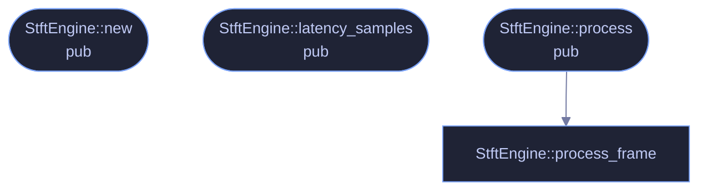

# `crates/veilvoice-core/src/stft.rs`

[[veilvoice-core|Crate-veilvoice-core]] &middot; 246 lines &middot; [read the source](https://github.com/tilas01/veilvoice/blob/main/crates/veilvoice-core/src/stft.rs)

## Contents

- [What calls what](#what-calls-what)
- [Items](#items)

Streaming short-time Fourier transform with overlap-add resynthesis.

Structure follows the classic FIFO/overlap-add pipeline (as popularised by
Bernsee's SMB pitch shifter): samples flow in and out one-for-one with a
fixed latency of `n - hop` samples, and a full frame is analysed/synthesised
every `hop` input samples. The caller supplies a closure that rewrites the
complex spectrum in place, keeping the FFT plumbing and the de-identification
maths cleanly separated.

The closure also receives the raw (unwindowed) analysis frame. Accent
neutralisation needs a time-domain view to track f0 — the FFT resolution at
useful frame sizes is far too coarse for that — and handing over the frame
that produced the spectrum keeps the two perfectly aligned. Its newest `hop`
samples are the tail.

## What calls what

## Items

| Item | Line | Documentation |
|---|---:|---|
| `StftEngine` pub struct | [23](https://github.com/tilas01/veilvoice/blob/main/crates/veilvoice-core/src/stft.rs#L23) | Reusable streaming STFT engine (single channel). |
| `StftEngine::new` pub fn | [47](https://github.com/tilas01/veilvoice/blob/main/crates/veilvoice-core/src/stft.rs#L47) | n must be even; hop must divide evenly for constant overlap-add (typical: hop = n/4). |
| `StftEngine::latency_samples` pub fn | [85](https://github.com/tilas01/veilvoice/blob/main/crates/veilvoice-core/src/stft.rs#L85) | End-to-end algorithmic latency (group delay) in samples. |
| `StftEngine::process` pub fn | [92](https://github.com/tilas01/veilvoice/blob/main/crates/veilvoice-core/src/stft.rs#L92) | Process input into output (equal length). |
| `StftEngine::process_frame` fn | [141](https://github.com/tilas01/veilvoice/blob/main/crates/veilvoice-core/src/stft.rs#L141) |  |
