<!-- GENERATED by tools/docs/generate.py from the doc comments in the source. Do not edit: edit the .rs file and run the generator. -->


# `crates/veilvoice-core/src/voices.rs`

[[veilvoice-core|Crate-veilvoice-core]] &middot; 867 lines &middot; [read the source](https://github.com/tilas01/veilvoice/blob/main/crates/veilvoice-core/src/voices.rs)

## Contents

- [What this is for](#what-this-is-for)
- [The security property, and how it survives](#the-security-property-and-how-it-survives)
- [What a conversation leaks that a monologue does not](#what-a-conversation-leaks-that-a-monologue-does-not)
- [A register has to land on a bin, and that is the whole constraint](#a-register-has-to-land-on-a-bin-and-that-is-the-whole-constraint)
- [Ten voices, from four registers and three vocal tracts](#ten-voices-from-four-registers-and-three-vocal-tracts)
- [If you change the frame size, check the table again](#if-you-change-the-frame-size-check-the-table-again)
- [In plain words](#in-plain-words)
  - [What calls what](#what-calls-what)
  - [Items](#items)

Destination voices: several canonical registers instead of one.

# What this is for

By default every speaker VeilVoice processes comes out as **the same
voice**, with one pitch register, one vocal-tract scale and one long-term
spectrum.
That is the many-to-one mapping the whole project rests on, and for a single
speaker it is exactly right.

It is wrong for a conversation. Two people veiled into one indistinguishable
voice produce a recording nobody can follow: the words survive and the
turn-taking does not, so a listener cannot tell a question from its answer.
This module hands out a small table of **distinct destination voices**, so a
recording with three people in it comes out with three voices in it.

# The security property, and how it survives

The property that matters is that **the output voice is a function of the
slot, not of the speaker**. Every input mapped onto slot 3 comes out as
voice 3, whoever they were. The mapping is still many-to-one, with
infinitely many inputs per output, so there is still no inverse to
compute. What changes is the number of buckets, from one to at most ten.

This is why a voice is **never derived from the speaker**. Choosing a
destination by measuring the input is the obvious implementation, and the
one that would sound most natural. It would make the output voice a function
of the input voice, which is precisely the linkage the project exists to destroy.
Slots are assigned by turn order, and turn order is something the *user*
supplies.

# What a conversation leaks that a monologue does not

Stated plainly, because it is a real cost and nobody should have to work it
out for themselves:

* **How many people were talking.** Ten voices in the output means ten
speakers in the input.
* **Who spoke when, and for how long.** Turn-taking structure is preserved
on purpose, because it is the thing that makes the result usable, and turn
structure is information about a conversation. Overlaps, interruptions,
the length of each answer and the rhythm of the exchange all survive.
* **Nothing about who they were.** The voiceprint of each speaker is
destroyed exactly as thoroughly as in single-speaker mode: the same phase
discard, the same many-to-one normalisation onto the slot's canonical
values.

# A register has to land on a bin, and that is the whole constraint

The first version of this table picked five registers about 26 Hz apart on
the reasoning that the just-noticeable difference for the fundamental of
speech is around 8 Hz, so 26 Hz would be three times that. The reasoning was
sound and the table was wrong, because it measured the wrong thing.

When accent neutralisation is on, `crate::spectral` does not resample the
excitation. It **replaces** it with a harmonic comb at the canonical
fundamental, quantised to the nearest whole FFT bin so that every comb line
sits on a bin centre and the frames overlap-add coherently. The rendered
fundamental is therefore not the number in the table. It is

```text
round(target_f0 / bin_hz) * bin_hz,   bin_hz = sample_rate / frame_size
```

At the default 1024-point frame and 48 kHz that spacing is **46.875 Hz**, so
the five registers 105, 131, 157, 183 and 209 Hz render as 93.75, 140.625,
140.625, 187.5 and 187.5, which is three distinct pitches, not five. Two pairs of
speakers would have shared a register with nothing in the interface saying
so. It was found by measuring the fundamental of an actual rendered file,
not by reading the code, and the tests below now measure the same thing the
ear would.

So the registers are **bin-exact by construction**: each is a whole number
of bins at the default configuration. Inside the range where a resynthesised
voice stays intelligible, roughly 90 to 240 Hz, below which the comb has too
few harmonics under the vowels and above which it stops being a speaking
register, there are exactly four:

| bin | rendered |
|---:|---:|
| 2 | 93.75 Hz |
| 3 | 140.625 Hz |
| 4 | 187.5 Hz |
| 5 | 234.375 Hz |

# Ten voices, from four registers and three vocal tracts

The second axis is the canonical vocal-tract scale, which is a continuous
warp and is **not** quantised, so it is free to take values the ear can
separate: 620, 760 and 900 Hz, each about 22 % from its neighbour, all
inside the range where the vowels stay natural.

Four registers times three tracts is twelve, and `MAX_VOICES` ships ten of
them. Twenty, which was asked for, is not available: it would need either
registers a single bin apart at a frame size four times longer, which
quadruples the latency, or vocal tracts close enough to be heard as the
same person on a different day.

# If you change the frame size, check the table again

The registers are exact at the *default* configuration. A caller who changes
`crate::DeidConfig::frame_size` or the sample rate moves the bin grid
underneath them, and two registers can collide again.
`Voice::rendered_f0_hz` reports what a given configuration will actually
produce, and `distinct_voices` counts how many of the ten survive it, so
a front end can say "this frame size gives you six distinguishable voices"
rather than handing out ten labels for six sounds.

# In plain words

The set of voices a recording can be turned into.

By default everyone comes out as the same one. That is on purpose: if every
speaker sounds identical, there is nothing in the result that distinguishes one
from another, and nothing to trace back.

When a recording has several people in it that becomes a problem, because a
listener cannot follow who is who. So there is a small set of destination
voices to hand out instead, chosen to be as far apart as the arithmetic allows,
and a measured limit on how many of them can genuinely be told apart by ear.

## What this file contains

867 lines defining **11 functions** (11 public), **1 type** and **11 constants**. Everything below is read out of the source, so it cannot disagree with the code.

**The types it owns.**

- `struct Voice` (line 134) -- One destination voice: the canonical values every speaker in this slot is mapped onto.

**What happens when it runs.** These are the ways in: public, and nothing else in this file calls them, so they are what an outside caller reaches first.

- `Voice::applied_to` (line 156) -- Apply this voice to an AccentConfig.
- `Voice::checked` (line 183) -- Whether this voice is inside the range the engine can render usefully.
- `Voice::describe` (line 227) -- A short label for an interface: "low register, narrow tract".
  - reaches: `rendered_f0_hz`, `bin_hz`
- `voice` (line 326) -- The destination voice for slot index.
- `clear_voices` (line 407) -- How many voices can be handed out before two of them are too alike.
  - reaches: `all`, `separation`
- `closest_pair` (line 427) -- The closest pair among the first count voices, as a ratio.
  - reaches: `all`, `separation`
- `distinct_voices` (line 453) -- How many of the ten are still distinguishable under config.
  - reaches: `all`

## What calls what

_Colour key: **entry** -- a way in: public, and nothing in this file calls it; **api** -- public, and also used inside this file._

<p align="center">
  
</p>

<details>
<summary>The same graph as Mermaid source</summary>



</details>

```mermaid
%%{init: {"theme":"base","themeVariables":{"background":"#1a1b26","primaryColor":"#1f2335","primaryTextColor":"#c0caf5","primaryBorderColor":"#7aa2f7","secondaryColor":"#16161e","tertiaryColor":"#16161e","lineColor":"#737aa2","textColor":"#c0caf5","mainBkg":"#1f2335","nodeBorder":"#7aa2f7","clusterBkg":"#16161e","clusterBorder":"#2f3549","fontFamily":"ui-monospace, SFMono-Regular, Consolas, monospace","fontSize":"14px"}}}%%
flowchart TD
    n_applied_to(["Voice::applied_to<br/>line 156"])
    n_rendered_f0_hz["Voice::rendered_f0_hz<br/>line 170"]
    n_checked(["Voice::checked<br/>line 183"])
    n_describe(["Voice::describe<br/>line 227"])
    n_bin_hz["bin_hz<br/>line 270"]
    n_voice(["voice<br/>line 326"])
    n_all["all<br/>line 337"]
    n_separation["separation<br/>line 363"]
    n_clear_voices(["clear_voices<br/>line 407"])
    n_closest_pair(["closest_pair<br/>line 427"])
    n_distinct_voices(["distinct_voices<br/>line 453"])
    n_clear_voices --> n_all
    n_clear_voices --> n_separation
    n_closest_pair --> n_all
    n_closest_pair --> n_separation
    n_describe --> n_rendered_f0_hz
    n_distinct_voices --> n_all
    n_rendered_f0_hz --> n_bin_hz
    click n_applied_to href "https://github.com/tilas01/veilvoice/blob/main/crates/veilvoice-core/src/voices.rs#L156" "open the source"
    click n_rendered_f0_hz href "https://github.com/tilas01/veilvoice/blob/main/crates/veilvoice-core/src/voices.rs#L170" "open the source"
    click n_checked href "https://github.com/tilas01/veilvoice/blob/main/crates/veilvoice-core/src/voices.rs#L183" "open the source"
    click n_describe href "https://github.com/tilas01/veilvoice/blob/main/crates/veilvoice-core/src/voices.rs#L227" "open the source"
    click n_bin_hz href "https://github.com/tilas01/veilvoice/blob/main/crates/veilvoice-core/src/voices.rs#L270" "open the source"
    click n_voice href "https://github.com/tilas01/veilvoice/blob/main/crates/veilvoice-core/src/voices.rs#L326" "open the source"
    click n_all href "https://github.com/tilas01/veilvoice/blob/main/crates/veilvoice-core/src/voices.rs#L337" "open the source"
    click n_separation href "https://github.com/tilas01/veilvoice/blob/main/crates/veilvoice-core/src/voices.rs#L363" "open the source"
    click n_clear_voices href "https://github.com/tilas01/veilvoice/blob/main/crates/veilvoice-core/src/voices.rs#L407" "open the source"
    click n_closest_pair href "https://github.com/tilas01/veilvoice/blob/main/crates/veilvoice-core/src/voices.rs#L427" "open the source"
    click n_distinct_voices href "https://github.com/tilas01/veilvoice/blob/main/crates/veilvoice-core/src/voices.rs#L453" "open the source"
    classDef entry fill:#1f2335,stroke:#7aa2f7,color:#c0caf5
    class n_applied_to,n_checked,n_describe,n_voice,n_clear_voices,n_closest_pair,n_distinct_voices entry
    classDef api fill:#1f2335,stroke:#7dcfff,color:#c0caf5
    class n_rendered_f0_hz,n_bin_hz,n_all,n_separation api
```

## Items

| Item | Line | Documentation |
|---|---:|---|
| `MAX_VOICES` <sub>pub const</sub> | [129](https://github.com/tilas01/veilvoice/blob/main/crates/veilvoice-core/src/voices.rs#L129) | How many distinct destination voices this engine hands out. |
| `Voice` <sub>pub struct</sub> | [134](https://github.com/tilas01/veilvoice/blob/main/crates/veilvoice-core/src/voices.rs#L134) | One destination voice: the canonical values every speaker in this slot is mapped onto. |
| `Voice::applied_to` <sub>pub fn</sub> | [156](https://github.com/tilas01/veilvoice/blob/main/crates/veilvoice-core/src/voices.rs#L156) | Apply this voice to an AccentConfig. |
| `Voice::rendered_f0_hz` <sub>pub fn</sub> | [170](https://github.com/tilas01/veilvoice/blob/main/crates/veilvoice-core/src/voices.rs#L170) | The fundamental this voice will actually be rendered at, under config. |
| `Voice::checked` <sub>pub fn</sub> | [183](https://github.com/tilas01/veilvoice/blob/main/crates/veilvoice-core/src/voices.rs#L183) | Whether this voice is inside the range the engine can render usefully. |
| `Voice::describe` <sub>pub fn</sub> | [227](https://github.com/tilas01/veilvoice/blob/main/crates/veilvoice-core/src/voices.rs#L227) | A short label for an interface: "low register, narrow tract". |
| `F0_MIN_HZ` <sub>pub const</sub> | [253](https://github.com/tilas01/veilvoice/blob/main/crates/veilvoice-core/src/voices.rs#L253) | The lowest fundamental a resynthesised voice stays intelligible at. |
| `F0_MAX_HZ` <sub>pub const</sub> | [255](https://github.com/tilas01/veilvoice/blob/main/crates/veilvoice-core/src/voices.rs#L255) | The highest fundamental that still reads as a speaking register. |
| `CENTROID_MIN_HZ` <sub>pub const</sub> | [257](https://github.com/tilas01/veilvoice/blob/main/crates/veilvoice-core/src/voices.rs#L257) | The narrowest canonical vocal tract offered. |
| `CENTROID_MAX_HZ` <sub>pub const</sub> | [259](https://github.com/tilas01/veilvoice/blob/main/crates/veilvoice-core/src/voices.rs#L259) | The widest canonical vocal tract offered. |
| `TILT_MIN_DB_OCT` <sub>pub const</sub> | [261](https://github.com/tilas01/veilvoice/blob/main/crates/veilvoice-core/src/voices.rs#L261) | The steepest permitted long-term slope, in dB per octave. |
| `TILT_MAX_DB_OCT` <sub>pub const</sub> | [263](https://github.com/tilas01/veilvoice/blob/main/crates/veilvoice-core/src/voices.rs#L263) | The flattest permitted long-term slope, in dB per octave. |
| `bin_hz` <sub>pub fn</sub> | [270](https://github.com/tilas01/veilvoice/blob/main/crates/veilvoice-core/src/voices.rs#L270) | The FFT bin spacing of a configuration, in hertz. |
| `REGISTERS_HZ` <sub>const</sub> | [283](https://github.com/tilas01/veilvoice/blob/main/crates/veilvoice-core/src/voices.rs#L283) | The four registers, each a whole number of bins at the default configuration: bins 2, 3, 4 and 5 of a 1024-point frame at 48 kHz. |
| `TRACTS` <sub>const</sub> | [287](https://github.com/tilas01/veilvoice/blob/main/crates/veilvoice-core/src/voices.rs#L287) | The three vocal-tract scales, about 22 % apart. |
| `TABLE` <sub>const</sub> | [305](https://github.com/tilas01/veilvoice/blob/main/crates/veilvoice-core/src/voices.rs#L305) | The ten destination voices, in the order they are handed out. |
| `voice` <sub>pub fn</sub> | [326](https://github.com/tilas01/veilvoice/blob/main/crates/veilvoice-core/src/voices.rs#L326) | The destination voice for slot index. |
| `all` <sub>pub fn</sub> | [337](https://github.com/tilas01/veilvoice/blob/main/crates/veilvoice-core/src/voices.rs#L337) | Every destination voice, in the order they are handed out. |
| `separation` <sub>pub fn</sub> | [363](https://github.com/tilas01/veilvoice/blob/main/crates/veilvoice-core/src/voices.rs#L363) | How far apart two voices are, as the larger of their two separations. |
| `CLEAR_SEPARATION` <sub>pub const</sub> | [395](https://github.com/tilas01/veilvoice/blob/main/crates/veilvoice-core/src/voices.rs#L395) | The separation below which two voices should not be handed to two people. |
| `clear_voices` <sub>pub fn</sub> | [407](https://github.com/tilas01/veilvoice/blob/main/crates/veilvoice-core/src/voices.rs#L407) | How many voices can be handed out before two of them are too alike. |
| `closest_pair` <sub>pub fn</sub> | [427](https://github.com/tilas01/veilvoice/blob/main/crates/veilvoice-core/src/voices.rs#L427) | The closest pair among the first count voices, as a ratio. |
| `distinct_voices` <sub>pub fn</sub> | [453](https://github.com/tilas01/veilvoice/blob/main/crates/veilvoice-core/src/voices.rs#L453) | How many of the ten are still distinguishable under config. |
