<!-- GENERATED by tools/docs/generate.py from the doc comments in the source. Do not edit: edit the .rs file and run the generator. -->

# `crates/veilvoice-core/src/window.rs`

[[veilvoice-core|Crate-veilvoice-core]] &middot; 91 lines &middot; [read the source](https://github.com/tilas01/veilvoice/blob/main/crates/veilvoice-core/src/window.rs)

## Contents

- [Why the periodic Hann window](#why-the-periodic-hann-window)
- [Why the gain is computed rather than assumed](#why-the-gain-is-computed-rather-than-assumed)
  - [What calls what](#what-calls-what)
  - [Items](#items)

Analysis and synthesis windowing, and the one constant that keeps
overlap-add honest.

Two functions, both small, both easy to get subtly wrong in ways that do not
look wrong.

# Why the *periodic* Hann window

There are two Hann windows and they differ by one sample. The **symmetric**
variant (`cos(2*pi*i / (n-1))`) is the right one for designing filters, and
it is what most textbook snippets show. The **periodic** variant
(`cos(2*pi*i / n)`, which is what `hann` returns) is the right one for an
STFT, because it is the one that tiles: shifted copies of it sum to a
constant, and the symmetric one does not quite.

Using the wrong one does not produce an obvious failure. It produces a
faint periodic amplitude ripple at the hop rate -- a quiet buzz that sounds
like a codec artefact rather than like a bug, and that nothing in a test
suite notices unless the test is looking for exactly it.

# Why the gain is computed rather than assumed

VeilVoice windows **twice**: once on analysis and once on synthesis. That is
deliberate -- a synthesis window suppresses the discontinuities that
modifying a spectrum introduces at frame edges, and this crate modifies every
spectrum it touches. The cost is that the reconstruction gain is no longer
the familiar Constant-Overlap-Add value, it is `sum(w^2) / hop`.

`ola_gain` returns the reciprocal of that, so a caller multiplies rather
than divides -- one multiply per sample in a hot loop instead of one divide.
It is derived from the window actually in use rather than hardcoded for a
particular size and overlap, so changing either cannot silently change the
output level.

The zero-length and single-sample cases are handled explicitly, and the
degenerate `sum(w^2) == 0` returns unity rather than infinity: this is a
gain that gets multiplied into every output sample, and one non-finite value
entering an engine with persistent state is permanent.

## What this file contains

91 lines defining **2 functions** (2 public), **0 types** and **0 constants**. Everything below is read out of the source, so it cannot disagree with the code.

**What happens when it runs.** These are the ways in: public, and nothing else in this file calls them, so they are what an outside caller reaches first.

- `hann` (line 47) -- Periodic Hann window of length n (the correct variant for STFT overlap-add, as opposed to the symmetric variant used for filter design).
- `ola_gain` (line 63) -- Overlap-add normalisation for a window applied on both analysis and synthesis at the given hop.

## What calls what

_Colour key: **entry** -- a way in: public, and nothing in this file calls it._

  

The same graph as Mermaid source

```mermaid
%%{init: {"theme":"base","themeVariables":{"background":"#1a1b26","primaryColor":"#1f2335","primaryTextColor":"#c0caf5","primaryBorderColor":"#7aa2f7","secondaryColor":"#16161e","tertiaryColor":"#16161e","lineColor":"#737aa2","textColor":"#c0caf5","mainBkg":"#1f2335","nodeBorder":"#7aa2f7","clusterBkg":"#16161e","clusterBorder":"#2f3549","fontFamily":"ui-monospace, SFMono-Regular, Consolas, monospace","fontSize":"14px"}}}%%
flowchart TD
    n_hann(["hann<br/>line 47"])
    n_ola_gain(["ola_gain<br/>line 63"])
    click n_hann href "https://github.com/tilas01/veilvoice/blob/main/crates/veilvoice-core/src/window.rs#L47" "open the source"
    click n_ola_gain href "https://github.com/tilas01/veilvoice/blob/main/crates/veilvoice-core/src/window.rs#L63" "open the source"
    classDef entry fill:#1f2335,stroke:#7aa2f7,color:#c0caf5
    class n_hann,n_ola_gain entry
```

## Items

| Item | Line | Documentation |
|---|---:|---|
| `hann` pub fn | [47](https://github.com/tilas01/veilvoice/blob/main/crates/veilvoice-core/src/window.rs#L47) | Periodic Hann window of length n (the correct variant for STFT overlap-add, as opposed to the symmetric variant used for filter design). |
| `ola_gain` pub fn | [63](https://github.com/tilas01/veilvoice/blob/main/crates/veilvoice-core/src/window.rs#L63) | Overlap-add normalisation for a window applied on both analysis and synthesis at the given hop. |
