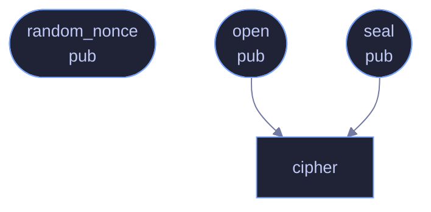

<!-- GENERATED by tools/docs/generate.py from the doc comments in the source. Do not edit: edit the .rs file and run the generator. -->

# `crates/veilvoice-crypto/src/aead.rs`

[[veilvoice-crypto|Crate-veilvoice-crypto]] &middot; 168 lines &middot; [read the source](https://github.com/tilas01/veilvoice/blob/main/crates/veilvoice-crypto/src/aead.rs)

## Contents

- [What calls what](#what-calls-what)
- [Items](#items)

Authenticated encryption with XChaCha20-Poly1305.

XChaCha20 rather than plain ChaCha20 because its 192-bit nonce can be drawn
at random with no practical collision risk. The 96-bit nonce of RFC 8439
ChaCha20-Poly1305 requires a counter and careful state tracking to stay
unique across runs; getting that wrong is catastrophic, and a random
192-bit nonce removes the failure mode entirely.

Every call is authenticated over associated data as well as the plaintext,
which is how the container header in `crate::container` is bound to its
ciphertext: flipping a bit in the stored KDF parameters produces a
decryption failure rather than a silently different key.

## What calls what

## Items

| Item | Line | Documentation |
|---|---:|---|
| `NONCE_LEN` pub const | [20](https://github.com/tilas01/veilvoice/blob/main/crates/veilvoice-crypto/src/aead.rs#L20) | Nonce length for XChaCha20-Poly1305, in bytes. |
| `TAG_LEN` pub const | [22](https://github.com/tilas01/veilvoice/blob/main/crates/veilvoice-crypto/src/aead.rs#L22) | Poly1305 authentication tag length, in bytes. |
| `random_nonce` pub fn | [25](https://github.com/tilas01/veilvoice/blob/main/crates/veilvoice-crypto/src/aead.rs#L25) | Draw a fresh random nonce from the OS CSPRNG. |
| `cipher` fn | [31](https://github.com/tilas01/veilvoice/blob/main/crates/veilvoice-crypto/src/aead.rs#L31) |  |
| `seal` pub fn | [41](https://github.com/tilas01/veilvoice/blob/main/crates/veilvoice-crypto/src/aead.rs#L41) | Encrypt plaintext, authenticating aad alongside it. |
| `open` pub fn | [60](https://github.com/tilas01/veilvoice/blob/main/crates/veilvoice-crypto/src/aead.rs#L60) | Decrypt and verify. |
