<!-- GENERATED by tools/docs/generate.py from the doc comments in the source. Do not edit: edit the .rs file and run the generator. -->

# `crates/veilvoice-crypto/src/amnesia.rs`

[[veilvoice-crypto|Crate-veilvoice-crypto]] &middot; 327 lines &middot; [read the source](https://github.com/tilas01/veilvoice/blob/main/crates/veilvoice-crypto/src/amnesia.rs)

## Contents

- [No unsafe, even here](#no-unsafe-even-here)
- [What locking does and does not buy](#what-locking-does-and-does-not-buy)
- [Why each secret owns whole pages](#why-each-secret-owns-whole-pages)
- [Why the lock is not held by an RAII guard](#why-the-lock-is-not-held-by-an-raii-guard)
- [In plain words](#in-plain-words)
  - [What calls what](#what-calls-what)
  - [Items](#items)

Amnesic secret storage: page-locked, zeroized, and never printed.

# No `unsafe`, even here

Locking pages out of the swap file is a raw syscall, `VirtualLock` on
Windows and `mlock` on Unix, and it is the one place a project like this
usually has to reach for `unsafe`. It does not here: the `region` crate
exposes a safe, cross-platform wrapper. VeilVoice therefore contains **no
`unsafe` code at all**, and every crate keeps `#![forbid(unsafe_code)]`.

# What locking does and does not buy

Locking keeps key material out of the page file, so a secret cannot be
recovered later by reading swap off the disk. It does **not** protect against
an attacker who can already read this process's memory, and it does not
survive hibernation, which writes RAM to disk wholesale. Locking can also
fail outright, because unprivileged Linux users get a small
`RLIMIT_MEMLOCK` budget, so it is best-effort hardening and never a
precondition.
`Secret::is_locked` reports what actually happened, so the UI can tell the
user the truth rather than imply a guarantee that was not obtained.

Zeroization, by contrast, always happens.

# Why each secret owns whole pages

Locking has *page* granularity, not byte granularity. If two secrets share a
4 KiB page, both lock it, and the first one dropped unlocks the page out from
under the second, which is still live and now swappable.

Each `Secret` therefore over-allocates and locks a page-aligned,
page-sized span lying entirely within its own allocation. No other allocation
can occupy those bytes, so none can be inside those pages: lock and unlock
are exact, and locking a secret never drags unrelated data into physical
memory alongside it.

# Why the lock is not held by an RAII guard

`region::lock` hands back a guard that unlocks on drop, but its destructor
**panics** if unlocking fails, and unlocking can fail for reasons that are
nobody's fault: Windows does not reference-count `VirtualLock` and may drop
pages from a process working set on its own, after which `VirtualUnlock`
reports `ERROR_NOT_LOCKED`. A type whose entire job is holding key material
must not abort the process while being dropped. The lock is released
explicitly instead, and a failure to unlock is ignored: it leaves pages
pinned, which is harmless, rather than unwinding out of a destructor.

# In plain words

A place to hold a passphrase or a key while it is being used, which tries hard
to forget it afterwards.

It asks the operating system not to write that memory out to disk, wipes it as
soon as it is finished with, and refuses to print itself. That last one matters
more than it sounds: secrets most often escape not by being stolen but by
appearing in an error message or a log that somebody later sends on.

Comparisons take the same amount of time whether or not they match, so nothing
is given away by how long an answer took.

## What this file contains

327 lines defining **13 functions** (9 public), **1 type** and **0 constants**. Everything below is read out of the source, so it cannot disagree with the code.

**The types it owns.**

- `struct Secret` (line 71) -- A byte buffer holding key material.

**What happens when it runs.** These are the ways in: public, and nothing else in this file calls them, so they are what an outside caller reaches first.

- `Secret::new` (line 83) -- Wrap bytes, taking ownership and wiping the caller's copy.
  - reaches: `zeroed`
- `Secret::random` (line 127) -- Fill len bytes from the operating-system CSPRNG.
  - reaches: `zeroed`
- `Secret::is_locked` (line 138) -- Whether the pages were successfully locked out of swap.
- `Secret::len` (line 143) -- Length in bytes.
- `Secret::is_empty` (line 148) -- Whether the secret is empty.
- `Secret::expose_mut` (line 159) -- Borrow mutably, for filling in place.
- `Secret::wipe` (line 167) -- Wipe the contents now, before the value goes out of scope.

## What calls what

_Colour key: **entry** -- a way in: public, and nothing in this file calls it; **api** -- public, and also used inside this file; **helper** -- private to this file._

  

The same graph as Mermaid source

```mermaid
%%{init: {"theme":"base","themeVariables":{"background":"#1a1b26","primaryColor":"#1f2335","primaryTextColor":"#c0caf5","primaryBorderColor":"#7aa2f7","secondaryColor":"#16161e","tertiaryColor":"#16161e","lineColor":"#737aa2","textColor":"#c0caf5","mainBkg":"#1f2335","nodeBorder":"#7aa2f7","clusterBkg":"#16161e","clusterBorder":"#2f3549","fontFamily":"ui-monospace, SFMono-Regular, Consolas, monospace","fontSize":"14px"}}}%%
flowchart TD
    n_new(["Secret::new<br/>line 83"])
    n_zeroed["Secret::zeroed<br/>line 91"]
    n_random(["Secret::random<br/>line 127"])
    n_is_locked(["Secret::is_locked<br/>line 138"])
    n_len(["Secret::len<br/>line 143"])
    n_is_empty(["Secret::is_empty<br/>line 148"])
    n_expose["Secret::expose<br/>line 154"]
    n_expose_mut(["Secret::expose_mut<br/>line 159"])
    n_wipe(["Secret::wipe<br/>line 167"])
    n_drop["Secret::drop<br/>line 173"]
    n_clone["Secret::clone<br/>line 184"]
    n_eq["Secret::eq<br/>line 194"]
    n_fmt["Secret::fmt<br/>line 203"]
    n_clone --> n_expose
    n_clone --> n_zeroed
    n_eq --> n_expose
    n_new --> n_zeroed
    n_random --> n_zeroed
    click n_new href "https://github.com/tilas01/veilvoice/blob/main/crates/veilvoice-crypto/src/amnesia.rs#L83" "open the source"
    click n_zeroed href "https://github.com/tilas01/veilvoice/blob/main/crates/veilvoice-crypto/src/amnesia.rs#L91" "open the source"
    click n_random href "https://github.com/tilas01/veilvoice/blob/main/crates/veilvoice-crypto/src/amnesia.rs#L127" "open the source"
    click n_is_locked href "https://github.com/tilas01/veilvoice/blob/main/crates/veilvoice-crypto/src/amnesia.rs#L138" "open the source"
    click n_len href "https://github.com/tilas01/veilvoice/blob/main/crates/veilvoice-crypto/src/amnesia.rs#L143" "open the source"
    click n_is_empty href "https://github.com/tilas01/veilvoice/blob/main/crates/veilvoice-crypto/src/amnesia.rs#L148" "open the source"
    click n_expose href "https://github.com/tilas01/veilvoice/blob/main/crates/veilvoice-crypto/src/amnesia.rs#L154" "open the source"
    click n_expose_mut href "https://github.com/tilas01/veilvoice/blob/main/crates/veilvoice-crypto/src/amnesia.rs#L159" "open the source"
    click n_wipe href "https://github.com/tilas01/veilvoice/blob/main/crates/veilvoice-crypto/src/amnesia.rs#L167" "open the source"
    click n_drop href "https://github.com/tilas01/veilvoice/blob/main/crates/veilvoice-crypto/src/amnesia.rs#L173" "open the source"
    click n_clone href "https://github.com/tilas01/veilvoice/blob/main/crates/veilvoice-crypto/src/amnesia.rs#L184" "open the source"
    click n_eq href "https://github.com/tilas01/veilvoice/blob/main/crates/veilvoice-crypto/src/amnesia.rs#L194" "open the source"
    click n_fmt href "https://github.com/tilas01/veilvoice/blob/main/crates/veilvoice-crypto/src/amnesia.rs#L203" "open the source"
    classDef entry fill:#1f2335,stroke:#7aa2f7,color:#c0caf5
    class n_new,n_random,n_is_locked,n_len,n_is_empty,n_expose_mut,n_wipe entry
    classDef api fill:#1f2335,stroke:#7dcfff,color:#c0caf5
    class n_zeroed,n_expose api
    classDef helper fill:#1f2335,stroke:#bb9af7,color:#c0caf5
    class n_drop,n_clone,n_eq,n_fmt helper
```

## Items

| Item | Line | Documentation |
|---|---:|---|
| `Secret` pub struct | [71](https://github.com/tilas01/veilvoice/blob/main/crates/veilvoice-crypto/src/amnesia.rs#L71) | A byte buffer holding key material. |
| `Secret::new` pub fn | [83](https://github.com/tilas01/veilvoice/blob/main/crates/veilvoice-crypto/src/amnesia.rs#L83) | Wrap bytes, taking ownership and wiping the caller's copy. |
| `Secret::zeroed` pub fn | [91](https://github.com/tilas01/veilvoice/blob/main/crates/veilvoice-crypto/src/amnesia.rs#L91) | Allocate len zero bytes, ready to be filled in place. |
| `Secret::random` pub fn | [127](https://github.com/tilas01/veilvoice/blob/main/crates/veilvoice-crypto/src/amnesia.rs#L127) | Fill len bytes from the operating-system CSPRNG. |
| `Secret::is_locked` pub fn | [138](https://github.com/tilas01/veilvoice/blob/main/crates/veilvoice-crypto/src/amnesia.rs#L138) | Whether the pages were successfully locked out of swap. |
| `Secret::len` pub fn | [143](https://github.com/tilas01/veilvoice/blob/main/crates/veilvoice-crypto/src/amnesia.rs#L143) | Length in bytes. |
| `Secret::is_empty` pub fn | [148](https://github.com/tilas01/veilvoice/blob/main/crates/veilvoice-crypto/src/amnesia.rs#L148) | Whether the secret is empty. |
| `Secret::expose` pub fn | [154](https://github.com/tilas01/veilvoice/blob/main/crates/veilvoice-crypto/src/amnesia.rs#L154) | Borrow the raw bytes. |
| `Secret::expose_mut` pub fn | [159](https://github.com/tilas01/veilvoice/blob/main/crates/veilvoice-crypto/src/amnesia.rs#L159) | Borrow mutably, for filling in place. |
| `Secret::wipe` pub fn | [167](https://github.com/tilas01/veilvoice/blob/main/crates/veilvoice-crypto/src/amnesia.rs#L167) | Wipe the contents now, before the value goes out of scope. |
| `Secret::drop` fn | [173](https://github.com/tilas01/veilvoice/blob/main/crates/veilvoice-crypto/src/amnesia.rs#L173) |  |
| `Secret::clone` fn | [184](https://github.com/tilas01/veilvoice/blob/main/crates/veilvoice-crypto/src/amnesia.rs#L184) |  |
| `Secret::eq` fn | [194](https://github.com/tilas01/veilvoice/blob/main/crates/veilvoice-crypto/src/amnesia.rs#L194) |  |
| `Secret::fmt` fn | [203](https://github.com/tilas01/veilvoice/blob/main/crates/veilvoice-crypto/src/amnesia.rs#L203) |  |
