<!-- GENERATED by tools/docs/generate.py from the doc comments in the source. Do not edit: edit the .rs file and run the generator. -->

# `crates/veilvoice-crypto/examples/seal_and_open.rs`

[[veilvoice-crypto|Crate-veilvoice-crypto]] &middot; 70 lines &middot; [read the source](https://github.com/tilas01/veilvoice/blob/main/crates/veilvoice-crypto/examples/seal_and_open.rs)

## Contents

- [What calls what](#what-calls-what)
- [Items](#items)

> This file has no `//!` module documentation yet.

## What calls what

```mermaid
%%{init: {"theme":"base","themeVariables":{"background":"#1a1b26","primaryColor":"#1f2335","primaryTextColor":"#c0caf5","primaryBorderColor":"#7aa2f7","secondaryColor":"#16161e","tertiaryColor":"#16161e","lineColor":"#737aa2","textColor":"#c0caf5","mainBkg":"#1f2335","nodeBorder":"#7aa2f7","clusterBkg":"#16161e","clusterBorder":"#2f3549","fontFamily":"ui-monospace, SFMono-Regular, Consolas, monospace","fontSize":"14px"}}}%%
flowchart TD
    n_main["main"]
```

## Items

| Item | Line | Documentation |
|---|---:|---|
| `main` fn | [14](https://github.com/tilas01/veilvoice/blob/main/crates/veilvoice-crypto/examples/seal_and_open.rs#L14) |  |
