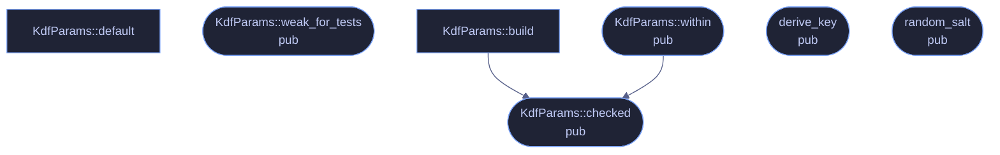

# `crates/veilvoice-crypto/src/kdf.rs`

[[veilvoice-crypto|Crate-veilvoice-crypto]] &middot; 353 lines &middot; [read the source](https://github.com/tilas01/veilvoice/blob/main/crates/veilvoice-crypto/src/kdf.rs)

## Contents

- [What calls what](#what-calls-what)
- [Items](#items)

Password-based key derivation with Argon2id.

Argon2id is the memory-hard KDF recommended by RFC 9106 and the OWASP
password-storage guidance; the `id` variant resists both GPU/ASIC
parallelism and the side-channel exposure of pure Argon2i.

Parameters travel *with* the ciphertext rather than being compiled in, so a
file encrypted today still opens after the defaults are raised, and a user
on a small machine can lower the memory cost without forking the format.

## What calls what

## Items

| Item | Line | Documentation |
|---|---:|---|
| `KdfParams` pub struct | [17](https://github.com/tilas01/veilvoice/blob/main/crates/veilvoice-crypto/src/kdf.rs#L17) | Argon2id cost parameters. |
| `KdfParams::default` fn | [31](https://github.com/tilas01/veilvoice/blob/main/crates/veilvoice-crypto/src/kdf.rs#L31) | RFC 9106's "first recommended" profile: 2 GiB is the second option, but 256 MiB with three passes is the sweet spot for an interactive desktop unlock — strong against offline cracking while still opening a file in well under a second on ordinary hardware. |
| `KdfParams::weak_for_tests` pub fn | [44](https://github.com/tilas01/veilvoice/blob/main/crates/veilvoice-crypto/src/kdf.rs#L44) | A deliberately cheap profile for tests and low-memory devices. |
| `KdfParams::MAX_P_COST` const | [53](https://github.com/tilas01/veilvoice/blob/main/crates/veilvoice-crypto/src/kdf.rs#L53) | Argon2's own documented ceiling on parallelism: 2^24 - 1. |
| `KdfParams::MAX_M_COST` pub const | [74](https://github.com/tilas01/veilvoice/blob/main/crates/veilvoice-crypto/src/kdf.rs#L74) | The largest memory cost this build will attempt, in KiB — 4 GiB. |
| `KdfParams::UNATTENDED_MAX_M_COST` pub const | [90](https://github.com/tilas01/veilvoice/blob/main/crates/veilvoice-crypto/src/kdf.rs#L90) | A ceiling for a caller with nobody watching. |
| `KdfParams::within` pub fn | [102](https://github.com/tilas01/veilvoice/blob/main/crates/veilvoice-crypto/src/kdf.rs#L102) | Check the costs against a caller-chosen memory ceiling as well as the built-in one. |
| `KdfParams::checked` pub fn | [131](https://github.com/tilas01/veilvoice/blob/main/crates/veilvoice-crypto/src/kdf.rs#L131) | Check the costs are ones Argon2 can accept, before handing them to it. |
| `KdfParams::build` fn | [151](https://github.com/tilas01/veilvoice/blob/main/crates/veilvoice-crypto/src/kdf.rs#L151) | Reject values Argon2 cannot accept, so a corrupt header fails loudly rather than panicking deep inside the KDF. |
| `SALT_LEN` pub const | [160](https://github.com/tilas01/veilvoice/blob/main/crates/veilvoice-crypto/src/kdf.rs#L160) | Length of the salt stored in an encrypted container. |
| `KEY_LEN` pub const | [162](https://github.com/tilas01/veilvoice/blob/main/crates/veilvoice-crypto/src/kdf.rs#L162) | Length of a derived symmetric key. |
| `derive_key` pub fn | [168](https://github.com/tilas01/veilvoice/blob/main/crates/veilvoice-crypto/src/kdf.rs#L168) | Derive a 32-byte key from password and salt. |
| `random_salt` pub fn | [181](https://github.com/tilas01/veilvoice/blob/main/crates/veilvoice-crypto/src/kdf.rs#L181) | Draw a fresh random salt from the OS CSPRNG. |
