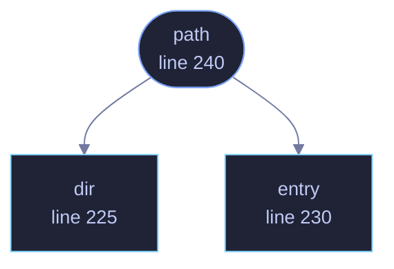

<!-- GENERATED by tools/docs/generate.py from the doc comments in the source. Do not edit: edit the .rs file and run the generator. -->

# `crates/veilvoice-crypto/src/layout.rs`

[[veilvoice-crypto|Crate-veilvoice-crypto]] &middot; 331 lines &middot; [read the source](https://github.com/tilas01/veilvoice/blob/main/crates/veilvoice-crypto/src/layout.rs)

## Contents

- [Why this is here and not in each module](#why-this-is-here-and-not-in-each-module)
- [It does not have to be complete for the reset to be](#it-does-not-have-to-be-complete-for-the-reset-to-be)
- [In plain words](#in-plain-words)
  - [What calls what](#what-calls-what)
  - [Items](#items)

Everything VeilVoice keeps between runs, in one list.

# Why this is here and not in each module

Every state file in this project is derived from `crate::lock::default_path`
and named where it is used: the settings file in the window's `prefs`, the
vaults in its `studio`, the allowlist in the command line's `capture`, the
mandate in `veilvoice-policy`. That is the right place for each of them and
this list does not replace any of it.

What it adds is the question none of those can answer on its own: **what is
all of it**. Two things ask that. The About tab lists where this copy keeps
things, so somebody knows what to back up. The reset offers to remove it, so
somebody can start again. Both have to say the same thing about the same
files, and a list assembled inside the window cannot be read by the command
line, which is where the reset also has to work.

# It does not have to be complete for the reset to be

That would be a promise this could not keep: a file added tomorrow in a
crate that has never heard of this module would be missed, and a reset that
silently leaves something behind is worse than no reset.

So the reset works by exclusion: it removes everything in the folder and
keeps what it was told to keep. This list is what puts a **name** on what is
about to go, not what decides that it goes. Something not listed here is
still removed; it is simply described as one of the files VeilVoice writes
rather than by what it is for.

# In plain words

One list of the things VeilVoice keeps on your computer, with a line each
about what they are, so the About tab and the reset both say the same thing
about the same files.

## What this file contains

331 lines defining **3 functions** (3 public), **2 types** and **1 constant**. Everything below is read out of the source, so it cannot disagree with the code.

**The types it owns.**

- `enum Item` (line 44) -- One thing VeilVoice keeps between runs.
- `struct Entry` (line 72) -- One entry: what it is called, what it is, and what losing it costs.

**What happens when it runs.** These are the ways in: public, and nothing else in this file calls them, so they are what an outside caller reaches first.

- `path` (line 240) -- Where one thing is, if this platform says where anything is.
  - reaches: `dir`, `entry`

## What calls what

_Colour key: **entry** -- a way in: public, and nothing in this file calls it; **api** -- public, and also used inside this file._

  

The same graph as Mermaid source

## Items

| Item | Line | Documentation |
|---|---:|---|
| `Item` pub enum | [44](https://github.com/tilas01/veilvoice/blob/main/crates/veilvoice-crypto/src/layout.rs#L44) | One thing VeilVoice keeps between runs. |
| `Entry` pub struct | [72](https://github.com/tilas01/veilvoice/blob/main/crates/veilvoice-crypto/src/layout.rs#L72) | One entry: what it is called, what it is, and what losing it costs. |
| `ALL` pub const | [103](https://github.com/tilas01/veilvoice/blob/main/crates/veilvoice-crypto/src/layout.rs#L103) | Every named thing, in the order a person meets it. |
| `dir` pub fn | [225](https://github.com/tilas01/veilvoice/blob/main/crates/veilvoice-crypto/src/layout.rs#L225) | The folder all of this is in, if this platform says where one is. |
| `entry` pub fn | [230](https://github.com/tilas01/veilvoice/blob/main/crates/veilvoice-crypto/src/layout.rs#L230) | The entry for one thing. |
| `path` pub fn | [240](https://github.com/tilas01/veilvoice/blob/main/crates/veilvoice-crypto/src/layout.rs#L240) | Where one thing is, if this platform says where anything is. |
