<!-- GENERATED by tools/docs/generate.py from the doc comments in the source. Do not edit: edit the .rs file and run the generator. -->

# `crates/veilvoice-crypto/src/lock.rs`

[[veilvoice-crypto|Crate-veilvoice-crypto]] &middot; 2250 lines &middot; [read the source](https://github.com/tilas01/veilvoice/blob/main/crates/veilvoice-crypto/src/lock.rs)

## Contents

- [What this is worth, stated before anything else](#what-this-is-worth-stated-before-anything-else)
- [Why a verifier and not a key](#why-a-verifier-and-not-a-key)
- [The tag, and the one tamper claim this file can honestly make](#the-tag-and-the-one-tamper-claim-this-file-can-honestly-make)
- [Rate limiting](#rate-limiting)
- [Separate from the recording password](#separate-from-the-recording-password)
- [In plain words](#in-plain-words)
  - [What calls what](#what-calls-what)
  - [Items](#items)

The application lock: an Argon2id password verifier with a rate limit.

# What this is worth, stated before anything else

**This is not a security boundary against someone holding the disk.** It
cannot be. A local application has nowhere to hide a secret from the machine
it runs on: whoever can read this file can also delete it, and deleting it
removes the lock. That is not a defect in the implementation, it is what a
local lock *is*.

What it does buy is real and worth having: someone who picks up your unlocked
computer, such as a flatmate, a colleague or a border officer with your
session open,
cannot open VeilVoice, see which files you have processed, or start a live
scramble. That is the threat this defends against, and `SCOPE` says so in
the words the user sees.

If the threat is an attacker with the disk, the answer is full-volume
encryption (LUKS, BitLocker, FileVault) plus `crate::container` for the
recordings themselves. Neither of those is replaced by this module.

# Why a verifier and not a key

The lock stores `Argon2id(domain ‖ password, salt)`, split by HKDF into a
verifier and a tag key, and compares the verifier in constant time. It
derives no key that encrypts anything, and that is still true of this
module after roadmap item 86.

What changed is one level up. The desktop application can now be told to
seal every recording it writes *with the app-lock passphrase*, and it does
that through `crate::container` in the ordinary way, with a fresh salt
per file. So the recordings do not depend on this file: delete the lock and
they still open, given the passphrase. Nothing here holds a key to them and
nothing here can.

The property that is given up by switching that on is not cryptographic, it
is human, and it belongs in the interface rather than in a comment: one
passphrase then opens the application and the archive together. The default
is still two separate secrets, and `docs/USER_GUIDE.md` section 5.4 states
the trade in the words a user reads.

The stored verifier is a password hash sitting on disk in the clear, and
must be treated like one. Argon2id at the default cost (256 MiB, t=3, p=4)
makes an offline attack expensive per guess, which matters for a decent
passphrase and does not save a bad one.

# The tag, and the one tamper claim this file can honestly make

Every record carries a 16-byte authentication tag over all the bytes before
it, keyed by a value that exists only while a correct passphrase is in
memory. The tag key is the second half of one Argon2id run, split from the
verifier by HKDF, so publishing the verifier, which the file does by
sitting on disk, says nothing about the tag key.

That buys exactly one thing, and it is worth naming precisely. Somebody who
edits this file without knowing the passphrase cannot leave the edit
looking authentic. Resetting the failure counter to zero, winding the
last-failure timestamp back to escape a wait, or dropping the Argon2id cost
so that a guess is cheap. All three are edits, and all three are caught at
the next successful unlock, because that is the moment the tag key exists.

It buys nothing at all against the two attacks people expect it to stop.
Deleting the file still removes the lock. Replacing the file wholesale with
a lock the attacker created still lets the attacker in, because their own
record is authentic under *their* passphrase. `crate::vault` answers the
first with a second copy and answers the second not at all.

The tamper flag, once raised, is stored and is cleared only by an unlock
that also proves the passphrase. So the report survives a restart, and the
person who caused it cannot dismiss it.

# Rate limiting

Wrong attempts are counted and the count is **persisted**, so killing the
process does not hand an attacker a fresh budget. After three free attempts
the wait doubles: 5 s, 10 s, 20 s … capped at fifteen minutes.

The counter is stored in the same unauthenticated file as the verifier, and
the wait is measured against the system clock. Someone who can edit the file
or move the clock defeats both. Again: casual access, not the disk.

# Separate from the recording password

The password that unlocks the app and the password that encrypts recordings
are two different passwords, on purpose, so that unlocking the app is not the
same act as unsealing everything it has ever written. To make that structural
rather than merely conventional, the verifier is derived over a domain-
separated input, so the same passphrase used in both places still produces
unrelated values.

# In plain words

The lock on the application window.

It asks for a passphrase before VeilVoice will open, and it slows down after
repeated wrong answers so that guessing is not worth trying.

**It is not protection against somebody who has your disk.** It stops the
person who picks up your unlocked laptop, and that is genuinely worth having,
but anybody who can read the files directly is not stopped by a program
deciding whether to show you a window. Encrypting your recordings is what
protects them; this protects the session.

## What this file contains

2250 lines defining **49 functions** (34 public), **3 types** and **16 constants**. Everything below is read out of the source, so it cannot disagree with the code.

**The types it owns.**

- `struct AppLock` (line 191) -- A password verifier plus its attempt history.
- `struct LockStore` (line 645) -- An AppLock bound to a file, which is persisted after every attempt.
- `enum Backing` (line 661) -- Where a LockStore keeps its record.

**What happens when it runs.** These are the ways in: public, and nothing else in this file calls them, so they are what an outside caller reaches first.

- `AppLock::create` (line 223) -- Create a lock for password.
  - reaches: `derive_pair`, `derive_keys`
- `AppLock::store_key` (line 255) -- Derive the key that names and opens the obfuscated program folder.
  - reaches: `derive_keys`
- `AppLock::same_secret_as` (line 307) -- Whether two records hold the same stored password.
- `AppLock::tampered` (line 319) -- Whether a record has been found edited by somebody without the passphrase, at any point since this was last cleared.
- `AppLock::acknowledge` (line 327) -- Clear the tamper report, after proving the passphrase.
  - reaches: `verify`, `unix_now`, `verify_at`, `cooldown_at`, `derive_pair`, `tag_matches`, `delay_secs`, `derive_keys`, `tag`, `body`
- `AppLock::cooldown` (line 361) -- Seconds still to wait before another attempt is accepted.
  - reaches: `cooldown_at`, `unix_now`, `delay_secs`
- `AppLock::failures` (line 378) -- Consecutive failed attempts recorded so far.
- `AppLock::params` (line 383) -- The Argon2id cost this lock was created with.
- `AppLock::retag` (line 421) -- Draw a fresh nonce and re-tag the record under password.
  - reaches: `derive_pair`, `tag`, `derive_keys`, `body`
- `AppLock::to_bytes` (line 452) -- Serialise exactly as it appears on disk.
  - reaches: `body`
- `LockStore::open` (line 681) -- Load the lock at path, or Ok(None) if no lock is configured there.
  - reaches: `parse`
- `LockStore::create` (line 703) -- Create a lock at path, refusing to overwrite one already there.
  - reaches: `derive_pair`, `derive_keys`
- `LockStore::tampered` (line 744) -- Whether the stored record has been found edited by somebody without the passphrase.
- `LockStore::acknowledge` (line 756) -- Clear the tamper report, after proving the passphrase, and persist that.
  - reaches: `verify`, `unix_now`, `verify_at`, `cooldown_at`, `derive_pair`, `tag_matches`, `delay_secs`, `derive_keys`, `tag`, `body`
- `LockStore::report_tamper` (line 771) -- Raise the tamper report from outside, and persist it if the passphrase allows.
- `LockStore::change_password` (line 776) -- Replace the password, after proving the current one.
  - reaches: `save`, `unlock`, `write_private`
- `LockStore::remove` (line 800) -- Remove the lock, after proving the password.
  - reaches: `unlock`, `save`, `write_private`
- `LockStore::cooldown` (line 809) -- Seconds still to wait before another attempt is accepted.
  - reaches: `cooldown_at`, `unix_now`, `delay_secs`
- `LockStore::store_key` (line 818) -- Derive the key that names and opens the obfuscated program folder.
  - reaches: `derive_keys`
- `LockStore::failures` (line 823) -- Consecutive failed attempts recorded so far.
- `LockStore::path` (line 829) -- Where this lock is stored.
- `LockStore::every_copy_current` (line 856) -- Whether the last write reached every copy.
- `open_default` (line 873) -- Open the lock at the default location, wherever this platform keeps it.
  - reaches: `default_dir`, `open_in`, `default_path`, `read_legacy`, `choose_base`, `config_path`, `portable_dir`, `parse`
- `create_default` (line 942) -- Create a lock at the default location, refusing to replace one already there.
  - reaches: `create_in`, `default_dir`, `read_legacy`, `default_path`, `parse`, `choose_base`, `config_path`, `portable_dir`
- `platform_dir` (line 1093) -- The platform's own configuration directory, whether or not it is the one in use.
  - reaches: `config_path`
- `is_portable` (line 1112) -- Whether this copy is keeping its state beside itself.
  - reaches: `portable_dir`

## What calls what

_22 of 43 functions are drawn; the diagram is bounded at 22 so it stays readable._

_Colour key: **entry** -- a way in: public, and nothing in this file calls it; **api** -- public, and also used inside this file._

  

The same graph as Mermaid source

```mermaid
%%{init: {"theme":"base","themeVariables":{"background":"#1a1b26","primaryColor":"#1f2335","primaryTextColor":"#c0caf5","primaryBorderColor":"#7aa2f7","secondaryColor":"#16161e","tertiaryColor":"#16161e","lineColor":"#737aa2","textColor":"#c0caf5","mainBkg":"#1f2335","nodeBorder":"#7aa2f7","clusterBkg":"#16161e","clusterBorder":"#2f3549","fontFamily":"ui-monospace, SFMono-Regular, Consolas, monospace","fontSize":"14px"}}}%%
flowchart TD
    n_delay_secs["delay_secs<br/>line 166"]
    n_create(["AppLock::create<br/>line 223"])
    n_store_key(["AppLock::store_key<br/>line 255"])
    n_verify["AppLock::verify<br/>line 265"]
    n_acknowledge(["AppLock::acknowledge<br/>line 327"])
    n_cooldown(["AppLock::cooldown<br/>line 361"])
    n_retag(["AppLock::retag<br/>line 421"])
    n_to_bytes(["AppLock::to_bytes<br/>line 452"])
    n_parse["AppLock::parse<br/>line 484"]
    n_open(["LockStore::open<br/>line 681"])
    n_create(["LockStore::create<br/>line 703"])
    n_unlock["LockStore::unlock<br/>line 724"]
    n_acknowledge(["LockStore::acknowledge<br/>line 756"])
    n_change_password(["LockStore::change_password<br/>line 776"])
    n_remove(["LockStore::remove<br/>line 800"])
    n_cooldown(["LockStore::cooldown<br/>line 809"])
    n_store_key(["LockStore::store_key<br/>line 818"])
    n_open_default(["open_default<br/>line 873"])
    n_open_in["open_in<br/>line 886"]
    n_create_default(["create_default<br/>line 942"])
    n_create_in["create_in<br/>line 952"]
    n_default_dir["default_dir<br/>line 1082"]
    n_acknowledge --> n_verify
    n_change_password --> n_unlock
    n_create_default --> n_create_in
    n_create_default --> n_default_dir
    n_open --> n_parse
    n_open_default --> n_default_dir
    n_open_default --> n_open_in
    n_remove --> n_unlock
    click n_delay_secs href "https://github.com/tilas01/veilvoice/blob/main/crates/veilvoice-crypto/src/lock.rs#L166" "open the source"
    click n_create href "https://github.com/tilas01/veilvoice/blob/main/crates/veilvoice-crypto/src/lock.rs#L223" "open the source"
    click n_store_key href "https://github.com/tilas01/veilvoice/blob/main/crates/veilvoice-crypto/src/lock.rs#L255" "open the source"
    click n_verify href "https://github.com/tilas01/veilvoice/blob/main/crates/veilvoice-crypto/src/lock.rs#L265" "open the source"
    click n_acknowledge href "https://github.com/tilas01/veilvoice/blob/main/crates/veilvoice-crypto/src/lock.rs#L327" "open the source"
    click n_cooldown href "https://github.com/tilas01/veilvoice/blob/main/crates/veilvoice-crypto/src/lock.rs#L361" "open the source"
    click n_retag href "https://github.com/tilas01/veilvoice/blob/main/crates/veilvoice-crypto/src/lock.rs#L421" "open the source"
    click n_to_bytes href "https://github.com/tilas01/veilvoice/blob/main/crates/veilvoice-crypto/src/lock.rs#L452" "open the source"
    click n_parse href "https://github.com/tilas01/veilvoice/blob/main/crates/veilvoice-crypto/src/lock.rs#L484" "open the source"
    click n_open href "https://github.com/tilas01/veilvoice/blob/main/crates/veilvoice-crypto/src/lock.rs#L681" "open the source"
    click n_create href "https://github.com/tilas01/veilvoice/blob/main/crates/veilvoice-crypto/src/lock.rs#L703" "open the source"
    click n_unlock href "https://github.com/tilas01/veilvoice/blob/main/crates/veilvoice-crypto/src/lock.rs#L724" "open the source"
    click n_acknowledge href "https://github.com/tilas01/veilvoice/blob/main/crates/veilvoice-crypto/src/lock.rs#L756" "open the source"
    click n_change_password href "https://github.com/tilas01/veilvoice/blob/main/crates/veilvoice-crypto/src/lock.rs#L776" "open the source"
    click n_remove href "https://github.com/tilas01/veilvoice/blob/main/crates/veilvoice-crypto/src/lock.rs#L800" "open the source"
    click n_cooldown href "https://github.com/tilas01/veilvoice/blob/main/crates/veilvoice-crypto/src/lock.rs#L809" "open the source"
    click n_store_key href "https://github.com/tilas01/veilvoice/blob/main/crates/veilvoice-crypto/src/lock.rs#L818" "open the source"
    click n_open_default href "https://github.com/tilas01/veilvoice/blob/main/crates/veilvoice-crypto/src/lock.rs#L873" "open the source"
    click n_open_in href "https://github.com/tilas01/veilvoice/blob/main/crates/veilvoice-crypto/src/lock.rs#L886" "open the source"
    click n_create_default href "https://github.com/tilas01/veilvoice/blob/main/crates/veilvoice-crypto/src/lock.rs#L942" "open the source"
    click n_create_in href "https://github.com/tilas01/veilvoice/blob/main/crates/veilvoice-crypto/src/lock.rs#L952" "open the source"
    click n_default_dir href "https://github.com/tilas01/veilvoice/blob/main/crates/veilvoice-crypto/src/lock.rs#L1082" "open the source"
    classDef entry fill:#1f2335,stroke:#7aa2f7,color:#c0caf5
    class n_create,n_store_key,n_acknowledge,n_cooldown,n_retag,n_to_bytes,n_open,n_create,n_acknowledge,n_change_password,n_remove,n_cooldown,n_store_key,n_open_default,n_create_default entry
    classDef api fill:#1f2335,stroke:#7dcfff,color:#c0caf5
    class n_delay_secs,n_verify,n_parse,n_unlock,n_open_in,n_create_in,n_default_dir api
```

## Items

| Item | Line | Documentation |
|---|---:|---|
| `SCOPE` pub const | [114](https://github.com/tilas01/veilvoice/blob/main/crates/veilvoice-crypto/src/lock.rs#L114) | What the app lock protects against, and what it does not, in the words a front-end should show the user. |
| `MAGIC` pub const | [122](https://github.com/tilas01/veilvoice/blob/main/crates/veilvoice-crypto/src/lock.rs#L122) | Magic bytes at the start of a lock file. |
| `FORMAT_VERSION` pub const | [124](https://github.com/tilas01/veilvoice/blob/main/crates/veilvoice-crypto/src/lock.rs#L124) | Format version this build writes. |
| `LOCK_LEN` pub const | [126](https://github.com/tilas01/veilvoice/blob/main/crates/veilvoice-crypto/src/lock.rs#L126) | Exact size of a version 2 lock file, in bytes. |
| `LOCK_LEN_V1` pub const | [128](https://github.com/tilas01/veilvoice/blob/main/crates/veilvoice-crypto/src/lock.rs#L128) | Exact size of a version 1 lock file, which this build still reads. |
| `DOMAIN` const | [132](https://github.com/tilas01/veilvoice/blob/main/crates/veilvoice-crypto/src/lock.rs#L132) | Domain separator, so the app-lock secret can never coincide with a key derived from the same passphrase anywhere else in this crate. |
| `INFO_VERIFIER` const | [134](https://github.com/tilas01/veilvoice/blob/main/crates/veilvoice-crypto/src/lock.rs#L134) | HKDF label for the half of the derivation that is written to disk. |
| `INFO_TAG` const | [136](https://github.com/tilas01/veilvoice/blob/main/crates/veilvoice-crypto/src/lock.rs#L136) | HKDF label for the half that is not, and that authenticates the record. |
| `INFO_STORE` const | [146](https://github.com/tilas01/veilvoice/blob/main/crates/veilvoice-crypto/src/lock.rs#L146) | HKDF label for the obfuscated store key. |
| `TAG_LEN` const | [148](https://github.com/tilas01/veilvoice/blob/main/crates/veilvoice-crypto/src/lock.rs#L148) | Length of the record tag. |
| `BODY_LEN` const | [151](https://github.com/tilas01/veilvoice/blob/main/crates/veilvoice-crypto/src/lock.rs#L151) | Length of the tagged part of a record, which is also the offset of the nonce that follows it. |
| `FREE_ATTEMPTS` const | [154](https://github.com/tilas01/veilvoice/blob/main/crates/veilvoice-crypto/src/lock.rs#L154) | Failed attempts allowed before the wait starts. |
| `BASE_DELAY_SECS` const | [156](https://github.com/tilas01/veilvoice/blob/main/crates/veilvoice-crypto/src/lock.rs#L156) | The first enforced wait, in seconds. |
| `MAX_DELAY_SECS` const | [160](https://github.com/tilas01/veilvoice/blob/main/crates/veilvoice-crypto/src/lock.rs#L160) | The longest the wait ever gets. |
| `delay_secs` pub fn | [166](https://github.com/tilas01/veilvoice/blob/main/crates/veilvoice-crypto/src/lock.rs#L166) | How long to refuse the next attempt after failures consecutive failures. |
| `unix_now` fn | [179](https://github.com/tilas01/veilvoice/blob/main/crates/veilvoice-crypto/src/lock.rs#L179) | Seconds since the Unix epoch, negative before it. |
| `AppLock` pub struct | [191](https://github.com/tilas01/veilvoice/blob/main/crates/veilvoice-crypto/src/lock.rs#L191) | A password verifier plus its attempt history. |
| `AppLock::create` pub fn | [223](https://github.com/tilas01/veilvoice/blob/main/crates/veilvoice-crypto/src/lock.rs#L223) | Create a lock for password. |
| `AppLock::store_key` pub fn | [255](https://github.com/tilas01/veilvoice/blob/main/crates/veilvoice-crypto/src/lock.rs#L255) | Derive the key that names and opens the obfuscated program folder. |
| `AppLock::verify` pub fn | [265](https://github.com/tilas01/veilvoice/blob/main/crates/veilvoice-crypto/src/lock.rs#L265) | Check password, recording the outcome. |
| `AppLock::verify_at` fn | [269](https://github.com/tilas01/veilvoice/blob/main/crates/veilvoice-crypto/src/lock.rs#L269) |  |
| `AppLock::same_secret_as` pub fn | [307](https://github.com/tilas01/veilvoice/blob/main/crates/veilvoice-crypto/src/lock.rs#L307) | Whether two records hold the same stored password. |
| `AppLock::tampered` pub fn | [319](https://github.com/tilas01/veilvoice/blob/main/crates/veilvoice-crypto/src/lock.rs#L319) | Whether a record has been found edited by somebody without the passphrase, at any point since this was last cleared. |
| `AppLock::acknowledge` pub fn | [327](https://github.com/tilas01/veilvoice/blob/main/crates/veilvoice-crypto/src/lock.rs#L327) | Clear the tamper report, after proving the passphrase. |
| `AppLock::tag_matches` fn | [333](https://github.com/tilas01/veilvoice/blob/main/crates/veilvoice-crypto/src/lock.rs#L333) |  |
| `AppLock::tag` fn | [350](https://github.com/tilas01/veilvoice/blob/main/crates/veilvoice-crypto/src/lock.rs#L350) | The authentication tag over everything in the record before it. |
| `AppLock::cooldown` pub fn | [361](https://github.com/tilas01/veilvoice/blob/main/crates/veilvoice-crypto/src/lock.rs#L361) | Seconds still to wait before another attempt is accepted. |
| `AppLock::cooldown_at` fn | [365](https://github.com/tilas01/veilvoice/blob/main/crates/veilvoice-crypto/src/lock.rs#L365) |  |
| `AppLock::failures` pub fn | [378](https://github.com/tilas01/veilvoice/blob/main/crates/veilvoice-crypto/src/lock.rs#L378) | Consecutive failed attempts recorded so far. |
| `AppLock::params` pub fn | [383](https://github.com/tilas01/veilvoice/blob/main/crates/veilvoice-crypto/src/lock.rs#L383) | The Argon2id cost this lock was created with. |
| `AppLock::body` fn | [402](https://github.com/tilas01/veilvoice/blob/main/crates/veilvoice-crypto/src/lock.rs#L402) | The bytes the tag covers. |
| `AppLock::retag` pub fn | [421](https://github.com/tilas01/veilvoice/blob/main/crates/veilvoice-crypto/src/lock.rs#L421) | Draw a fresh nonce and re-tag the record under password. |
| `AppLock::to_bytes` pub fn | [452](https://github.com/tilas01/veilvoice/blob/main/crates/veilvoice-crypto/src/lock.rs#L452) | Serialise exactly as it appears on disk. |
| `AppLock::parse` pub fn | [484](https://github.com/tilas01/veilvoice/blob/main/crates/veilvoice-crypto/src/lock.rs#L484) | Parse a lock file, version 1 or version 2. |
| `derive_pair` fn | [602](https://github.com/tilas01/veilvoice/blob/main/crates/veilvoice-crypto/src/lock.rs#L602) | Derive the verifier and the tag key for password. |
| `derive_keys` fn | [617](https://github.com/tilas01/veilvoice/blob/main/crates/veilvoice-crypto/src/lock.rs#L617) | As derive_pair, and the store key with it. |
| `LockStore` pub struct | [645](https://github.com/tilas01/veilvoice/blob/main/crates/veilvoice-crypto/src/lock.rs#L645) | An AppLock bound to a file, which is persisted after every attempt. |
| `Backing` enum | [661](https://github.com/tilas01/veilvoice/blob/main/crates/veilvoice-crypto/src/lock.rs#L661) | Where a LockStore keeps its record. |
| `Backing::primary` fn | [667](https://github.com/tilas01/veilvoice/blob/main/crates/veilvoice-crypto/src/lock.rs#L667) |  |
| `LockStore::open` pub fn | [681](https://github.com/tilas01/veilvoice/blob/main/crates/veilvoice-crypto/src/lock.rs#L681) | Load the lock at path, or Ok(None) if no lock is configured there. |
| `LockStore::create` pub fn | [703](https://github.com/tilas01/veilvoice/blob/main/crates/veilvoice-crypto/src/lock.rs#L703) | Create a lock at path, refusing to overwrite one already there. |
| `LockStore::unlock` pub fn | [724](https://github.com/tilas01/veilvoice/blob/main/crates/veilvoice-crypto/src/lock.rs#L724) | Check password and persist the outcome. |
| `LockStore::tampered` pub fn | [744](https://github.com/tilas01/veilvoice/blob/main/crates/veilvoice-crypto/src/lock.rs#L744) | Whether the stored record has been found edited by somebody without the passphrase. |
| `LockStore::acknowledge` pub fn | [756](https://github.com/tilas01/veilvoice/blob/main/crates/veilvoice-crypto/src/lock.rs#L756) | Clear the tamper report, after proving the passphrase, and persist that. |
| `LockStore::report_tamper` pub fn | [771](https://github.com/tilas01/veilvoice/blob/main/crates/veilvoice-crypto/src/lock.rs#L771) | Raise the tamper report from outside, and persist it if the passphrase allows. |
| `LockStore::change_password` pub fn | [776](https://github.com/tilas01/veilvoice/blob/main/crates/veilvoice-crypto/src/lock.rs#L776) | Replace the password, after proving the current one. |
| `LockStore::remove` pub fn | [800](https://github.com/tilas01/veilvoice/blob/main/crates/veilvoice-crypto/src/lock.rs#L800) | Remove the lock, after proving the password. |
| `LockStore::cooldown` pub fn | [809](https://github.com/tilas01/veilvoice/blob/main/crates/veilvoice-crypto/src/lock.rs#L809) | Seconds still to wait before another attempt is accepted. |
| `LockStore::store_key` pub fn | [818](https://github.com/tilas01/veilvoice/blob/main/crates/veilvoice-crypto/src/lock.rs#L818) | Derive the key that names and opens the obfuscated program folder. |
| `LockStore::failures` pub fn | [823](https://github.com/tilas01/veilvoice/blob/main/crates/veilvoice-crypto/src/lock.rs#L823) | Consecutive failed attempts recorded so far. |
| `LockStore::path` pub fn | [829](https://github.com/tilas01/veilvoice/blob/main/crates/veilvoice-crypto/src/lock.rs#L829) | Where this lock is stored. |
| `LockStore::save` fn | [837](https://github.com/tilas01/veilvoice/blob/main/crates/veilvoice-crypto/src/lock.rs#L837) | Write the record, and say whether every copy of it is now current. |
| `LockStore::every_copy_current` pub fn | [856](https://github.com/tilas01/veilvoice/blob/main/crates/veilvoice-crypto/src/lock.rs#L856) | Whether the last write reached every copy. |
| `open_default` pub fn | [873](https://github.com/tilas01/veilvoice/blob/main/crates/veilvoice-crypto/src/lock.rs#L873) | Open the lock at the default location, wherever this platform keeps it. |
| `LEGACY_NAME` const | [879](https://github.com/tilas01/veilvoice/blob/main/crates/veilvoice-crypto/src/lock.rs#L879) | The name the lock had before the vault: one file, under the obvious name. |
| `open_in` pub fn | [886](https://github.com/tilas01/veilvoice/blob/main/crates/veilvoice-crypto/src/lock.rs#L886) | Open a vault-backed lock under base, adopting a pre-vault file if one is there. |
| `read_legacy` fn | [932](https://github.com/tilas01/veilvoice/blob/main/crates/veilvoice-crypto/src/lock.rs#L932) | Read a pre-vault lock file, if one is there. |
| `create_default` pub fn | [942](https://github.com/tilas01/veilvoice/blob/main/crates/veilvoice-crypto/src/lock.rs#L942) | Create a lock at the default location, refusing to replace one already there. |
| `create_in` pub fn | [952](https://github.com/tilas01/veilvoice/blob/main/crates/veilvoice-crypto/src/lock.rs#L952) | Create a vault-backed lock under base. |
| `write_private` fn | [978](https://github.com/tilas01/veilvoice/blob/main/crates/veilvoice-crypto/src/lock.rs#L978) | Write the lock file so it is owner-only from the moment it exists. |
| `config_path` fn | [1008](https://github.com/tilas01/veilvoice/blob/main/crates/veilvoice-crypto/src/lock.rs#L1008) | Where the lock file lives, given a platform and an environment. |
| `PORTABLE_DIR` pub const | [1041](https://github.com/tilas01/veilvoice/blob/main/crates/veilvoice-crypto/src/lock.rs#L1041) | The name of the folder that makes a copy of VeilVoice keep its state beside itself. |
| `portable_dir` fn | [1057](https://github.com/tilas01/veilvoice/blob/main/crates/veilvoice-crypto/src/lock.rs#L1057) | Where a portable copy keeps its state, when it is one. |
| `choose_base` fn | [1076](https://github.com/tilas01/veilvoice/blob/main/crates/veilvoice-crypto/src/lock.rs#L1076) | Which of the two locations a copy is using, given what is beside it and what the platform says. |
| `default_dir` pub fn | [1082](https://github.com/tilas01/veilvoice/blob/main/crates/veilvoice-crypto/src/lock.rs#L1082) | The configuration directory the vault keeps its files in, if the environment says where one is. |
| `platform_dir` pub fn | [1093](https://github.com/tilas01/veilvoice/blob/main/crates/veilvoice-crypto/src/lock.rs#L1093) | The platform's own configuration directory, whether or not it is the one in use. |
| `is_portable` pub fn | [1112](https://github.com/tilas01/veilvoice/blob/main/crates/veilvoice-crypto/src/lock.rs#L1112) | Whether this copy is keeping its state beside itself. |
| `default_path` pub fn | [1135](https://github.com/tilas01/veilvoice/blob/main/crates/veilvoice-crypto/src/lock.rs#L1135) | Where the lock file lives, if there is anywhere for it. |
