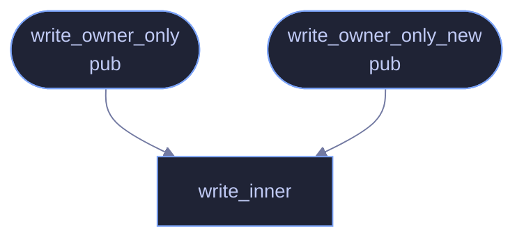

# `crates/veilvoice-crypto/src/privatefile.rs`

[[veilvoice-crypto|Crate-veilvoice-crypto]] &middot; 157 lines &middot; [read the source](https://github.com/tilas01/veilvoice/blob/main/crates/veilvoice-crypto/src/privatefile.rs)

## Contents

- [Why this is not std::fs::write plus a chmod](#why-this-is-not-stdfswrite-plus-a-chmod)
- [What this does not do](#what-this-does-not-do)
  - [What calls what](#what-calls-what)
  - [Items](#items)

Writing a file that only its owner can read.

Returns `std::io::Result` rather than this crate's [`Error`](crate::Error),
which is `Copy` and therefore cannot carry the underlying reason. A caller
reporting "could not write the key" is far more useful when it can say why.

# Why this is not `std::fs::write` plus a `chmod`

`std::fs::write` creates the file with the process umask, which on almost
every Unix system means `0644` -- world readable. Tightening it afterwards
with `set_permissions` leaves a window, however short, in which any other
local user can open the file and read all of it. For a file that exists
*because* its contents are sensitive, that window has no reason to exist:
`OpenOptions::mode` applies the permission at the moment of creation, before
any byte is written.

The audit found this pattern in three places -- the app-lock verifier, the
encrypted private key written by `veilvoice keygen`, and the plaintext a
recording is decrypted into. The verifier one was the worst, because it is
rewritten after *every* failed unlock attempt, so the window reopened on
each try. This module is the single answer to all of them.

# What this does not do

It is a Unix permission, not a security boundary against root, against
someone holding the disk, or against a backup client running as you. It
narrows one specific, avoidable exposure: another unprivileged user on the
same machine.

On Windows there is no `mode`. A file created under the user profile
inherits an ACL that already excludes other unprivileged users, and there is
no portable tightening to apply beyond that -- so on Windows this is an
ordinary write, and says so rather than implying a protection it did not
obtain.

## What calls what

## Items

| Item | Line | Documentation |
|---|---:|---|
| `write_owner_only` pub fn | [44](https://github.com/tilas01/veilvoice/blob/main/crates/veilvoice-crypto/src/privatefile.rs#L44) | Create path containing bytes, readable only by the current user. |
| `write_owner_only_new` pub fn | [55](https://github.com/tilas01/veilvoice/blob/main/crates/veilvoice-crypto/src/privatefile.rs#L55) | As write_owner_only, but fail if anything is already at path. |
| `write_inner` fn | [59](https://github.com/tilas01/veilvoice/blob/main/crates/veilvoice-crypto/src/privatefile.rs#L59) |  |
