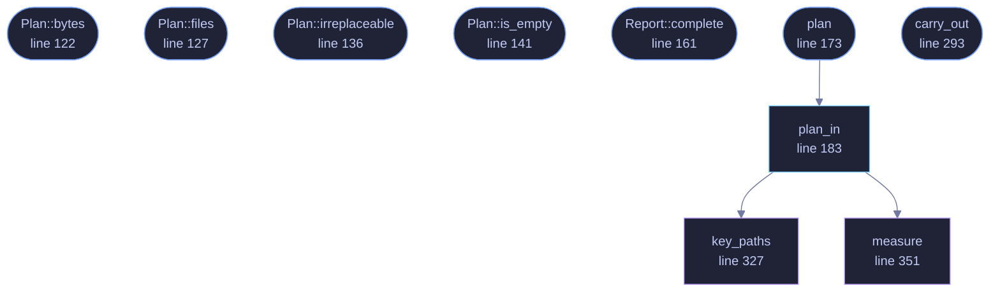

<!-- GENERATED by tools/docs/generate.py from the doc comments in the source. Do not edit: edit the .rs file and run the generator. -->

# `crates/veilvoice-crypto/src/reset.rs`

[[veilvoice-crypto|Crate-veilvoice-crypto]] &middot; 612 lines &middot; [read the source](https://github.com/tilas01/veilvoice/blob/main/crates/veilvoice-crypto/src/reset.rs)

## Contents

- [What a reset is for](#what-a-reset-is-for)
- [It works by exclusion, and that is the point](#it-works-by-exclusion-and-that-is-the-point)
- [Nothing happens until somebody has read it](#nothing-happens-until-somebody-has-read-it)
- [Keeping the keys](#keeping-the-keys)
- [What it does not pretend to do](#what-it-does-not-pretend-to-do)
- [In plain words](#in-plain-words)
  - [What calls what](#what-calls-what)
  - [Items](#items)

Putting this machine back to a new install.

# What a reset is for

Somebody has a VeilVoice that is wrong. A policy they no longer want, a
settings file that has been edited by hand, a folder full of vaults from a
job that is finished, a lock whose passphrase they have decided to change by
starting over. Until this existed the answer was "find the folder yourself
and delete the right things out of it", and that answer is a person deleting
the wrong file.

# It works by exclusion, and that is the point

A reset that removes a **list** of things leaves behind whatever was added
to the folder after the list was written, which is the failure mode of every
uninstaller that has ever left half of itself on a disk. So this removes
everything in the folder and keeps only what it was asked to keep.

`crate::layout` is what puts a name on each thing, so somebody can read
what they are about to lose. It does not decide what goes. Anything the
layout has never heard of is removed too, and described as one of the files
VeilVoice writes.

# Nothing happens until somebody has read it

`plan` only looks. It returns what would go, what would stay, how many
files and how many bytes, and whether anything in it is **irreplaceable**:
recordings, and colour schemes somebody wrote. That last answer is what a
front end turns into a typed confirmation, because a settings file has
defaults to come back to and a recording does not.

`carry_out` is the half that removes, and it takes a plan rather than a
directory, so the thing removed is the thing that was described.

# Keeping the keys

`Keep::Keys` leaves the app lock exactly as it is. That is the common case
and it is not a compromise: somebody resetting a misconfigured interface
wants their recordings afterwards, and the recordings are sealed with the
lock. Losing it would mean losing them, which is the opposite of what they
asked for.

What it keeps is the lock and nothing else. The vaults are removed either
way, because they are what "start again" means. A person who wants to keep
their recordings and their lock is not resetting; they are changing a
setting.

# What it does not pretend to do

**It deletes rather than erases.** The bytes go where deleted bytes go on
this filesystem, and `crate::shred` explains at length why overwriting
them is not the guarantee it sounds like on flash storage. A reset that
spent an hour overwriting a vault and still could not promise the blocks
were gone would be buying a feeling. Full-volume encryption is the answer to
that threat and it always was.

**It only touches this folder.** An administrator's copy of the lock, where
the platform allowed one, is under `/etc` and an ordinary user cannot remove
it. A reset that quietly left it behind would leave a lock that comes back
by itself on the next launch, from `crate::vault::Vault::load`'s own
restore, so the plan reports it by name and says what it needs.

# In plain words

Puts VeilVoice back to how it was the day you installed it. It shows you
everything it is about to remove, with how much of it there is, before it
removes anything, and it can leave your password and the recordings' key
alone if that is all you wanted.

## What this file contains

612 lines defining **10 functions** (8 public), **4 types** and **0 constants**. Everything below is read out of the source, so it cannot disagree with the code.

**The types it owns.**

- `enum Keep` (line 76) -- What a reset leaves behind.
- `struct Doomed` (line 87) -- One thing a reset would remove, in the words somebody can read.
- `struct Plan` (line 105) -- What a reset would do, before it does any of it.
- `struct Report` (line 148) -- What a reset did.

**What happens when it runs.** These are the ways in: public, and nothing else in this file calls them, so they are what an outside caller reaches first.

- `Plan::bytes` (line 122) -- How much would go altogether.
- `Plan::files` (line 127) -- How many files would go altogether.
- `Plan::irreplaceable` (line 136) -- Whether any of it is something nothing can put back.
- `Plan::is_empty` (line 141) -- Whether there is nothing to do.
- `Report::complete` (line 161) -- Whether everything the plan named is gone.
- `plan` (line 173) -- What this reset would do to the folder this copy is using.
  - reaches: `plan_in`, `key_paths`, `measure`
- `carry_out` (line 293) -- Remove what the plan named.

## What calls what

_Colour key: **entry** -- a way in: public, and nothing in this file calls it; **api** -- public, and also used inside this file; **helper** -- private to this file._

  

The same graph as Mermaid source

## Items

| Item | Line | Documentation |
|---|---:|---|
| `Keep` pub enum | [76](https://github.com/tilas01/veilvoice/blob/main/crates/veilvoice-crypto/src/reset.rs#L76) | What a reset leaves behind. |
| `Doomed` pub struct | [87](https://github.com/tilas01/veilvoice/blob/main/crates/veilvoice-crypto/src/reset.rs#L87) | One thing a reset would remove, in the words somebody can read. |
| `Plan` pub struct | [105](https://github.com/tilas01/veilvoice/blob/main/crates/veilvoice-crypto/src/reset.rs#L105) | What a reset would do, before it does any of it. |
| `Plan::bytes` pub fn | [122](https://github.com/tilas01/veilvoice/blob/main/crates/veilvoice-crypto/src/reset.rs#L122) | How much would go altogether. |
| `Plan::files` pub fn | [127](https://github.com/tilas01/veilvoice/blob/main/crates/veilvoice-crypto/src/reset.rs#L127) | How many files would go altogether. |
| `Plan::irreplaceable` pub fn | [136](https://github.com/tilas01/veilvoice/blob/main/crates/veilvoice-crypto/src/reset.rs#L136) | Whether any of it is something nothing can put back. |
| `Plan::is_empty` pub fn | [141](https://github.com/tilas01/veilvoice/blob/main/crates/veilvoice-crypto/src/reset.rs#L141) | Whether there is nothing to do. |
| `Report` pub struct | [148](https://github.com/tilas01/veilvoice/blob/main/crates/veilvoice-crypto/src/reset.rs#L148) | What a reset did. |
| `Report::complete` pub fn | [161](https://github.com/tilas01/veilvoice/blob/main/crates/veilvoice-crypto/src/reset.rs#L161) | Whether everything the plan named is gone. |
| `plan` pub fn | [173](https://github.com/tilas01/veilvoice/blob/main/crates/veilvoice-crypto/src/reset.rs#L173) | What this reset would do to the folder this copy is using. |
| `plan_in` pub fn | [183](https://github.com/tilas01/veilvoice/blob/main/crates/veilvoice-crypto/src/reset.rs#L183) | The same, for a folder named outright. |
| `carry_out` pub fn | [293](https://github.com/tilas01/veilvoice/blob/main/crates/veilvoice-crypto/src/reset.rs#L293) | Remove what the plan named. |
| `key_paths` fn | [327](https://github.com/tilas01/veilvoice/blob/main/crates/veilvoice-crypto/src/reset.rs#L327) | The app lock's own files: the index, and the two copies it names. |
| `measure` fn | [351](https://github.com/tilas01/veilvoice/blob/main/crates/veilvoice-crypto/src/reset.rs#L351) | How many files and how many bytes, counting inside a folder. |
