<!-- GENERATED by tools/docs/generate.py from the doc comments in the source. Do not edit: edit the .rs file and run the generator. -->


# `crates/veilvoice-crypto/src/studio.rs`

[[veilvoice-crypto|Crate-veilvoice-crypto]] &middot; 654 lines &middot; [read the source](https://github.com/tilas01/veilvoice/blob/main/crates/veilvoice-crypto/src/studio.rs)

## Contents

- [The one thing this adds](#the-one-thing-this-adds)
- [How the two are combined](#how-the-two-are-combined)
- [What it is worth, and what it is not](#what-it-is-worth-and-what-it-is-not)
- [In plain words](#in-plain-words)
  - [What calls what](#what-calls-what)
  - [Items](#items)

The studio vault: a key that exists only when both locks have been opened.

# The one thing this adds

Everything else in this crate is protected by one secret. The app lock
guards the window; a sealed recording is opened by its own passphrase. Each
is a single point: whoever has that one secret has the thing it guards.

A `StudioKey` is derived from **both**, and from neither alone. A laptop
stolen with VeilVoice already unlocked opens nothing here, because the
at-rest passphrase was never entered. An at-rest passphrase learned by any
means opens nothing here either, because it is not the app lock. Both, at
the same time, on the same machine, or the vault stays shut.

# How the two are combined

Not concatenated, and not one encrypting the other. Both secrets go into
HKDF-SHA256 as input keying material, under a salt that names this vault and
its version, and the output is the vault key:

```text
ikm  = app_lock_key || at_rest_key
salt = "veilvoice/studio-vault/v1"
key  = HKDF-SHA256(ikm, salt, info)
```

HKDF-Extract mixes the whole of the input, so an attacker holding one half
and guessing the other faces the full cost of the half they are guessing.
Concatenating the two *ciphertexts* instead, or encrypting once with each
key in turn, would let each layer be attacked separately, which is the
mistake this shape exists to avoid.

The length of each half is bound into the info string. Without that,
`("ab", "c")` and `("a", "bc")` would produce the same input keying material
and therefore the same vault key, which is a collision an attacker chooses
rather than finds.

# What it is worth, and what it is not

It raises the cost of a stolen machine and of a leaked passphrase, and it
turns one compromise into two. Both of those are real.

It does **not** defeat somebody who is watching this process while both
secrets are entered: at that moment the derived key exists in memory, and
this crate has never claimed to beat an attacker who is already inside the
process. It is page-locked and zeroized like every other secret here, which
narrows the window and does not close it. The vault is a second lock on the
door, not a guard in the room.

# In plain words

The recordings the studio makes are locked with a key made out of *two* of
your passwords at once. Somebody who learns one of them still cannot open
them, and neither can somebody who walks off with the computer while the app
is open.

What it cannot do is protect you from something already running inside
VeilVoice at the moment you type both.

## What this file contains

654 lines defining **18 functions** (9 public), **3 types** and **4 constants**. Everything below is read out of the source, so it cannot disagree with the code.

**The types it owns.**

- `struct StudioKey` (line 83) -- A key that exists only while both locks are open.
- `struct Entry` (line 144) -- One recording in the vault.
- `struct Studio` (line 175) -- A directory of recordings, sealed under a StudioKey.

**What happens when it runs.** These are the ways in: public, and nothing else in this file calls them, so they are what an outside caller reaches first.

- `StudioKey::derive` (line 94) -- Derive the vault key from both secrets.
- `StudioKey::expose` (line 124) -- Borrow the key bytes, for sealing and opening the vault.
- `StudioKey::is_locked` (line 134) -- Whether the operating system agreed to keep this key out of swap.
- `Studio::open` (line 187) -- Open the vault in dir, creating the directory if it is not there.
- `Studio::dir` (line 194) -- Where the vault lives.
- `Studio::store` (line 228) -- Seal wav into the vault under name, returning its entry.
  - reaches: `list`, `new_id`, `seal`, `write_index`, `parse_index`, `unseal`, `secret_key`, `render_index`, `safe_id`
- `Studio::load` (line 257) -- Open one recording into locked memory.
  - reaches: `safe_id`, `unseal`, `secret_key`
- `Studio::remove` (line 269) -- Remove one recording and its index entry.
  - reaches: `list`, `safe_id`, `write_index`, `parse_index`, `unseal`, `render_index`, `seal`, `secret_key`

## What calls what

_Colour key: **entry** -- a way in: public, and nothing in this file calls it; **api** -- public, and also used inside this file; **helper** -- private to this file._

<p align="center">
  
</p>

<details>
<summary>The same graph as Mermaid source</summary>



</details>

```mermaid
%%{init: {"theme":"base","themeVariables":{"background":"#1a1b26","primaryColor":"#1f2335","primaryTextColor":"#c0caf5","primaryBorderColor":"#7aa2f7","secondaryColor":"#16161e","tertiaryColor":"#16161e","lineColor":"#737aa2","textColor":"#c0caf5","mainBkg":"#1f2335","nodeBorder":"#7aa2f7","clusterBkg":"#16161e","clusterBorder":"#2f3549","fontFamily":"ui-monospace, SFMono-Regular, Consolas, monospace","fontSize":"14px"}}}%%
flowchart TD
    n_derive(["StudioKey::derive<br/>line 94"])
    n_expose(["StudioKey::expose<br/>line 124"])
    n_is_locked(["StudioKey::is_locked<br/>line 134"])
    n_fmt["Entry::fmt<br/>line 159"]
    n_open(["Studio::open<br/>line 187"])
    n_dir(["Studio::dir<br/>line 194"])
    n_secret_key["Studio::secret_key<br/>line 203"]
    n_list["Studio::list<br/>line 214"]
    n_store(["Studio::store<br/>line 228"])
    n_load(["Studio::load<br/>line 257"])
    n_remove(["Studio::remove<br/>line 269"])
    n_write_index["Studio::write_index<br/>line 282"]
    n_seal["Studio::seal<br/>line 291"]
    n_unseal["Studio::unseal<br/>line 300"]
    n_new_id["new_id<br/>line 312"]
    n_safe_id["safe_id<br/>line 327"]
    n_render_index["render_index<br/>line 337"]
    n_parse_index["parse_index<br/>line 346"]
    n_list --> n_parse_index
    n_list --> n_unseal
    n_load --> n_safe_id
    n_load --> n_unseal
    n_parse_index --> n_safe_id
    n_remove --> n_list
    n_remove --> n_safe_id
    n_remove --> n_write_index
    n_seal --> n_secret_key
    n_store --> n_list
    n_store --> n_new_id
    n_store --> n_seal
    n_store --> n_write_index
    n_unseal --> n_secret_key
    n_write_index --> n_render_index
    n_write_index --> n_seal
    click n_derive href "https://github.com/tilas01/veilvoice/blob/main/crates/veilvoice-crypto/src/studio.rs#L94" "open the source"
    click n_expose href "https://github.com/tilas01/veilvoice/blob/main/crates/veilvoice-crypto/src/studio.rs#L124" "open the source"
    click n_is_locked href "https://github.com/tilas01/veilvoice/blob/main/crates/veilvoice-crypto/src/studio.rs#L134" "open the source"
    click n_fmt href "https://github.com/tilas01/veilvoice/blob/main/crates/veilvoice-crypto/src/studio.rs#L159" "open the source"
    click n_open href "https://github.com/tilas01/veilvoice/blob/main/crates/veilvoice-crypto/src/studio.rs#L187" "open the source"
    click n_dir href "https://github.com/tilas01/veilvoice/blob/main/crates/veilvoice-crypto/src/studio.rs#L194" "open the source"
    click n_secret_key href "https://github.com/tilas01/veilvoice/blob/main/crates/veilvoice-crypto/src/studio.rs#L203" "open the source"
    click n_list href "https://github.com/tilas01/veilvoice/blob/main/crates/veilvoice-crypto/src/studio.rs#L214" "open the source"
    click n_store href "https://github.com/tilas01/veilvoice/blob/main/crates/veilvoice-crypto/src/studio.rs#L228" "open the source"
    click n_load href "https://github.com/tilas01/veilvoice/blob/main/crates/veilvoice-crypto/src/studio.rs#L257" "open the source"
    click n_remove href "https://github.com/tilas01/veilvoice/blob/main/crates/veilvoice-crypto/src/studio.rs#L269" "open the source"
    click n_write_index href "https://github.com/tilas01/veilvoice/blob/main/crates/veilvoice-crypto/src/studio.rs#L282" "open the source"
    click n_seal href "https://github.com/tilas01/veilvoice/blob/main/crates/veilvoice-crypto/src/studio.rs#L291" "open the source"
    click n_unseal href "https://github.com/tilas01/veilvoice/blob/main/crates/veilvoice-crypto/src/studio.rs#L300" "open the source"
    click n_new_id href "https://github.com/tilas01/veilvoice/blob/main/crates/veilvoice-crypto/src/studio.rs#L312" "open the source"
    click n_safe_id href "https://github.com/tilas01/veilvoice/blob/main/crates/veilvoice-crypto/src/studio.rs#L327" "open the source"
    click n_render_index href "https://github.com/tilas01/veilvoice/blob/main/crates/veilvoice-crypto/src/studio.rs#L337" "open the source"
    click n_parse_index href "https://github.com/tilas01/veilvoice/blob/main/crates/veilvoice-crypto/src/studio.rs#L346" "open the source"
    classDef entry fill:#1f2335,stroke:#7aa2f7,color:#c0caf5
    class n_derive,n_expose,n_is_locked,n_open,n_dir,n_store,n_load,n_remove entry
    classDef api fill:#1f2335,stroke:#7dcfff,color:#c0caf5
    class n_list api
    classDef helper fill:#1f2335,stroke:#bb9af7,color:#c0caf5
    class n_fmt,n_secret_key,n_write_index,n_seal,n_unseal,n_new_id,n_safe_id,n_render_index,n_parse_index helper
```

## Items

| Item | Line | Documentation |
|---|---:|---|
| `KEY_LEN` <sub>pub const</sub> | [67](https://github.com/tilas01/veilvoice/blob/main/crates/veilvoice-crypto/src/studio.rs#L67) | Bytes in a studio vault key. |
| `SALT` <sub>const</sub> | [73](https://github.com/tilas01/veilvoice/blob/main/crates/veilvoice-crypto/src/studio.rs#L73) | Names this construction and its version in the HKDF salt. |
| `INFO` <sub>const</sub> | [76](https://github.com/tilas01/veilvoice/blob/main/crates/veilvoice-crypto/src/studio.rs#L76) | The HKDF info label. |
| `StudioKey` <sub>pub struct</sub> | [83](https://github.com/tilas01/veilvoice/blob/main/crates/veilvoice-crypto/src/studio.rs#L83) | A key that exists only while both locks are open. |
| `StudioKey::derive` <sub>pub fn</sub> | [94](https://github.com/tilas01/veilvoice/blob/main/crates/veilvoice-crypto/src/studio.rs#L94) | Derive the vault key from both secrets. |
| `StudioKey::expose` <sub>pub fn</sub> | [124](https://github.com/tilas01/veilvoice/blob/main/crates/veilvoice-crypto/src/studio.rs#L124) | Borrow the key bytes, for sealing and opening the vault. |
| `StudioKey::is_locked` <sub>pub fn</sub> | [134](https://github.com/tilas01/veilvoice/blob/main/crates/veilvoice-crypto/src/studio.rs#L134) | Whether the operating system agreed to keep this key out of swap. |
| `Entry` <sub>pub struct</sub> | [144](https://github.com/tilas01/veilvoice/blob/main/crates/veilvoice-crypto/src/studio.rs#L144) | One recording in the vault. |
| `Entry::fmt` <sub>fn</sub> | [159](https://github.com/tilas01/veilvoice/blob/main/crates/veilvoice-crypto/src/studio.rs#L159) |  |
| `Studio` <sub>pub struct</sub> | [175](https://github.com/tilas01/veilvoice/blob/main/crates/veilvoice-crypto/src/studio.rs#L175) | A directory of recordings, sealed under a StudioKey. |
| `INDEX` <sub>const</sub> | [183](https://github.com/tilas01/veilvoice/blob/main/crates/veilvoice-crypto/src/studio.rs#L183) | The index file's name. |
| `Studio::open` <sub>pub fn</sub> | [187](https://github.com/tilas01/veilvoice/blob/main/crates/veilvoice-crypto/src/studio.rs#L187) | Open the vault in dir, creating the directory if it is not there. |
| `Studio::dir` <sub>pub fn</sub> | [194](https://github.com/tilas01/veilvoice/blob/main/crates/veilvoice-crypto/src/studio.rs#L194) | Where the vault lives. |
| `Studio::secret_key` <sub>fn</sub> | [203](https://github.com/tilas01/veilvoice/blob/main/crates/veilvoice-crypto/src/studio.rs#L203) | The vault key as a Secret, for the AEAD. |
| `Studio::list` <sub>pub fn</sub> | [214](https://github.com/tilas01/veilvoice/blob/main/crates/veilvoice-crypto/src/studio.rs#L214) | Every recording in the vault, oldest first. |
| `Studio::store` <sub>pub fn</sub> | [228](https://github.com/tilas01/veilvoice/blob/main/crates/veilvoice-crypto/src/studio.rs#L228) | Seal wav into the vault under name, returning its entry. |
| `Studio::load` <sub>pub fn</sub> | [257](https://github.com/tilas01/veilvoice/blob/main/crates/veilvoice-crypto/src/studio.rs#L257) | Open one recording into locked memory. |
| `Studio::remove` <sub>pub fn</sub> | [269](https://github.com/tilas01/veilvoice/blob/main/crates/veilvoice-crypto/src/studio.rs#L269) | Remove one recording and its index entry. |
| `Studio::write_index` <sub>fn</sub> | [282](https://github.com/tilas01/veilvoice/blob/main/crates/veilvoice-crypto/src/studio.rs#L282) |  |
| `Studio::seal` <sub>fn</sub> | [291](https://github.com/tilas01/veilvoice/blob/main/crates/veilvoice-crypto/src/studio.rs#L291) | Seal with a fresh nonce, binding aad so a file cannot be moved to another identity inside the same vault and still open. |
| `Studio::unseal` <sub>fn</sub> | [300](https://github.com/tilas01/veilvoice/blob/main/crates/veilvoice-crypto/src/studio.rs#L300) |  |
| `new_id` <sub>fn</sub> | [312](https://github.com/tilas01/veilvoice/blob/main/crates/veilvoice-crypto/src/studio.rs#L312) | A random, opaque identifier: 32 base32-ish characters that say nothing. |
| `safe_id` <sub>fn</sub> | [327](https://github.com/tilas01/veilvoice/blob/main/crates/veilvoice-crypto/src/studio.rs#L327) | Whether id is one this vault could have produced. |
| `render_index` <sub>fn</sub> | [337](https://github.com/tilas01/veilvoice/blob/main/crates/veilvoice-crypto/src/studio.rs#L337) | The index, as lines. |
| `parse_index` <sub>fn</sub> | [346](https://github.com/tilas01/veilvoice/blob/main/crates/veilvoice-crypto/src/studio.rs#L346) |  |
