<!-- GENERATED by tools/docs/generate.py from the doc comments in the source. Do not edit: edit the .rs file and run the generator. -->

# `crates/veilvoice-crypto/tests/parser_fuzz.rs`

[[veilvoice-crypto|Crate-veilvoice-crypto]] &middot; 306 lines &middot; [read the source](https://github.com/tilas01/veilvoice/blob/main/crates/veilvoice-crypto/tests/parser_fuzz.rs)

## Contents

- [What is being defended](#what-is-being-defended)
- [Why this and not cargo fuzz](#why-this-and-not-cargo-fuzz)
  - [What calls what](#what-calls-what)
  - [Items](#items)

Randomised robustness testing for the two parsers that read untrusted input.

# What is being defended

`container::Header::parse` reads a file somebody sent you.
`lock::AppLock::parse` reads the app-lock file, which is worse: it is
parsed **before anyone has authenticated anything**, so it is the first
bytes the program touches on a locked machine.

For a parser in a security tool the bar is not "usually returns the right
answer". It is:

1. **Never panic.** A panic on hostile input is a denial of service, and in
a `panic = "abort"` release profile it is the whole process.
2. **Never hang.** Every loop must be bounded by the input, not by a length
field the input controls.
3. **Never report success for something it did not fully understand.** An
`Ok` must come with offsets that are actually inside the buffer.

# Why this and not `cargo fuzz`

`cargo fuzz` needs nightly and libFuzzer, which is a poor fit for a project
that pins a stable toolchain and wants every check runnable by anyone who
cloned it. This is a deterministic campaign instead: a seeded PRNG, so a
failure is reproducible from its seed rather than being a story about a run
nobody can repeat, and structure-aware mutation, so the bytes spend their
time near the interesting boundaries rather than being rejected at the magic
number.

It is **not** a substitute for a coverage-guided fuzzer and `docs/AUDIT.md`
does not claim it is. It is the campaign that can actually be run on every
commit, on every platform, by everybody.

Set `VEILVOICE_FUZZ_ROUNDS` to run it longer than the default.

## What this file contains

306 lines defining **12 functions** (0 public), **1 type** and **0 constants**. Everything below is read out of the source, so it cannot disagree with the code.

**The types it owns.**

- `struct Rng` (line 41) -- xorshift32.

## What calls what

_Colour key: **helper** -- private to this file._

  

The same graph as Mermaid source

```mermaid
%%{init: {"theme":"base","themeVariables":{"background":"#1a1b26","primaryColor":"#1f2335","primaryTextColor":"#c0caf5","primaryBorderColor":"#7aa2f7","secondaryColor":"#16161e","tertiaryColor":"#16161e","lineColor":"#737aa2","textColor":"#c0caf5","mainBkg":"#1f2335","nodeBorder":"#7aa2f7","clusterBkg":"#16161e","clusterBorder":"#2f3549","fontFamily":"ui-monospace, SFMono-Regular, Consolas, monospace","fontSize":"14px"}}}%%
flowchart TD
    n_new["Rng::new<br/>line 44"]
    n_next_u32["Rng::next_u32<br/>line 47"]
    n_below["Rng::below<br/>line 53"]
    n_byte["Rng::byte<br/>line 60"]
    n_rounds["rounds<br/>line 65"]
    n_mutate["mutate<br/>line 77"]
    n_weak["weak<br/>line 151"]
    n_cheap["cheap<br/>line 169"]
    n_the_container_header_parser_survives_hostile_input["the_container_header_parser_s…<br/>line 174"]
    n_the_app_lock_parser_survives_hostile_input["the_app_lock_parser_survives_…<br/>line 225"]
    n_both_parsers_survive_pure_noise["both_parsers_survive_pure_noi…<br/>line 265"]
    n_every_length_around_a_boundary_is_handled["every_length_around_a_boundar…<br/>line 285"]
    n_below --> n_next_u32
    n_both_parsers_survive_pure_noise --> n_cheap
    n_both_parsers_survive_pure_noise --> n_new
    n_both_parsers_survive_pure_noise --> n_rounds
    n_byte --> n_next_u32
    n_every_length_around_a_boundary_is_handled --> n_weak
    n_the_app_lock_parser_survives_hostile_input --> n_cheap
    n_the_app_lock_parser_survives_hostile_input --> n_mutate
    n_the_app_lock_parser_survives_hostile_input --> n_new
    n_the_app_lock_parser_survives_hostile_input --> n_rounds
    n_the_app_lock_parser_survives_hostile_input --> n_weak
    n_the_container_header_parser_survives_hostile_input --> n_cheap
    n_the_container_header_parser_survives_hostile_input --> n_mutate
    n_the_container_header_parser_survives_hostile_input --> n_new
    n_the_container_header_parser_survives_hostile_input --> n_rounds
    n_the_container_header_parser_survives_hostile_input --> n_weak
    click n_new href "https://github.com/tilas01/veilvoice/blob/main/crates/veilvoice-crypto/tests/parser_fuzz.rs#L44" "open the source"
    click n_next_u32 href "https://github.com/tilas01/veilvoice/blob/main/crates/veilvoice-crypto/tests/parser_fuzz.rs#L47" "open the source"
    click n_below href "https://github.com/tilas01/veilvoice/blob/main/crates/veilvoice-crypto/tests/parser_fuzz.rs#L53" "open the source"
    click n_byte href "https://github.com/tilas01/veilvoice/blob/main/crates/veilvoice-crypto/tests/parser_fuzz.rs#L60" "open the source"
    click n_rounds href "https://github.com/tilas01/veilvoice/blob/main/crates/veilvoice-crypto/tests/parser_fuzz.rs#L65" "open the source"
    click n_mutate href "https://github.com/tilas01/veilvoice/blob/main/crates/veilvoice-crypto/tests/parser_fuzz.rs#L77" "open the source"
    click n_weak href "https://github.com/tilas01/veilvoice/blob/main/crates/veilvoice-crypto/tests/parser_fuzz.rs#L151" "open the source"
    click n_cheap href "https://github.com/tilas01/veilvoice/blob/main/crates/veilvoice-crypto/tests/parser_fuzz.rs#L169" "open the source"
    click n_the_container_header_parser_survives_hostile_input href "https://github.com/tilas01/veilvoice/blob/main/crates/veilvoice-crypto/tests/parser_fuzz.rs#L174" "open the source"
    click n_the_app_lock_parser_survives_hostile_input href "https://github.com/tilas01/veilvoice/blob/main/crates/veilvoice-crypto/tests/parser_fuzz.rs#L225" "open the source"
    click n_both_parsers_survive_pure_noise href "https://github.com/tilas01/veilvoice/blob/main/crates/veilvoice-crypto/tests/parser_fuzz.rs#L265" "open the source"
    click n_every_length_around_a_boundary_is_handled href "https://github.com/tilas01/veilvoice/blob/main/crates/veilvoice-crypto/tests/parser_fuzz.rs#L285" "open the source"
    classDef helper fill:#1f2335,stroke:#bb9af7,color:#c0caf5
    class n_new,n_next_u32,n_below,n_byte,n_rounds,n_mutate,n_weak,n_cheap,n_the_container_header_parser_survives_hostile_input,n_the_app_lock_parser_survives_hostile_input,n_both_parsers_survive_pure_noise,n_every_length_around_a_boundary_is_handled helper
```

## Items

| Item | Line | Documentation |
|---|---:|---|
| `Rng` struct | [41](https://github.com/tilas01/veilvoice/blob/main/crates/veilvoice-crypto/tests/parser_fuzz.rs#L41) | xorshift32. |
| `Rng::new` fn | [44](https://github.com/tilas01/veilvoice/blob/main/crates/veilvoice-crypto/tests/parser_fuzz.rs#L44) |  |
| `Rng::next_u32` fn | [47](https://github.com/tilas01/veilvoice/blob/main/crates/veilvoice-crypto/tests/parser_fuzz.rs#L47) |  |
| `Rng::below` fn | [53](https://github.com/tilas01/veilvoice/blob/main/crates/veilvoice-crypto/tests/parser_fuzz.rs#L53) |  |
| `Rng::byte` fn | [60](https://github.com/tilas01/veilvoice/blob/main/crates/veilvoice-crypto/tests/parser_fuzz.rs#L60) |  |
| `rounds` fn | [65](https://github.com/tilas01/veilvoice/blob/main/crates/veilvoice-crypto/tests/parser_fuzz.rs#L65) |  |
| `mutate` fn | [77](https://github.com/tilas01/veilvoice/blob/main/crates/veilvoice-crypto/tests/parser_fuzz.rs#L77) | Mutate seed_bytes in one of the ways that break parsers in practice. |
| `weak` fn | [151](https://github.com/tilas01/veilvoice/blob/main/crates/veilvoice-crypto/tests/parser_fuzz.rs#L151) |  |
| `cheap` fn | [169](https://github.com/tilas01/veilvoice/blob/main/crates/veilvoice-crypto/tests/parser_fuzz.rs#L169) | Whether it is worth actually running the KDF for these parameters. |
| `the_container_header_parser_survives_hostile_input` fn | [174](https://github.com/tilas01/veilvoice/blob/main/crates/veilvoice-crypto/tests/parser_fuzz.rs#L174) |  |
| `the_app_lock_parser_survives_hostile_input` fn | [225](https://github.com/tilas01/veilvoice/blob/main/crates/veilvoice-crypto/tests/parser_fuzz.rs#L225) |  |
| `both_parsers_survive_pure_noise` fn | [265](https://github.com/tilas01/veilvoice/blob/main/crates/veilvoice-crypto/tests/parser_fuzz.rs#L265) | Pure noise, with no valid seed to start from. |
| `every_length_around_a_boundary_is_handled` fn | [285](https://github.com/tilas01/veilvoice/blob/main/crates/veilvoice-crypto/tests/parser_fuzz.rs#L285) | The lengths a parser gets wrong are the ones either side of a boundary, and a random campaign hits them only by luck. |
