<!-- GENERATED by tools/docs/generate.py from the doc comments in the source. Do not edit: edit the .rs file and run the generator. -->


# `crates/veilvoice-crypto/tests/timing.rs`

[[veilvoice-crypto|Crate-veilvoice-crypto]] &middot; 249 lines &middot; [read the source](https://github.com/tilas01/veilvoice/blob/main/crates/veilvoice-crypto/tests/timing.rs)

## Contents

- [These are ignored by default, and that is deliberate](#these-are-ignored-by-default-and-that-is-deliberate)
- [In plain words](#in-plain-words)
  - [What calls what](#what-calls-what)
  - [Items](#items)

Timing measurement of the password paths.

`docs/AUDIT.md` listed this as outstanding: Argon2id is inherently
constant-ish, but nobody had measured the code *around* it. The question is
whether the time an attempt takes leaks anything about the password —
classically, whether a byte-by-byte comparison returns early and turns
"how long did that take" into "how many characters were right".

# These are ignored by default, and that is deliberate

A timing test on a shared CI runner measures the neighbours, not the code.
Run them on a quiet machine and read the numbers:

```text
cargo test -p veilvoice-crypto --release --test timing -- --ignored --nocapture
```

The thresholds below are loose on purpose. They are there to catch a
*catastrophic* regression — someone replacing a constant-time comparison
with `==`, which shows up as a difference of orders of magnitude — not to
certify a bound in nanoseconds, which this method cannot honestly do.

# In plain words

Measures whether checking a password takes a different amount of time depending
on how wrong it is.

If it did, somebody could work out a password one character at a time by
watching the clock rather than by guessing. This runs the comparison many times
and checks that the timing says nothing.

## What this file contains

249 lines defining **9 functions** (0 public), **1 type** and **1 constant**. Everything below is read out of the source, so it cannot disagree with the code.

**The types it owns.**

- `struct Stats` (line 58) -- What a run of samples looked like.

## What calls what

_Colour key: **helper** -- private to this file._

<p align="center">
  
</p>

<details>
<summary>The same graph as Mermaid source</summary>



</details>

```mermaid
%%{init: {"theme":"base","themeVariables":{"background":"#1a1b26","primaryColor":"#1f2335","primaryTextColor":"#c0caf5","primaryBorderColor":"#7aa2f7","secondaryColor":"#16161e","tertiaryColor":"#16161e","lineColor":"#737aa2","textColor":"#c0caf5","mainBkg":"#1f2335","nodeBorder":"#7aa2f7","clusterBkg":"#16161e","clusterBorder":"#2f3549","fontFamily":"ui-monospace, SFMono-Regular, Consolas, monospace","fontSize":"14px"}}}%%
flowchart TD
    n_params["params<br/>line 40"]
    n_summarise["summarise<br/>line 64"]
    n_show["show<br/>line 74"]
    n_time_it["time_it<br/>line 81"]
    n_time_each["time_each<br/>line 105"]
    n_ratio["ratio<br/>line 118"]
    n_opening_a_container_does_not_leak_how_much_of_the_password_was_right["opening_a_container_does_not_leak_how_<br/>much_of_the_password_was_right<br/>line 124"]
    n_the_app_lock_takes_the_same_time_whether_or_not_the_password_is_right["the_app_lock_takes_the_same_time_<br/>whether_or_not_the_password_is_right<br/>line 168"]
    n_a_rate_limited_attempt_is_visibly_cheaper_and_that_is_intended["a_rate_limited_attempt_is_visibly_<br/>cheaper_and_that_is_intended<br/>line 220"]
    n_a_rate_limited_attempt_is_visibly_cheaper_and_that_is_intended --> n_params
    n_a_rate_limited_attempt_is_visibly_cheaper_and_that_is_intended --> n_show
    n_a_rate_limited_attempt_is_visibly_cheaper_and_that_is_intended --> n_time_each
    n_a_rate_limited_attempt_is_visibly_cheaper_and_that_is_intended --> n_time_it
    n_opening_a_container_does_not_leak_how_much_of_the_password_was_right --> n_params
    n_opening_a_container_does_not_leak_how_much_of_the_password_was_right --> n_ratio
    n_opening_a_container_does_not_leak_how_much_of_the_password_was_right --> n_show
    n_opening_a_container_does_not_leak_how_much_of_the_password_was_right --> n_time_it
    n_the_app_lock_takes_the_same_time_whether_or_not_the_password_is_right --> n_params
    n_the_app_lock_takes_the_same_time_whether_or_not_the_password_is_right --> n_ratio
    n_the_app_lock_takes_the_same_time_whether_or_not_the_password_is_right --> n_show
    n_the_app_lock_takes_the_same_time_whether_or_not_the_password_is_right --> n_time_each
    n_time_each --> n_summarise
    n_time_it --> n_summarise
    click n_params href "https://github.com/tilas01/veilvoice/blob/main/crates/veilvoice-crypto/tests/timing.rs#L40" "open the source"
    click n_summarise href "https://github.com/tilas01/veilvoice/blob/main/crates/veilvoice-crypto/tests/timing.rs#L64" "open the source"
    click n_show href "https://github.com/tilas01/veilvoice/blob/main/crates/veilvoice-crypto/tests/timing.rs#L74" "open the source"
    click n_time_it href "https://github.com/tilas01/veilvoice/blob/main/crates/veilvoice-crypto/tests/timing.rs#L81" "open the source"
    click n_time_each href "https://github.com/tilas01/veilvoice/blob/main/crates/veilvoice-crypto/tests/timing.rs#L105" "open the source"
    click n_ratio href "https://github.com/tilas01/veilvoice/blob/main/crates/veilvoice-crypto/tests/timing.rs#L118" "open the source"
    click n_opening_a_container_does_not_leak_how_much_of_the_password_was_right href "https://github.com/tilas01/veilvoice/blob/main/crates/veilvoice-crypto/tests/timing.rs#L124" "open the source"
    click n_the_app_lock_takes_the_same_time_whether_or_not_the_password_is_right href "https://github.com/tilas01/veilvoice/blob/main/crates/veilvoice-crypto/tests/timing.rs#L168" "open the source"
    click n_a_rate_limited_attempt_is_visibly_cheaper_and_that_is_intended href "https://github.com/tilas01/veilvoice/blob/main/crates/veilvoice-crypto/tests/timing.rs#L220" "open the source"
    classDef helper fill:#1f2335,stroke:#bb9af7,color:#c0caf5
    class n_params,n_summarise,n_show,n_time_it,n_time_each,n_ratio,n_opening_a_container_does_not_leak_how_much_of_the_password_was_right,n_the_app_lock_takes_the_same_time_whether_or_not_the_password_is_right,n_a_rate_limited_attempt_is_visibly_cheaper_and_that_is_intended helper
```

## Items

| Item | Line | Documentation |
|---|---:|---|
| `params` <sub>fn</sub> | [40](https://github.com/tilas01/veilvoice/blob/main/crates/veilvoice-crypto/tests/timing.rs#L40) | Cheap parameters on purpose: a fast KDF makes the *comparison* a larger share of the total, so a non-constant-time one is easier to see. |
| `SAMPLES` <sub>const</sub> | [48](https://github.com/tilas01/veilvoice/blob/main/crates/veilvoice-crypto/tests/timing.rs#L48) |  |
| `Stats` <sub>struct</sub> | [58](https://github.com/tilas01/veilvoice/blob/main/crates/veilvoice-crypto/tests/timing.rs#L58) | What a run of samples looked like. |
| `summarise` <sub>fn</sub> | [64](https://github.com/tilas01/veilvoice/blob/main/crates/veilvoice-crypto/tests/timing.rs#L64) |  |
| `show` <sub>fn</sub> | [74](https://github.com/tilas01/veilvoice/blob/main/crates/veilvoice-crypto/tests/timing.rs#L74) |  |
| `time_it` <sub>fn</sub> | [81](https://github.com/tilas01/veilvoice/blob/main/crates/veilvoice-crypto/tests/timing.rs#L81) |  |
| `time_each` <sub>fn</sub> | [105](https://github.com/tilas01/veilvoice/blob/main/crates/veilvoice-crypto/tests/timing.rs#L105) | Time one call each against a batch of values prepared *outside* the clock. |
| `ratio` <sub>fn</sub> | [118](https://github.com/tilas01/veilvoice/blob/main/crates/veilvoice-crypto/tests/timing.rs#L118) |  |
| `opening_a_container_does_not_leak_how_much_of_the_password_was_right` <sub>fn</sub> | [124](https://github.com/tilas01/veilvoice/blob/main/crates/veilvoice-crypto/tests/timing.rs#L124) |  |
| `the_app_lock_takes_the_same_time_whether_or_not_the_password_is_right` <sub>fn</sub> | [168](https://github.com/tilas01/veilvoice/blob/main/crates/veilvoice-crypto/tests/timing.rs#L168) |  |
| `a_rate_limited_attempt_is_visibly_cheaper_and_that_is_intended` <sub>fn</sub> | [220](https://github.com/tilas01/veilvoice/blob/main/crates/veilvoice-crypto/tests/timing.rs#L220) | The rate limiter returns before touching the KDF, so a locked-out attempt is obviously faster than a real one. |
