<!-- GENERATED by tools/docs/generate.py from the doc comments in the source. Do not edit: edit the .rs file and run the generator. -->

# `crates/veilvoice-crypto/src/vault.rs`

[[veilvoice-crypto|Crate-veilvoice-crypto]] &middot; 615 lines &middot; [read the source](https://github.com/tilas01/veilvoice/blob/main/crates/veilvoice-crypto/src/vault.rs)

## Contents

- [What is real here and what is only awkward](#what-is-real-here-and-what-is-only-awkward)
- [What none of it does](#what-none-of-it-does)
- [In plain words](#in-plain-words)
  - [What calls what](#what-calls-what)
  - [Items](#items)

Where the app lock is kept: two copies, unpredictable names, and a restore.

# What is real here and what is only awkward

This module does three things to the app-lock file, and they are not worth
the same amount. Saying which is which is the point of this section.

**The second copy is real.** A lock kept in one file is removed by deleting
that file. A lock kept in two files in two different directories is not,
unless the person deleting knows about both. When the first copy is gone or
unreadable, `Vault::load` restores it from the second and reports the
event, so the lock comes back and the owner is told it went.

**The administrator-only copy is real, where the platform provides it.** On
Unix, when VeilVoice is run with enough privilege to write under `/etc`, the
second copy is written there and is thereafter not writable by an ordinary
user. Removing the lock then needs `sudo`, which is a genuine step up from
needing a file manager. VeilVoice never asks for that privilege and never
elevates itself: it uses what it already has and otherwise carries on. On
Windows the equivalent needs an access-control list this crate does not link
the API to set, so the second copy there is a second copy and nothing more,
and this module says so rather than implying a protection it did not obtain.

**The unpredictable name and the masked contents are neither.** They are
obscurity. The name is derived from a value in an index file that sits at a
fixed, obvious path, because something has to, or nothing could ever find
the lock again. Anybody who reads this source, or simply reads the index,
recomputes both names in a second. What they buy is narrow and real enough
to keep: a scan for the string `VEILLOK1` across a disk finds nothing, a
backup rule written against `applock.bin` misses, and advice of the form
"just delete this file" does not survive being passed on. None of that
stops an attacker who is paying attention, and none of it is counted as
security anywhere in the documentation.

# What none of it does

It does not stop somebody holding the disk. It does not stop somebody who
knows the passphrase. It does not make the failed-attempt counter
trustworthy: see `crate::lock::AppLock::to_bytes` for why that one cannot
be authenticated at all. If the threat is the disk, the answer is still
full-volume encryption.

# In plain words

The lock is kept twice, in two places, under names that are not guessable
from the outside, and scrambled so it does not look like a password file.
If one copy goes missing, the other puts it back and you are told.

The scrambling and the odd names are speed bumps, not locks. They stop
careless deletion and casual searching. They do not stop somebody who has
decided to get in and has your disk. Where VeilVoice is already running
with administrator rights, the spare copy is put somewhere an ordinary user
cannot touch, and that part is not a speed bump.

## What this file contains

615 lines defining **12 functions** (8 public), **2 types** and **6 constants**. Everything below is read out of the source, so it cannot disagree with the code.

**The types it owns.**

- `enum Found` (line 76) -- What Vault::load found when it went looking.
- `struct Vault` (line 103) -- The two files a lock lives in, and the index that names them.

**What happens when it runs.** These are the ways in: public, and nothing else in this file calls them, so they are what an outside caller reaches first.

- `Vault::at` (line 117) -- Resolve the vault under base, creating the index if there is none.
  - reaches: `name_for`
- `Vault::primary` (line 164) -- The file the lock is read from and written to.
- `Vault::shadow` (line 169) -- The second copy.
- `Vault::index` (line 174) -- The index that names both.
- `Vault::load` (line 184) -- Read the lock, restoring one copy from the other if it has to.
  - reaches: `read_masked`, `write_one`, `mask`
- `Vault::store` (line 233) -- Write both copies, and say whether the spare is now current.
  - reaches: `write_one`, `mask`
- `Vault::clear` (line 240) -- Remove both copies, and the index with them.
- `admin_dir` (line 328) -- A directory only an administrator can write to, if this process can make one there.

## What calls what

_Colour key: **entry** -- a way in: public, and nothing in this file calls it; **helper** -- private to this file._

  

The same graph as Mermaid source

```mermaid
%%{init: {"theme":"base","themeVariables":{"background":"#1a1b26","primaryColor":"#1f2335","primaryTextColor":"#c0caf5","primaryBorderColor":"#7aa2f7","secondaryColor":"#16161e","tertiaryColor":"#16161e","lineColor":"#737aa2","textColor":"#c0caf5","mainBkg":"#1f2335","nodeBorder":"#7aa2f7","clusterBkg":"#16161e","clusterBorder":"#2f3549","fontFamily":"ui-monospace, SFMono-Regular, Consolas, monospace","fontSize":"14px"}}}%%
flowchart TD
    n_at(["Vault::at<br/>line 117"])
    n_primary(["Vault::primary<br/>line 164"])
    n_shadow(["Vault::shadow<br/>line 169"])
    n_index(["Vault::index<br/>line 174"])
    n_load(["Vault::load<br/>line 184"])
    n_store(["Vault::store<br/>line 233"])
    n_clear(["Vault::clear<br/>line 240"])
    n_write_one["Vault::write_one<br/>line 256"]
    n_read_masked["Vault::read_masked<br/>line 271"]
    n_name_for["name_for<br/>line 279"]
    n_mask["mask<br/>line 298"]
    n_admin_dir(["admin_dir<br/>line 328"])
    n_at --> n_name_for
    n_load --> n_read_masked
    n_load --> n_write_one
    n_read_masked --> n_mask
    n_store --> n_write_one
    n_write_one --> n_mask
    click n_at href "https://github.com/tilas01/veilvoice/blob/main/crates/veilvoice-crypto/src/vault.rs#L117" "open the source"
    click n_primary href "https://github.com/tilas01/veilvoice/blob/main/crates/veilvoice-crypto/src/vault.rs#L164" "open the source"
    click n_shadow href "https://github.com/tilas01/veilvoice/blob/main/crates/veilvoice-crypto/src/vault.rs#L169" "open the source"
    click n_index href "https://github.com/tilas01/veilvoice/blob/main/crates/veilvoice-crypto/src/vault.rs#L174" "open the source"
    click n_load href "https://github.com/tilas01/veilvoice/blob/main/crates/veilvoice-crypto/src/vault.rs#L184" "open the source"
    click n_store href "https://github.com/tilas01/veilvoice/blob/main/crates/veilvoice-crypto/src/vault.rs#L233" "open the source"
    click n_clear href "https://github.com/tilas01/veilvoice/blob/main/crates/veilvoice-crypto/src/vault.rs#L240" "open the source"
    click n_write_one href "https://github.com/tilas01/veilvoice/blob/main/crates/veilvoice-crypto/src/vault.rs#L256" "open the source"
    click n_read_masked href "https://github.com/tilas01/veilvoice/blob/main/crates/veilvoice-crypto/src/vault.rs#L271" "open the source"
    click n_name_for href "https://github.com/tilas01/veilvoice/blob/main/crates/veilvoice-crypto/src/vault.rs#L279" "open the source"
    click n_mask href "https://github.com/tilas01/veilvoice/blob/main/crates/veilvoice-crypto/src/vault.rs#L298" "open the source"
    click n_admin_dir href "https://github.com/tilas01/veilvoice/blob/main/crates/veilvoice-crypto/src/vault.rs#L328" "open the source"
    classDef entry fill:#1f2335,stroke:#7aa2f7,color:#c0caf5
    class n_at,n_primary,n_shadow,n_index,n_load,n_store,n_clear,n_admin_dir entry
    classDef helper fill:#1f2335,stroke:#bb9af7,color:#c0caf5
    class n_write_one,n_read_masked,n_name_for,n_mask helper
```

## Items

| Item | Line | Documentation |
|---|---:|---|
| `SITE_LEN` const | [61](https://github.com/tilas01/veilvoice/blob/main/crates/veilvoice-crypto/src/vault.rs#L61) | Length of the per-installation value the file names are derived from. |
| `NAME_BYTES` const | [64](https://github.com/tilas01/veilvoice/blob/main/crates/veilvoice-crypto/src/vault.rs#L64) | Bytes of hex in a derived file name. |
| `INDEX_NAME` const | [67](https://github.com/tilas01/veilvoice/blob/main/crates/veilvoice-crypto/src/vault.rs#L67) | Fixed name of the index. |
| `LABEL_PRIMARY` const | [70](https://github.com/tilas01/veilvoice/blob/main/crates/veilvoice-crypto/src/vault.rs#L70) | Domain separators, so the two names and the mask cannot coincide. |
| `LABEL_SHADOW` const | [71](https://github.com/tilas01/veilvoice/blob/main/crates/veilvoice-crypto/src/vault.rs#L71) |  |
| `LABEL_MASK` const | [72](https://github.com/tilas01/veilvoice/blob/main/crates/veilvoice-crypto/src/vault.rs#L72) |  |
| `Found` pub enum | [76](https://github.com/tilas01/veilvoice/blob/main/crates/veilvoice-crypto/src/vault.rs#L76) | What Vault::load found when it went looking. |
| `Vault` pub struct | [103](https://github.com/tilas01/veilvoice/blob/main/crates/veilvoice-crypto/src/vault.rs#L103) | The two files a lock lives in, and the index that names them. |
| `Vault::at` pub fn | [117](https://github.com/tilas01/veilvoice/blob/main/crates/veilvoice-crypto/src/vault.rs#L117) | Resolve the vault under base, creating the index if there is none. |
| `Vault::primary` pub fn | [164](https://github.com/tilas01/veilvoice/blob/main/crates/veilvoice-crypto/src/vault.rs#L164) | The file the lock is read from and written to. |
| `Vault::shadow` pub fn | [169](https://github.com/tilas01/veilvoice/blob/main/crates/veilvoice-crypto/src/vault.rs#L169) | The second copy. |
| `Vault::index` pub fn | [174](https://github.com/tilas01/veilvoice/blob/main/crates/veilvoice-crypto/src/vault.rs#L174) | The index that names both. |
| `Vault::load` pub fn | [184](https://github.com/tilas01/veilvoice/blob/main/crates/veilvoice-crypto/src/vault.rs#L184) | Read the lock, restoring one copy from the other if it has to. |
| `Vault::store` pub fn | [233](https://github.com/tilas01/veilvoice/blob/main/crates/veilvoice-crypto/src/vault.rs#L233) | Write both copies, and say whether the spare is now current. |
| `Vault::clear` pub fn | [240](https://github.com/tilas01/veilvoice/blob/main/crates/veilvoice-crypto/src/vault.rs#L240) | Remove both copies, and the index with them. |
| `Vault::write_one` fn | [256](https://github.com/tilas01/veilvoice/blob/main/crates/veilvoice-crypto/src/vault.rs#L256) |  |
| `Vault::read_masked` fn | [271](https://github.com/tilas01/veilvoice/blob/main/crates/veilvoice-crypto/src/vault.rs#L271) |  |
| `name_for` fn | [279](https://github.com/tilas01/veilvoice/blob/main/crates/veilvoice-crypto/src/vault.rs#L279) | The file name derived from site under label. |
| `mask` fn | [298](https://github.com/tilas01/veilvoice/blob/main/crates/veilvoice-crypto/src/vault.rs#L298) | Exclusive-or bytes with a keystream derived from site. |
| `admin_dir` pub fn | [328](https://github.com/tilas01/veilvoice/blob/main/crates/veilvoice-crypto/src/vault.rs#L328) | A directory only an administrator can write to, if this process can make one there. |
