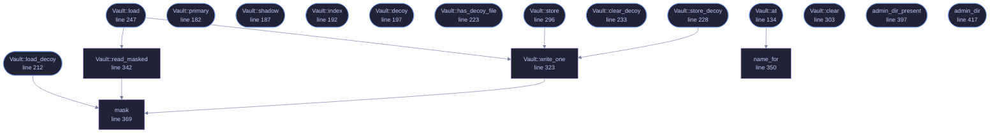

<!-- GENERATED by tools/docs/generate.py from the doc comments in the source. Do not edit: edit the .rs file and run the generator. -->

# `crates/veilvoice-crypto/src/vault.rs`

[[veilvoice-crypto|Crate-veilvoice-crypto]] &middot; 769 lines &middot; [read the source](https://github.com/tilas01/veilvoice/blob/main/crates/veilvoice-crypto/src/vault.rs)

## Contents

- [What is real here and what is only awkward](#what-is-real-here-and-what-is-only-awkward)
- [What none of it does](#what-none-of-it-does)
- [In plain words](#in-plain-words)
  - [What calls what](#what-calls-what)
  - [Items](#items)

Where the app lock is kept: two copies, unpredictable names, and a restore.

# What is real here and what is only awkward

This module does three things to the app-lock file, and they are not worth
the same amount. Saying which is which is the point of this section.

**The second copy is real.** A lock kept in one file is removed by deleting
that file. A lock kept in two files in two different directories is not,
unless the person deleting knows about both. When the first copy is gone or
unreadable, `Vault::load` restores it from the second and reports the
event, so the lock comes back and the owner is told it went.

**The administrator-only copy is real, where the platform provides it.** On
Unix, when VeilVoice is run with enough privilege to write under `/etc`, the
second copy is written there and is thereafter not writable by an ordinary
user. Removing the lock then needs `sudo`, which is a genuine step up from
needing a file manager. VeilVoice never asks for that privilege and never
elevates itself: it uses what it already has and otherwise carries on. On
Windows the equivalent needs an access-control list this crate does not link
the API to set, so the second copy there is a second copy and nothing more,
and this module says so rather than implying a protection it did not obtain.

**The unpredictable name and the masked contents are neither.** They are
obscurity. The name is derived from a value in an index file that sits at a
fixed, obvious path, because something has to, or nothing could ever find
the lock again. Anybody who reads this source, or simply reads the index,
recomputes both names in a second. What they buy is narrow and real enough
to keep: a scan for the string `VEILLOK1` across a disk finds nothing, a
backup rule written against `applock.bin` misses, and advice of the form
"just delete this file" does not survive being passed on. None of that
stops an attacker who is paying attention, and none of it is counted as
security anywhere in the documentation.

# What none of it does

It does not stop somebody holding the disk. It does not stop somebody who
knows the passphrase. It does not make the failed-attempt counter
trustworthy: see `crate::lock::AppLock::to_bytes` for why that one cannot
be authenticated at all. If the threat is the disk, the answer is still
full-volume encryption.

# In plain words

The lock is kept twice, in two places, under names that are not guessable
from the outside, and scrambled so it does not look like a password file.
If one copy goes missing, the other puts it back and you are told.

The scrambling and the odd names are speed bumps, not locks. They stop
careless deletion and casual searching. They do not stop somebody who has
decided to get in and has your disk. Where VeilVoice is already running
with administrator rights, the spare copy is put somewhere an ordinary user
cannot touch, and that part is not a speed bump.

## What this file contains

769 lines defining **18 functions** (14 public), **2 types** and **8 constants**. Everything below is read out of the source, so it cannot disagree with the code.

**The types it owns.**

- `enum Found` (line 92) -- What Vault::load found when it went looking.
- `struct Vault` (line 119) -- The two files a lock lives in, and the index that names them.

**What happens when it runs.** These are the ways in: public, and nothing else in this file calls them, so they are what an outside caller reaches first.

- `Vault::at` (line 134) -- Resolve the vault under base, creating the index if there is none.
  - reaches: `name_for`
- `Vault::primary` (line 182) -- The file the lock is read from and written to.
- `Vault::shadow` (line 187) -- The second copy.
- `Vault::index` (line 192) -- The index that names both.
- `Vault::decoy` (line 197) -- The decoy passphrase's record, where one is set.
- `Vault::load_decoy` (line 212) -- Read the decoy record, or None when no decoy is set.
  - reaches: `mask`
- `Vault::has_decoy_file` (line 223) -- Whether there is a decoy record at all, whether or not it reads.
- `Vault::store_decoy` (line 228) -- Write the decoy record, masked, owner-only.
  - reaches: `write_one`, `mask`
- `Vault::clear_decoy` (line 233) -- Remove the decoy record.
- `Vault::load` (line 247) -- Read the lock, restoring one copy from the other if it has to.
  - reaches: `read_masked`, `write_one`, `mask`
- `Vault::store` (line 296) -- Write both copies, and say whether the spare is now current.
  - reaches: `write_one`, `mask`
- `Vault::clear` (line 303) -- Remove both copies, and the index with them.
- `admin_dir_present` (line 397) -- That same directory, but only when it is already there.
- `admin_dir` (line 417) -- A directory only an administrator can write to, if this process can make one there.

## What calls what

_Colour key: **entry** -- a way in: public, and nothing in this file calls it; **helper** -- private to this file._

  

The same graph as Mermaid source

```mermaid
%%{init: {"theme":"base","themeVariables":{"background":"#1a1b26","primaryColor":"#1f2335","primaryTextColor":"#c0caf5","primaryBorderColor":"#7aa2f7","secondaryColor":"#16161e","tertiaryColor":"#16161e","lineColor":"#737aa2","textColor":"#c0caf5","mainBkg":"#1f2335","nodeBorder":"#7aa2f7","clusterBkg":"#16161e","clusterBorder":"#2f3549","fontFamily":"ui-monospace, SFMono-Regular, Consolas, monospace","fontSize":"14px"}}}%%
flowchart TD
    n_at(["Vault::at<br/>line 134"])
    n_primary(["Vault::primary<br/>line 182"])
    n_shadow(["Vault::shadow<br/>line 187"])
    n_index(["Vault::index<br/>line 192"])
    n_decoy(["Vault::decoy<br/>line 197"])
    n_load_decoy(["Vault::load_decoy<br/>line 212"])
    n_has_decoy_file(["Vault::has_decoy_file<br/>line 223"])
    n_store_decoy(["Vault::store_decoy<br/>line 228"])
    n_clear_decoy(["Vault::clear_decoy<br/>line 233"])
    n_load(["Vault::load<br/>line 247"])
    n_store(["Vault::store<br/>line 296"])
    n_clear(["Vault::clear<br/>line 303"])
    n_write_one["Vault::write_one<br/>line 323"]
    n_read_masked["Vault::read_masked<br/>line 342"]
    n_name_for["name_for<br/>line 350"]
    n_mask["mask<br/>line 369"]
    n_admin_dir_present(["admin_dir_present<br/>line 397"])
    n_admin_dir(["admin_dir<br/>line 417"])
    n_at --> n_name_for
    n_load --> n_read_masked
    n_load --> n_write_one
    n_load_decoy --> n_mask
    n_read_masked --> n_mask
    n_store --> n_write_one
    n_store_decoy --> n_write_one
    n_write_one --> n_mask
    click n_at href "https://github.com/tilas01/veilvoice/blob/main/crates/veilvoice-crypto/src/vault.rs#L134" "open the source"
    click n_primary href "https://github.com/tilas01/veilvoice/blob/main/crates/veilvoice-crypto/src/vault.rs#L182" "open the source"
    click n_shadow href "https://github.com/tilas01/veilvoice/blob/main/crates/veilvoice-crypto/src/vault.rs#L187" "open the source"
    click n_index href "https://github.com/tilas01/veilvoice/blob/main/crates/veilvoice-crypto/src/vault.rs#L192" "open the source"
    click n_decoy href "https://github.com/tilas01/veilvoice/blob/main/crates/veilvoice-crypto/src/vault.rs#L197" "open the source"
    click n_load_decoy href "https://github.com/tilas01/veilvoice/blob/main/crates/veilvoice-crypto/src/vault.rs#L212" "open the source"
    click n_has_decoy_file href "https://github.com/tilas01/veilvoice/blob/main/crates/veilvoice-crypto/src/vault.rs#L223" "open the source"
    click n_store_decoy href "https://github.com/tilas01/veilvoice/blob/main/crates/veilvoice-crypto/src/vault.rs#L228" "open the source"
    click n_clear_decoy href "https://github.com/tilas01/veilvoice/blob/main/crates/veilvoice-crypto/src/vault.rs#L233" "open the source"
    click n_load href "https://github.com/tilas01/veilvoice/blob/main/crates/veilvoice-crypto/src/vault.rs#L247" "open the source"
    click n_store href "https://github.com/tilas01/veilvoice/blob/main/crates/veilvoice-crypto/src/vault.rs#L296" "open the source"
    click n_clear href "https://github.com/tilas01/veilvoice/blob/main/crates/veilvoice-crypto/src/vault.rs#L303" "open the source"
    click n_write_one href "https://github.com/tilas01/veilvoice/blob/main/crates/veilvoice-crypto/src/vault.rs#L323" "open the source"
    click n_read_masked href "https://github.com/tilas01/veilvoice/blob/main/crates/veilvoice-crypto/src/vault.rs#L342" "open the source"
    click n_name_for href "https://github.com/tilas01/veilvoice/blob/main/crates/veilvoice-crypto/src/vault.rs#L350" "open the source"
    click n_mask href "https://github.com/tilas01/veilvoice/blob/main/crates/veilvoice-crypto/src/vault.rs#L369" "open the source"
    click n_admin_dir_present href "https://github.com/tilas01/veilvoice/blob/main/crates/veilvoice-crypto/src/vault.rs#L397" "open the source"
    click n_admin_dir href "https://github.com/tilas01/veilvoice/blob/main/crates/veilvoice-crypto/src/vault.rs#L417" "open the source"
    classDef entry fill:#1f2335,stroke:#7aa2f7,color:#c0caf5
    class n_at,n_primary,n_shadow,n_index,n_decoy,n_load_decoy,n_has_decoy_file,n_store_decoy,n_clear_decoy,n_load,n_store,n_clear,n_admin_dir_present,n_admin_dir entry
    classDef helper fill:#1f2335,stroke:#bb9af7,color:#c0caf5
    class n_write_one,n_read_masked,n_name_for,n_mask helper
```

## Items

| Item | Line | Documentation |
|---|---:|---|
| `SITE_LEN` const | [61](https://github.com/tilas01/veilvoice/blob/main/crates/veilvoice-crypto/src/vault.rs#L61) | Length of the per-installation value the file names are derived from. |
| `NAME_BYTES` const | [64](https://github.com/tilas01/veilvoice/blob/main/crates/veilvoice-crypto/src/vault.rs#L64) | Bytes of hex in a derived file name. |
| `INDEX_NAME` const | [67](https://github.com/tilas01/veilvoice/blob/main/crates/veilvoice-crypto/src/vault.rs#L67) | Fixed name of the index. |
| `LABEL_PRIMARY` const | [75](https://github.com/tilas01/veilvoice/blob/main/crates/veilvoice-crypto/src/vault.rs#L75) | Derives the real vault's key from the material the unlock produced. |
| `LABEL_SHADOW` const | [78](https://github.com/tilas01/veilvoice/blob/main/crates/veilvoice-crypto/src/vault.rs#L78) | Derives the decoy vault's key from the same material, so the two keys are unrelated even though one passphrase leads to both. |
| `LABEL_MASK` const | [80](https://github.com/tilas01/veilvoice/blob/main/crates/veilvoice-crypto/src/vault.rs#L80) | Derives the mask that hides which of the two an index entry belongs to. |
| `LABEL_DECOY` const | [88](https://github.com/tilas01/veilvoice/blob/main/crates/veilvoice-crypto/src/vault.rs#L88) | The decoy passphrase's own record, where one is set. |
| `Found` pub enum | [92](https://github.com/tilas01/veilvoice/blob/main/crates/veilvoice-crypto/src/vault.rs#L92) | What Vault::load found when it went looking. |
| `Vault` pub struct | [119](https://github.com/tilas01/veilvoice/blob/main/crates/veilvoice-crypto/src/vault.rs#L119) | The two files a lock lives in, and the index that names them. |
| `Vault::at` pub fn | [134](https://github.com/tilas01/veilvoice/blob/main/crates/veilvoice-crypto/src/vault.rs#L134) | Resolve the vault under base, creating the index if there is none. |
| `Vault::primary` pub fn | [182](https://github.com/tilas01/veilvoice/blob/main/crates/veilvoice-crypto/src/vault.rs#L182) | The file the lock is read from and written to. |
| `Vault::shadow` pub fn | [187](https://github.com/tilas01/veilvoice/blob/main/crates/veilvoice-crypto/src/vault.rs#L187) | The second copy. |
| `Vault::index` pub fn | [192](https://github.com/tilas01/veilvoice/blob/main/crates/veilvoice-crypto/src/vault.rs#L192) | The index that names both. |
| `Vault::decoy` pub fn | [197](https://github.com/tilas01/veilvoice/blob/main/crates/veilvoice-crypto/src/vault.rs#L197) | The decoy passphrase's record, where one is set. |
| `Vault::load_decoy` pub fn | [212](https://github.com/tilas01/veilvoice/blob/main/crates/veilvoice-crypto/src/vault.rs#L212) | Read the decoy record, or None when no decoy is set. |
| `Vault::has_decoy_file` pub fn | [223](https://github.com/tilas01/veilvoice/blob/main/crates/veilvoice-crypto/src/vault.rs#L223) | Whether there is a decoy record at all, whether or not it reads. |
| `Vault::store_decoy` pub fn | [228](https://github.com/tilas01/veilvoice/blob/main/crates/veilvoice-crypto/src/vault.rs#L228) | Write the decoy record, masked, owner-only. |
| `Vault::clear_decoy` pub fn | [233](https://github.com/tilas01/veilvoice/blob/main/crates/veilvoice-crypto/src/vault.rs#L233) | Remove the decoy record. |
| `Vault::load` pub fn | [247](https://github.com/tilas01/veilvoice/blob/main/crates/veilvoice-crypto/src/vault.rs#L247) | Read the lock, restoring one copy from the other if it has to. |
| `Vault::store` pub fn | [296](https://github.com/tilas01/veilvoice/blob/main/crates/veilvoice-crypto/src/vault.rs#L296) | Write both copies, and say whether the spare is now current. |
| `Vault::clear` pub fn | [303](https://github.com/tilas01/veilvoice/blob/main/crates/veilvoice-crypto/src/vault.rs#L303) | Remove both copies, and the index with them. |
| `Vault::write_one` fn | [323](https://github.com/tilas01/veilvoice/blob/main/crates/veilvoice-crypto/src/vault.rs#L323) | Mask bytes for this site and write them at path, creating the directory if it is not there. |
| `Vault::read_masked` fn | [342](https://github.com/tilas01/veilvoice/blob/main/crates/veilvoice-crypto/src/vault.rs#L342) | Read one file back and unmask it, or None if it is not a lock. |
| `name_for` fn | [350](https://github.com/tilas01/veilvoice/blob/main/crates/veilvoice-crypto/src/vault.rs#L350) | The file name derived from site under label. |
| `mask` fn | [369](https://github.com/tilas01/veilvoice/blob/main/crates/veilvoice-crypto/src/vault.rs#L369) | Exclusive-or bytes with a keystream derived from site. |
| `ADMIN_DIR` const | [388](https://github.com/tilas01/veilvoice/blob/main/crates/veilvoice-crypto/src/vault.rs#L388) | Where an administrator's copy of the lock goes, on a platform that has one. |
| `admin_dir_present` pub fn | [397](https://github.com/tilas01/veilvoice/blob/main/crates/veilvoice-crypto/src/vault.rs#L397) | That same directory, but only when it is already there. |
| `admin_dir` pub fn | [417](https://github.com/tilas01/veilvoice/blob/main/crates/veilvoice-crypto/src/vault.rs#L417) | A directory only an administrator can write to, if this process can make one there. |
