<!-- GENERATED by tools/docs/generate.py from the doc comments in the source. Do not edit: edit the .rs file and run the generator. -->

# `crates/veilvoice-crypto/src/weave.rs`

[[veilvoice-crypto|Crate-veilvoice-crypto]] &middot; 1727 lines &middot; [read the source](https://github.com/tilas01/veilvoice/blob/main/crates/veilvoice-crypto/src/weave.rs)

## Contents

- [What this buys, and it is not what it looks like](#what-this-buys-and-it-is-not-what-it-looks-like)
- [It is nowhere near the live path, and adds no lag](#it-is-nowhere-near-the-live-path-and-adds-no-lag)
- [Names are different, and the difference matters](#names-are-different-and-the-difference-matters)
- [In plain words](#in-plain-words)
  - [What calls what](#what-calls-what)
  - [Items](#items)

Thirty-one reversible encodings, chosen at random, applied around the
encryption -- before it, after it, or both.

# What this buys, and it is not what it looks like

Say the disappointing part first, because the alternative is letting a
reader assume it.

**This adds no cryptographic strength.** Every record here is sealed with
ChaCha20-Poly1305, whose output is already indistinguishable from random to
anybody without the key. Encoding the plaintext before encrypting it does
not make that ciphertext harder to break, and anybody who tells you a layer
of base91 under an AEAD is "double encryption" is wrong. If the only thing
standing between an attacker and your data were the encoding, the answer
would be: that is not security, it is a puzzle.

So the honest list of what it does buy, all of it smaller than the previous
paragraph is big:

- **Plaintext that leaks by a route other than the AEAD is not readable.**
A core dump, a swap file, a page that was written before the seal, a
future bug in this crate's own framing -- any of those hands somebody the
plaintext buffer. `frame_ms = 4.25` in that buffer is a sentence. The
same record base91-ed under a move-to-front transform is not, and cannot
be grepped for.
- **After a key compromise there is one more step.** Small, and worth
naming as small: somebody with the passphrase reads the encoding marker
in the first byte and undoes it. It costs them a minute, not a month.
- **A partially-recovered record does not read as text.** Truncated or
damaged plaintext that decodes to nothing is better than truncated
plaintext that decodes to half your settings.

That is the whole claim. It is defence in depth against exposure that does
not go through the cipher, not a second cipher.

# It is nowhere near the live path, and adds no lag

These run only when VeilVoice writes one of its own small files -- settings,
measurements, the integrity record. They never touch a sample of audio. The
DSP and capture crates do not name this module, and cannot, because it is
not in their dependency graph. So "does the encoding slow down the live
scramble" has a structural answer rather than a benchmarked one: the code
that would slow it down is not reachable from it.

Even where they do run, the input is kilobytes and the transforms are a
single linear pass, so the cost is lost in the Argon2id run the same unlock
already pays for.

# Names are different, and the difference matters

A record's filename is 18 bytes of HMAC, base64url-encoded to exactly 24
characters. Weaving those bytes first is fine -- but **only with a codec
that preserves length**.

If a name could be hex-encoded it would come out 48 characters instead of
24, and the length of the filename would announce which encoding was used.
Worse, decoys are random bytes with a random weave while records have a
key-derived one, so a length difference would separate the two at a glance
and undo the entire point of the decoys.

So names use `LENGTH_PRESERVING` only, and the choice is derived from the
key rather than drawn at random, because a name has to be computable again
next time. Contents may use anything, because contents are padded to fixed
buckets afterwards.

One honest consequence of that padding: an expanding codec can push a
record into a larger bucket than a compact one would, so writing the same
data twice can produce two different file sizes. That reveals nothing about
the data -- only that the encoding changed -- and it is the reason bucket
sizes are coarse.

# In plain words

Before VeilVoice encrypts one of its own files, it scrambles the contents
into one of twenty-seven odd formats picked at random, and does something
similar to the filename.

It is not what keeps the file secret. The encryption does that. This means
that if the unencrypted contents ever escape some other way -- a crash
dump, a swap file -- what escapes does not read as anything.

## What this file contains

1727 lines defining **21 functions** (10 public), **1 type** and **18 constants**. Everything below is read out of the source, so it cannot disagree with the code.

**The types it owns.**

- `enum Weave` (line 90) -- Every encoding, by name.

**What happens when it runs.** These are the ways in: public, and nothing else in this file calls them, so they are what an outside caller reaches first.

- `Weave::id` (line 227) -- The marker stored with a record so the encoding can be undone.
- `Weave::from_id` (line 264) -- Recover an encoding from its marker.
- `Weave::preserves_length` (line 302) -- Whether this leaves the byte count untouched.
- `Weave::random_length_preserving` (line 330) -- Pick one at random from the length-preserving set.
- `Weave::for_name` (line 356) -- Pick one deterministically from key material, from LENGTH_PRESERVING.
- `Weave::apply` (line 366) -- Encode.
  - reaches: `base32_encode`, `base45_encode`, `base85_encode`, `base91_encode`, `sixbit_encode`
- `Weave::undo` (line 545) -- Decode.
  - reaches: `base32_decode`, `base45_decode`, `base85_decode`, `base91_decode`, `nibble`, `sixbit_decode`
- `encode` (line 728) -- Encode with a randomly chosen encoding, returning it so it can be undone.
  - reaches: `random`
- `decode` (line 734) -- Undo encode.

## What calls what

_Colour key: **entry** -- a way in: public, and nothing in this file calls it; **api** -- public, and also used inside this file; **helper** -- private to this file._

  

The same graph as Mermaid source

```mermaid
%%{init: {"theme":"base","themeVariables":{"background":"#1a1b26","primaryColor":"#1f2335","primaryTextColor":"#c0caf5","primaryBorderColor":"#7aa2f7","secondaryColor":"#16161e","tertiaryColor":"#16161e","lineColor":"#737aa2","textColor":"#c0caf5","mainBkg":"#1f2335","nodeBorder":"#7aa2f7","clusterBkg":"#16161e","clusterBorder":"#2f3549","fontFamily":"ui-monospace, SFMono-Regular, Consolas, monospace","fontSize":"14px"}}}%%
flowchart TD
    n_id(["Weave::id<br/>line 227"])
    n_from_id(["Weave::from_id<br/>line 264"])
    n_preserves_length(["Weave::preserves_length<br/>line 302"])
    n_random_length_preserving(["Weave::<br/>random_length_preserving<br/>line 330"])
    n_random["Weave::random<br/>line 342"]
    n_for_name(["Weave::for_name<br/>line 356"])
    n_apply(["Weave::apply<br/>line 366"])
    n_undo(["Weave::undo<br/>line 545"])
    n_encode(["encode<br/>line 728"])
    n_decode(["decode<br/>line 734"])
    n_nibble["nibble<br/>line 741"]
    n_base32_encode["base32_encode<br/>line 793"]
    n_base32_decode["base32_decode<br/>line 816"]
    n_base45_encode["base45_encode<br/>line 843"]
    n_base45_decode["base45_decode<br/>line 863"]
    n_base85_encode["base85_encode<br/>line 890"]
    n_base85_decode["base85_decode<br/>line 914"]
    n_base91_encode["base91_encode<br/>line 956"]
    n_base91_decode["base91_decode<br/>line 987"]
    n_sixbit_encode["sixbit_encode<br/>line 1015"]
    n_sixbit_decode["sixbit_decode<br/>line 1036"]
    n_apply --> n_base32_encode
    n_apply --> n_base45_encode
    n_apply --> n_base85_encode
    n_apply --> n_base91_encode
    n_apply --> n_sixbit_encode
    n_encode --> n_random
    n_undo --> n_base32_decode
    n_undo --> n_base45_decode
    n_undo --> n_base85_decode
    n_undo --> n_base91_decode
    n_undo --> n_nibble
    n_undo --> n_sixbit_decode
    click n_id href "https://github.com/tilas01/veilvoice/blob/main/crates/veilvoice-crypto/src/weave.rs#L227" "open the source"
    click n_from_id href "https://github.com/tilas01/veilvoice/blob/main/crates/veilvoice-crypto/src/weave.rs#L264" "open the source"
    click n_preserves_length href "https://github.com/tilas01/veilvoice/blob/main/crates/veilvoice-crypto/src/weave.rs#L302" "open the source"
    click n_random_length_preserving href "https://github.com/tilas01/veilvoice/blob/main/crates/veilvoice-crypto/src/weave.rs#L330" "open the source"
    click n_random href "https://github.com/tilas01/veilvoice/blob/main/crates/veilvoice-crypto/src/weave.rs#L342" "open the source"
    click n_for_name href "https://github.com/tilas01/veilvoice/blob/main/crates/veilvoice-crypto/src/weave.rs#L356" "open the source"
    click n_apply href "https://github.com/tilas01/veilvoice/blob/main/crates/veilvoice-crypto/src/weave.rs#L366" "open the source"
    click n_undo href "https://github.com/tilas01/veilvoice/blob/main/crates/veilvoice-crypto/src/weave.rs#L545" "open the source"
    click n_encode href "https://github.com/tilas01/veilvoice/blob/main/crates/veilvoice-crypto/src/weave.rs#L728" "open the source"
    click n_decode href "https://github.com/tilas01/veilvoice/blob/main/crates/veilvoice-crypto/src/weave.rs#L734" "open the source"
    click n_nibble href "https://github.com/tilas01/veilvoice/blob/main/crates/veilvoice-crypto/src/weave.rs#L741" "open the source"
    click n_base32_encode href "https://github.com/tilas01/veilvoice/blob/main/crates/veilvoice-crypto/src/weave.rs#L793" "open the source"
    click n_base32_decode href "https://github.com/tilas01/veilvoice/blob/main/crates/veilvoice-crypto/src/weave.rs#L816" "open the source"
    click n_base45_encode href "https://github.com/tilas01/veilvoice/blob/main/crates/veilvoice-crypto/src/weave.rs#L843" "open the source"
    click n_base45_decode href "https://github.com/tilas01/veilvoice/blob/main/crates/veilvoice-crypto/src/weave.rs#L863" "open the source"
    click n_base85_encode href "https://github.com/tilas01/veilvoice/blob/main/crates/veilvoice-crypto/src/weave.rs#L890" "open the source"
    click n_base85_decode href "https://github.com/tilas01/veilvoice/blob/main/crates/veilvoice-crypto/src/weave.rs#L914" "open the source"
    click n_base91_encode href "https://github.com/tilas01/veilvoice/blob/main/crates/veilvoice-crypto/src/weave.rs#L956" "open the source"
    click n_base91_decode href "https://github.com/tilas01/veilvoice/blob/main/crates/veilvoice-crypto/src/weave.rs#L987" "open the source"
    click n_sixbit_encode href "https://github.com/tilas01/veilvoice/blob/main/crates/veilvoice-crypto/src/weave.rs#L1015" "open the source"
    click n_sixbit_decode href "https://github.com/tilas01/veilvoice/blob/main/crates/veilvoice-crypto/src/weave.rs#L1036" "open the source"
    classDef entry fill:#1f2335,stroke:#7aa2f7,color:#c0caf5
    class n_id,n_from_id,n_preserves_length,n_random_length_preserving,n_for_name,n_apply,n_undo,n_encode,n_decode entry
    classDef api fill:#1f2335,stroke:#7dcfff,color:#c0caf5
    class n_random api
    classDef helper fill:#1f2335,stroke:#bb9af7,color:#c0caf5
    class n_nibble,n_base32_encode,n_base32_decode,n_base45_encode,n_base45_decode,n_base85_encode,n_base85_decode,n_base91_encode,n_base91_decode,n_sixbit_encode,n_sixbit_decode helper
```

## Items

| Item | Line | Documentation |
|---|---:|---|
| `Weave` pub enum | [90](https://github.com/tilas01/veilvoice/blob/main/crates/veilvoice-crypto/src/weave.rs#L90) | Every encoding, by name. |
| `LENGTH_PRESERVING` pub const | [167](https://github.com/tilas01/veilvoice/blob/main/crates/veilvoice-crypto/src/weave.rs#L167) | Every encoding that leaves the byte count alone. |
| `ALL` pub const | [188](https://github.com/tilas01/veilvoice/blob/main/crates/veilvoice-crypto/src/weave.rs#L188) | Every encoding, for contents. |
| `Weave::id` pub fn | [227](https://github.com/tilas01/veilvoice/blob/main/crates/veilvoice-crypto/src/weave.rs#L227) | The marker stored with a record so the encoding can be undone. |
| `Weave::from_id` pub fn | [264](https://github.com/tilas01/veilvoice/blob/main/crates/veilvoice-crypto/src/weave.rs#L264) | Recover an encoding from its marker. |
| `Weave::preserves_length` pub fn | [302](https://github.com/tilas01/veilvoice/blob/main/crates/veilvoice-crypto/src/weave.rs#L302) | Whether this leaves the byte count untouched. |
| `Weave::random_length_preserving` pub fn | [330](https://github.com/tilas01/veilvoice/blob/main/crates/veilvoice-crypto/src/weave.rs#L330) | Pick one at random from the length-preserving set. |
| `Weave::random` pub fn | [342](https://github.com/tilas01/veilvoice/blob/main/crates/veilvoice-crypto/src/weave.rs#L342) | Pick one at random, from ALL. |
| `Weave::for_name` pub fn | [356](https://github.com/tilas01/veilvoice/blob/main/crates/veilvoice-crypto/src/weave.rs#L356) | Pick one deterministically from key material, from LENGTH_PRESERVING. |
| `Weave::apply` pub fn | [366](https://github.com/tilas01/veilvoice/blob/main/crates/veilvoice-crypto/src/weave.rs#L366) | Encode. |
| `Weave::undo` pub fn | [545](https://github.com/tilas01/veilvoice/blob/main/crates/veilvoice-crypto/src/weave.rs#L545) | Decode. |
| `encode` pub fn | [728](https://github.com/tilas01/veilvoice/blob/main/crates/veilvoice-crypto/src/weave.rs#L728) | Encode with a randomly chosen encoding, returning it so it can be undone. |
| `decode` pub fn | [734](https://github.com/tilas01/veilvoice/blob/main/crates/veilvoice-crypto/src/weave.rs#L734) | Undo encode. |
| `nibble` fn | [741](https://github.com/tilas01/veilvoice/blob/main/crates/veilvoice-crypto/src/weave.rs#L741) | One hex digit as a number, in either case. |
| `HEX` const | [750](https://github.com/tilas01/veilvoice/blob/main/crates/veilvoice-crypto/src/weave.rs#L750) |  |
| `HEX_UPPER` const | [751](https://github.com/tilas01/veilvoice/blob/main/crates/veilvoice-crypto/src/weave.rs#L751) |  |
| `B32` const | [752](https://github.com/tilas01/veilvoice/blob/main/crates/veilvoice-crypto/src/weave.rs#L752) |  |
| `B32HEX` const | [753](https://github.com/tilas01/veilvoice/blob/main/crates/veilvoice-crypto/src/weave.rs#L753) |  |
| `ZB32` const | [754](https://github.com/tilas01/veilvoice/blob/main/crates/veilvoice-crypto/src/weave.rs#L754) |  |
| `CROCKFORD` const | [755](https://github.com/tilas01/veilvoice/blob/main/crates/veilvoice-crypto/src/weave.rs#L755) |  |
| `B45` const | [756](https://github.com/tilas01/veilvoice/blob/main/crates/veilvoice-crypto/src/weave.rs#L756) |  |
| `A85` const | [757](https://github.com/tilas01/veilvoice/blob/main/crates/veilvoice-crypto/src/weave.rs#L757) |  |
| `Z85A` const | [758](https://github.com/tilas01/veilvoice/blob/main/crates/veilvoice-crypto/src/weave.rs#L758) |  |
| `UU` const | [759](https://github.com/tilas01/veilvoice/blob/main/crates/veilvoice-crypto/src/weave.rs#L759) |  |
| `XX` const | [760](https://github.com/tilas01/veilvoice/blob/main/crates/veilvoice-crypto/src/weave.rs#L760) |  |
| `XX_ALPHABET` const | [761](https://github.com/tilas01/veilvoice/blob/main/crates/veilvoice-crypto/src/weave.rs#L761) |  |
| `Z85_ALPHABET` const | [762](https://github.com/tilas01/veilvoice/blob/main/crates/veilvoice-crypto/src/weave.rs#L762) |  |
| `SBOX` const | [769](https://github.com/tilas01/veilvoice/blob/main/crates/veilvoice-crypto/src/weave.rs#L769) | A fixed permutation of every byte value, and its inverse. |
| `UNSBOX` const | [779](https://github.com/tilas01/veilvoice/blob/main/crates/veilvoice-crypto/src/weave.rs#L779) |  |
| `base32_encode` fn | [793](https://github.com/tilas01/veilvoice/blob/main/crates/veilvoice-crypto/src/weave.rs#L793) | Five bytes to eight characters, over whichever 32-character alphabet was chosen. |
| `base32_decode` fn | [816](https://github.com/tilas01/veilvoice/blob/main/crates/veilvoice-crypto/src/weave.rs#L816) | Undo base32_encode over the same alphabet. |
| `base45_encode` fn | [843](https://github.com/tilas01/veilvoice/blob/main/crates/veilvoice-crypto/src/weave.rs#L843) | Two bytes to three characters, over the 45-character alphabet the QR standard uses. |
| `base45_decode` fn | [863](https://github.com/tilas01/veilvoice/blob/main/crates/veilvoice-crypto/src/weave.rs#L863) | Undo base45_encode. |
| `base85_encode` fn | [890](https://github.com/tilas01/veilvoice/blob/main/crates/veilvoice-crypto/src/weave.rs#L890) | Four bytes to five characters. |
| `base85_decode` fn | [914](https://github.com/tilas01/veilvoice/blob/main/crates/veilvoice-crypto/src/weave.rs#L914) | Undo base85_encode with the same flavour and offset. |
| `B91` const | [951](https://github.com/tilas01/veilvoice/blob/main/crates/veilvoice-crypto/src/weave.rs#L951) |  |
| `base91_encode` fn | [956](https://github.com/tilas01/veilvoice/blob/main/crates/veilvoice-crypto/src/weave.rs#L956) | Thirteen or fourteen bits at a time, over 91 characters, which is the densest of these that stays printable ASCII. |
| `base91_decode` fn | [987](https://github.com/tilas01/veilvoice/blob/main/crates/veilvoice-crypto/src/weave.rs#L987) | Undo base91_encode. |
| `sixbit_encode` fn | [1015](https://github.com/tilas01/veilvoice/blob/main/crates/veilvoice-crypto/src/weave.rs#L1015) | Three bytes to four characters over a 64-character alphabet, in the shape uuencode and xxencode use. |
| `sixbit_decode` fn | [1036](https://github.com/tilas01/veilvoice/blob/main/crates/veilvoice-crypto/src/weave.rs#L1036) | Undo sixbit_encode with the same flavour. |
