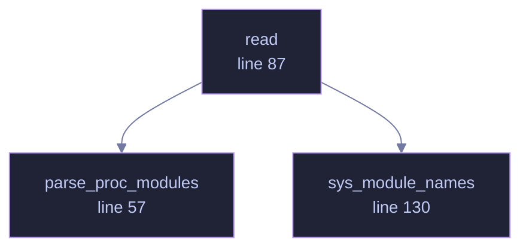

<!-- GENERATED by tools/docs/generate.py from the doc comments in the source. Do not edit: edit the .rs file and run the generator. -->


# `crates/veilvoice-drivers/src/linux.rs`

[[veilvoice-drivers|Crate-veilvoice-drivers]] &middot; 239 lines &middot; [read the source](https://github.com/tilas01/veilvoice/blob/main/crates/veilvoice-drivers/src/linux.rs)

## Contents

- [Two files, no subprocess](#two-files-no-subprocess)
- [The format](#the-format)
- [The cross-view check](#the-cross-view-check)
- [In plain words](#in-plain-words)
  - [What calls what](#what-calls-what)
  - [Items](#items)

Linux: `/proc/modules`, cross-checked against `/sys/module`.

# Two files, no subprocess

The kernel publishes the loaded module list as a file, so this reads it.
Nothing is spawned, nothing needs privileges, and the whole operation costs
two directory reads — cheap enough to run on a timer without becoming the
reason the interface stopped painting.

# The format

```text
nvidia 56807424 42 nvidia_uvm,nvidia_modeset, Live 0xffffffffc0e00000
```

Name, size in bytes, reference count, the modules that depend on it, the
state, and the load address. The address is **not** recorded: on most
systems `kptr_restrict` makes it read as zeros for an unprivileged reader,
and on the rest it changes at every boot — so recording it would make every
module look altered after a restart, which is a report nobody reads.

# The cross-view check

`/sys/module` has a directory per module, and the two lists should agree.
A name in one and not the other is worth reporting: unlinking from
`/proc/modules` and forgetting `/sys/module` is a mistake real rootkits have
made.

It catches carelessness only. Both lists come from the same kernel, so
anything with the privilege to edit one has the privilege to edit both.

One honest wrinkle: `/sys/module` also lists built-in modules and boot
parameters, which were never in `/proc/modules` and never will be. Those
have no `initstate` file, so only directories that have one are compared —
otherwise the check would produce dozens of discrepancies on every machine
and be switched off within a day.

# In plain words

Asks Linux which kernel modules are loaded, by reading two files the system
keeps.

Nothing is run at all: the answer is already written down. Both files are read
and compared, because a module that appears in one and not the other is itself
worth reporting.

## What this file contains

239 lines defining **3 functions** (0 public), **0 types** and **0 constants**. Everything below is read out of the source, so it cannot disagree with the code.

## What calls what

_Colour key: **helper** -- private to this file._

<p align="center">
  
</p>

<details>
<summary>The same graph as Mermaid source</summary>



</details>

## Items

| Item | Line | Documentation |
|---|---:|---|
| `parse_proc_modules` <sub>pub(crate) fn</sub> | [57](https://github.com/tilas01/veilvoice/blob/main/crates/veilvoice-drivers/src/linux.rs#L57) | Parse the contents of /proc/modules. |
| `read` <sub>pub(crate) fn</sub> | [87](https://github.com/tilas01/veilvoice/blob/main/crates/veilvoice-drivers/src/linux.rs#L87) | Read both views and compare them. |
| `sys_module_names` <sub>fn</sub> | [130](https://github.com/tilas01/veilvoice/blob/main/crates/veilvoice-drivers/src/linux.rs#L130) | The names under /sys/module that correspond to loadable modules. |
