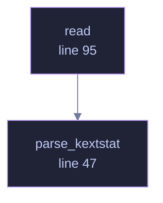

<!-- GENERATED by tools/docs/generate.py from the doc comments in the source. Do not edit: edit the .rs file and run the generator. -->


# `crates/veilvoice-drivers/src/macos.rs`

[[veilvoice-drivers|Crate-veilvoice-drivers]] &middot; 214 lines &middot; [read the source](https://github.com/tilas01/veilvoice/blob/main/crates/veilvoice-drivers/src/macos.rs)

## Contents

- [Two tools, because Apple is mid-transition](#two-tools-because-apple-is-mid-transition)
- [Why a subprocess](#why-a-subprocess)
- [In plain words](#in-plain-words)
  - [What calls what](#what-calls-what)
  - [Items](#items)

macOS: `kmutil showloaded`, falling back to `kextstat`.

# Two tools, because Apple is mid-transition

`kextstat` is the old one and is deprecated; `kmutil` is the replacement and
does not exist on older systems. Both are tried, newest first, and if
neither answers the reason is reported rather than an empty list being
passed off as "no kernel extensions", which would be false on every Mac
ever made.

Both print the same shape, which is why one parser handles both:

```text
Index Refs Address            Size       Wired      Name (Version) UUID <Linked Against>
1   88 0                  0          0          com.apple.kpi.bsd (20.6.0)
134    0 0xffffff7f8312d000 0x9000     0x9000     com.example.driver (1.2.3) <7 5 4 1>
```

The **address is deliberately dropped**, for the same reason as on Linux: it
is zeroed for an unprivileged reader on a machine with kernel-pointer
restriction, and changes at every boot on one without. Recording it would
make every extension look altered after a restart, and a report that is
entirely false positives after every reboot is a report nobody opens twice.

# Why a subprocess

The native answer is IOKit, which is FFI. `#![forbid(unsafe_code)]` holds
here as everywhere else in the workspace, so this asks a tool the system
already ships, the same trade the Windows and Linux readers make.

# In plain words

Asks macOS which system extensions are loaded.

There are two tools depending on how new the machine is, because Apple is part
way through replacing one with the other. The newer one is tried first and the
older is the fallback, so this works on both without being told which you have.

## What this file contains

214 lines defining **2 functions** (0 public), **0 types** and **0 constants**. Everything below is read out of the source, so it cannot disagree with the code.

## What calls what

_Colour key: **helper** -- private to this file._

<p align="center">
  
</p>

<details>
<summary>The same graph as Mermaid source</summary>



</details>

## Items

| Item | Line | Documentation |
|---|---:|---|
| `parse_kextstat` <sub>pub(crate) fn</sub> | [47](https://github.com/tilas01/veilvoice/blob/main/crates/veilvoice-drivers/src/macos.rs#L47) | Parse kextstat-style output, which kmutil showloaded also produces. |
| `read` <sub>pub(crate) fn</sub> | [95](https://github.com/tilas01/veilvoice/blob/main/crates/veilvoice-drivers/src/macos.rs#L95) | Ask kmutil, then kextstat. |
