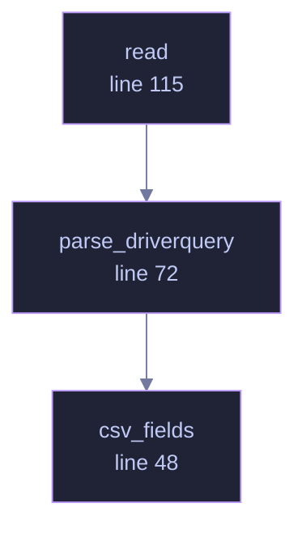

<!-- GENERATED by tools/docs/generate.py from the doc comments in the source. Do not edit: edit the .rs file and run the generator. -->


# `crates/veilvoice-drivers/src/windows.rs`

[[veilvoice-drivers|Crate-veilvoice-drivers]] &middot; 232 lines &middot; [read the source](https://github.com/tilas01/veilvoice/blob/main/crates/veilvoice-drivers/src/windows.rs)

## Contents

- [Why a subprocess](#why-a-subprocess)
- [The format](#the-format)
- [What it lists, and what that means](#what-it-lists-and-what-that-means)
  - [What calls what](#what-calls-what)
  - [Items](#items)

Windows: `driverquery.exe`, which the system already ships.

# Why a subprocess

The native answer is `EnumDeviceDrivers` or a service-control enumeration,
and both are FFI. `#![forbid(unsafe_code)]` holds in this crate as it does
everywhere else in the workspace, so this shells out to a tool Windows
installs by default — the same trade `veilvoice-watch` makes for the
registry and `veilvoice-verify` makes for downloading.

`driverquery.exe` is resolved by absolute path under `%SystemRoot%`. Never
by bare name: Windows searches the current directory before most of `PATH`,
so running from a folder containing a `driverquery.exe` somebody else wrote
would run that one instead. This is a security tool asking what is loaded in
the kernel; it is a poor place to be relaxed about which program answers.

# The format

`/FO CSV /NH` gives one quoted record per line:

```text
"ACPI","Microsoft ACPI Driver","Kernel ","1/1/1970 12:00:00 AM"
```

Module name, display name, driver type, link date. The link date is kept —
unlike the Linux load address it is a property of the file rather than of
this boot, so it does not change under a machine that has not changed.

# What it lists, and what that means

Installed drivers, which is a superset of what is loaded right now. A driver
appearing here is therefore "something installed a driver", not "something
is running in the kernel" — a real distinction, and the front end wording
keeps it.

## What this file contains

232 lines defining **3 functions** (0 public), **0 types** and **0 constants**. Everything below is read out of the source, so it cannot disagree with the code.

## What calls what

_Colour key: **helper** -- private to this file._

<p align="center">
  
</p>

<details>
<summary>The same graph as Mermaid source</summary>



</details>

## Items

| Item | Line | Documentation |
|---|---:|---|
| `csv_fields` <sub>fn</sub> | [48](https://github.com/tilas01/veilvoice/blob/main/crates/veilvoice-drivers/src/windows.rs#L48) | Split one CSV line into its quoted fields. |
| `parse_driverquery` <sub>pub(crate) fn</sub> | [72](https://github.com/tilas01/veilvoice/blob/main/crates/veilvoice-drivers/src/windows.rs#L72) | Parse driverquery /FO CSV /NH output. |
| `read` <sub>pub(crate) fn</sub> | [115](https://github.com/tilas01/veilvoice/blob/main/crates/veilvoice-drivers/src/windows.rs#L115) | Run driverquery and parse what it says. |
