<!-- GENERATED by tools/docs/generate.py from the doc comments in the source. Do not edit: edit the .rs file and run the generator. -->

# `crates/veilvoice-gnupg/src/script.rs`

[[veilvoice-gnupg|Crate-veilvoice-gnupg]] &middot; 281 lines &middot; [read the source](https://github.com/tilas01/veilvoice/blob/main/crates/veilvoice-gnupg/src/script.rs)

## Contents

- [Why a script at all, when there is a verifier](#why-a-script-at-all-when-there-is-a-verifier)
- [Why it is generated rather than committed](#why-it-is-generated-rather-than-committed)
- [What it deliberately does not do](#what-it-deliberately-does-not-do)
  - [What calls what](#what-calls-what)
  - [Items](#items)

A shell script that checks a release, for people who would rather read one.

# Why a script at all, when there is a verifier

`veilvoice-verify` does this check, and it does more of it: every extracted
file, not just the archive. But it has the problem every such program has,
and this project says so on the tab: **it came out of the download it is
checking.** A tampered release ships a tampered verifier.

This is the answer to that. Sixty lines of shell, using `gpg` and
`sha256sum` and nothing else, short enough that somebody can read the whole
of it before running it. That is the point of it: not convenience, but that
the thing doing the checking is not this project's code.

# Why it is generated rather than committed

The fingerprint in it is `veilvoice_check::FINGERPRINT`, and the one thing
that must never happen is a script checking against a fingerprint that has
drifted from the one the project actually signs with. A committed script is
a second copy of that string. This is written from the first copy, every
time, so there is no second one to go stale.

# What it deliberately does not do

It does not install anything, and it does not download the release. It
checks files that are already in the current directory, and it says what to
run if `gpg` is missing rather than running it. A verification script that
fetched things would be a verification script with a network path in it.

## What this file contains

281 lines defining **4 functions** (2 public), **1 type** and **0 constants**. Everything below is read out of the source, so it cannot disagree with the code.

**The types it owns.**

- `enum Flavour` (line 37) -- Which system the script is being written for.

**What happens when it runs.** These are the ways in: public, and nothing else in this file calls them, so they are what an outside caller reaches first.

- `Flavour::file_name` (line 62) -- The name a reader would give the file.
- `shell` (line 71) -- The script, with the fingerprint compiled in from the one source of it.

## What calls what

_Colour key: **entry** -- a way in: public, and nothing in this file calls it; **helper** -- private to this file._

  

The same graph as Mermaid source

```mermaid
%%{init: {"theme":"base","themeVariables":{"background":"#1a1b26","primaryColor":"#1f2335","primaryTextColor":"#c0caf5","primaryBorderColor":"#7aa2f7","secondaryColor":"#16161e","tertiaryColor":"#16161e","lineColor":"#737aa2","textColor":"#c0caf5","mainBkg":"#1f2335","nodeBorder":"#7aa2f7","clusterBkg":"#16161e","clusterBorder":"#2f3549","fontFamily":"ui-monospace, SFMono-Regular, Consolas, monospace","fontSize":"14px"}}}%%
flowchart TD
    n_hash_check["Flavour::hash_check<br/>line 46"]
    n_install_hint["Flavour::install_hint<br/>line 54"]
    n_file_name(["Flavour::file_name<br/>line 62"])
    n_shell(["shell<br/>line 71"])
    click n_hash_check href "https://github.com/tilas01/veilvoice/blob/main/crates/veilvoice-gnupg/src/script.rs#L46" "open the source"
    click n_install_hint href "https://github.com/tilas01/veilvoice/blob/main/crates/veilvoice-gnupg/src/script.rs#L54" "open the source"
    click n_file_name href "https://github.com/tilas01/veilvoice/blob/main/crates/veilvoice-gnupg/src/script.rs#L62" "open the source"
    click n_shell href "https://github.com/tilas01/veilvoice/blob/main/crates/veilvoice-gnupg/src/script.rs#L71" "open the source"
    classDef entry fill:#1f2335,stroke:#7aa2f7,color:#c0caf5
    class n_file_name,n_shell entry
    classDef helper fill:#1f2335,stroke:#bb9af7,color:#c0caf5
    class n_hash_check,n_install_hint helper
```

## Items

| Item | Line | Documentation |
|---|---:|---|
| `Flavour` pub enum | [37](https://github.com/tilas01/veilvoice/blob/main/crates/veilvoice-gnupg/src/script.rs#L37) | Which system the script is being written for. |
| `Flavour::hash_check` fn | [46](https://github.com/tilas01/veilvoice/blob/main/crates/veilvoice-gnupg/src/script.rs#L46) | The command that checks a file against SHA256SUMS. |
| `Flavour::install_hint` fn | [54](https://github.com/tilas01/veilvoice/blob/main/crates/veilvoice-gnupg/src/script.rs#L54) | What to type if GnuPG is not installed. |
| `Flavour::file_name` pub fn | [62](https://github.com/tilas01/veilvoice/blob/main/crates/veilvoice-gnupg/src/script.rs#L62) | The name a reader would give the file. |
| `shell` pub fn | [71](https://github.com/tilas01/veilvoice/blob/main/crates/veilvoice-gnupg/src/script.rs#L71) | The script, with the fingerprint compiled in from the one source of it. |
