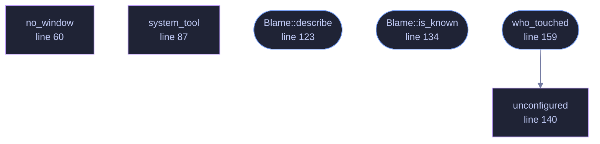

<!-- GENERATED by tools/docs/generate.py from the doc comments in the source. Do not edit: edit the .rs file and run the generator. -->

# `crates/veilvoice-guard/src/blame.rs`

[[veilvoice-guard|Crate-veilvoice-guard]] &middot; 421 lines &middot; [read the source](https://github.com/tilas01/veilvoice/blob/main/crates/veilvoice-guard/src/blame.rs)

## Contents

- [Read this before relying on it](#read-this-before-relying-on-it)
- [Where an answer can come from](#where-an-answer-can-come-from)
- [In plain words](#in-plain-words)
  - [What calls what](#what-calls-what)
  - [Items](#items)

Best-effort attribution: which program changed a file.

# Read this before relying on it

**Most of the time this cannot answer, and says so.** Neither Windows nor
Linux records who wrote to a file unless auditing has been switched on for
that path in advance, and on a normal desktop it has not been. An
unprivileged program cannot switch it on either.

So the honest design is a function that returns `Blame::Unknown` with a
reason, and tells the user what would have to be configured for a real
answer. A plausible guess would be worse than nothing here: naming the wrong
program to somebody worried about surveillance is not a small error.

# Where an answer can come from

- **Linux** -- the kernel audit subsystem. With a watch in place
(`auditctl -w <path> -p wa -k veilvoice`), `ausearch` reports the syscall,
the pid and the executable name for every write. Reading those records
usually needs root as well.
- **Windows** -- object access auditing. With a SACL on the file and the
"Audit File System" policy enabled, Security event 4663 records the
process that opened it for write. `wevtutil` can query that log, though
reading the Security log needs elevation.

Both are checked for, neither is configured by this crate, and the absence
of either is reported rather than hidden. Setting them up is a deliberate
act by an administrator, and pretending otherwise would misrepresent what a
clean report means.

# In plain words

Tries to say which program changed a file, and is careful about how sure it is.

It is a guess built from what was running at the time. It can be wrong, and it
says so with every answer. Naming the wrong program confidently is worse than
naming none, because somebody acts on it.

## What this file contains

421 lines defining **6 functions** (3 public), **1 type** and **0 constants**. Everything below is read out of the source, so it cannot disagree with the code.

**The types it owns.**

- `enum Blame` (line 102) -- What, if anything, is known about who changed a file.

**What happens when it runs.** These are the ways in: public, and nothing else in this file calls them, so they are what an outside caller reaches first.

- `Blame::describe` (line 123) -- A single line for a terminal, an alert or a log.
- `Blame::is_known` (line 134) -- Whether an actual name was found.
- `who_touched` (line 159) -- Try to name the program that last wrote to path.
  - reaches: `unconfigured`

## What calls what

_Colour key: **entry** -- a way in: public, and nothing in this file calls it; **helper** -- private to this file._

  

The same graph as Mermaid source

## Items

| Item | Line | Documentation |
|---|---:|---|
| `no_window` fn | [60](https://github.com/tilas01/veilvoice/blob/main/crates/veilvoice-guard/src/blame.rs#L60) | Spawn without a console window. |
| `system_tool` fn | [87](https://github.com/tilas01/veilvoice/blob/main/crates/veilvoice-guard/src/blame.rs#L87) | Resolve a system tool to an absolute path, rather than letting the operating system search for it. |
| `Blame` pub enum | [102](https://github.com/tilas01/veilvoice/blob/main/crates/veilvoice-guard/src/blame.rs#L102) | What, if anything, is known about who changed a file. |
| `Blame::describe` pub fn | [123](https://github.com/tilas01/veilvoice/blob/main/crates/veilvoice-guard/src/blame.rs#L123) | A single line for a terminal, an alert or a log. |
| `Blame::is_known` pub fn | [134](https://github.com/tilas01/veilvoice/blob/main/crates/veilvoice-guard/src/blame.rs#L134) | Whether an actual name was found. |
| `unconfigured` fn | [140](https://github.com/tilas01/veilvoice/blob/main/crates/veilvoice-guard/src/blame.rs#L140) | Build the "nobody configured auditing" answer for this platform. |
| `who_touched` pub fn | [159](https://github.com/tilas01/veilvoice/blob/main/crates/veilvoice-guard/src/blame.rs#L159) | Try to name the program that last wrote to path. |
| `linux` mod | [176](https://github.com/tilas01/veilvoice/blob/main/crates/veilvoice-guard/src/blame.rs#L176) |  |
| `windows` mod | [254](https://github.com/tilas01/veilvoice/blob/main/crates/veilvoice-guard/src/blame.rs#L254) |  |
