<!-- GENERATED by tools/docs/generate.py from the doc comments in the source. Do not edit: edit the .rs file and run the generator. -->

# `crates/veilvoice-guard/src/record.rs`

[[veilvoice-guard|Crate-veilvoice-guard]] &middot; 94 lines &middot; [read the source](https://github.com/tilas01/veilvoice/blob/main/crates/veilvoice-guard/src/record.rs)

## Contents

- [Why it sits beside the app lock](#why-it-sits-beside-the-app-lock)
- [In plain words](#in-plain-words)
  - [What calls what](#what-calls-what)
  - [Items](#items)

Where the integrity record is kept.

Three lines of arithmetic over a path, and they are here rather than in the
programs that use them because there are now three of those. The command
line's `veilvoice guard` worked it out, the desktop application's
integrity tab worked it out again, and roadmap item 179's updater needed it
a third time: it re-takes the record after it has replaced the
installation, because a new installation's files are new and the old record
would report every one of them as changed.

A third copy would have been the point at which the two existing ones
started to drift, and a record written to one path and checked at another
is a check that passes for the wrong reason. So the callers delegate and
this is the definition.

# Why it sits beside the app lock

Because the sealed form of the record is sealed under the app lock's own
passphrase, and that passphrase exists for exactly as long as an unlock
does. Keeping the two files in one directory means one place to look, one
place to back up and one place to delete, and it means `record_path` can
be derived from a location the rest of the project already knows how to
find rather than invented here.

# In plain words

The list of what VeilVoice's own files should look like is kept next to your
app lock, and this is the one piece of code that decides where that is.

## What this file contains

94 lines defining **2 functions** (2 public), **0 types** and **1 constant**. Everything below is read out of the source, so it cannot disagree with the code.

**What happens when it runs.** These are the ways in: public, and nothing else in this file calls them, so they are what an outside caller reaches first.

- `record_path` (line 43) -- Where the record is kept, or None on a platform that offers nowhere.
- `sealed_path` (line 54) -- The sealed record, which sits beside the plain one under the container suffix.

## What calls what

_Colour key: **entry** -- a way in: public, and nothing in this file calls it._

  

The same graph as Mermaid source

```mermaid
%%{init: {"theme":"base","themeVariables":{"background":"#1a1b26","primaryColor":"#1f2335","primaryTextColor":"#c0caf5","primaryBorderColor":"#7aa2f7","secondaryColor":"#16161e","tertiaryColor":"#16161e","lineColor":"#737aa2","textColor":"#c0caf5","mainBkg":"#1f2335","nodeBorder":"#7aa2f7","clusterBkg":"#16161e","clusterBorder":"#2f3549","fontFamily":"ui-monospace, SFMono-Regular, Consolas, monospace","fontSize":"14px"}}}%%
flowchart TD
    n_record_path(["record_path<br/>line 43"])
    n_sealed_path(["sealed_path<br/>line 54"])
    click n_record_path href "https://github.com/tilas01/veilvoice/blob/main/crates/veilvoice-guard/src/record.rs#L43" "open the source"
    click n_sealed_path href "https://github.com/tilas01/veilvoice/blob/main/crates/veilvoice-guard/src/record.rs#L54" "open the source"
    classDef entry fill:#1f2335,stroke:#7aa2f7,color:#c0caf5
    class n_record_path,n_sealed_path entry
```

## Items

| Item | Line | Documentation |
|---|---:|---|
| `RECORD` pub const | [34](https://github.com/tilas01/veilvoice/blob/main/crates/veilvoice-guard/src/record.rs#L34) | The file name the record is written under, plain. |
| `record_path` pub fn | [43](https://github.com/tilas01/veilvoice/blob/main/crates/veilvoice-guard/src/record.rs#L43) | Where the record is kept, or None on a platform that offers nowhere. |
| `sealed_path` pub fn | [54](https://github.com/tilas01/veilvoice/blob/main/crates/veilvoice-guard/src/record.rs#L54) | The sealed record, which sits beside the plain one under the container suffix. |
