<!-- GENERATED by tools/docs/generate.py from the doc comments in the source. Do not edit: edit the .rs file and run the generator. -->

# `crates/veilvoice-gui/src/app.rs`

[[veilvoice-gui|Crate-veilvoice-gui]] &middot; 3682 lines &middot; [read the source](https://github.com/tilas01/veilvoice/blob/main/crates/veilvoice-gui/src/app.rs)

## Contents

- [The tabs, and why these](#the-tabs-and-why-these)
- [Nothing slow runs on the UI thread](#nothing-slow-runs-on-the-ui-thread)
- [The at-rest choice is enforced here, not merely offered](#the-at-rest-choice-is-enforced-here-not-merely-offered)
- [Nothing that talks to the operating system runs on this thread](#nothing-that-talks-to-the-operating-system-runs-on-this-thread)
- [The monitor indicator](#the-monitor-indicator)
- [A policy tightens the controls, and the tightening is not the drawing code](#a-policy-tightens-the-controls-and-the-tightening-is-not-the-drawing-code)
- [Where the honest limits are stated](#where-the-honest-limits-are-stated)
- [In plain words](#in-plain-words)
  - [What calls what](#what-calls-what)
  - [Items](#items)

The VeilVoice desktop application: seven tabs, one window, no menus.

One window, seven tabs, no menus and no settings file to hunt for. This file
owns the window: the tab strip, the state behind it, and the rules about
what the user is allowed to do before they have answered the questions that
matter. The tabs themselves live partly here and partly in siblings --
`crate::security` draws the lock tab and the unlock screen,
`crate::prefs` draws settings.

# The tabs, and why these

One row, in the order `Tab::ALL` lists them, which is the order they are
drawn in and the order this table is in.

| Tab | What it is |
|---|---|
| **anonymise file** | Process a recording on disk. The default path. |
| **group** | One recording with several people in it, each given their own voice. |
| **studio** | Scramble a microphone in real time, and keep what was said if it was asked for. |
| **browser** | What is in the recording vault, without opening any of it. |
| **monitor** | Which applications currently hold the microphone and camera. |
| **lock** | The app lock, and a plain statement of what it is worth. |
| **verify** | Check a download against the signed list of hashes. |
| **settings** | Colour scheme, animation, and where those choices are kept. |
| **install** | Whether this copy is portable or installed, and the optional companions. |
| **about** | Versions, licence, and the honest scope. |

**Roadmap item 130** took one row out of this table rather than adding one. Live
scramble was a tab, and everything it did the Studio also did, through the
same session, with the devices the other tab happened to be set to. Two
screens for one act, and two starters for one microphone.

There is no "advanced" tab and no hidden pane. Everything the program can
do is reachable in one click from the strip, because a privacy tool whose
important controls are buried is a privacy tool whose important controls do
not get used.

# Nothing slow runs on the UI thread

`VeilVoiceApp::start_job` spawns a worker and hands back an
`std::sync::mpsc` receiver; `VeilVoiceApp::poll_job` drains it with
`try_recv` once per frame. The window keeps painting while a job runs.

That split is not tidiness. A long recording takes real time to process,
and sealing it runs Argon2id at 256 MiB, which is **deliberately** slow --
that is the whole point of a memory-hard KDF. Doing either on the UI thread
means a frozen window and an operating system offering to kill the
application, in the middle of the operation the user cares most about
completing.

`poll_job` handles all three channel outcomes, including
`Disconnected` -- a worker that panicked. The user is told the thread
stopped rather than watching a progress state that will never finish.

# The at-rest choice is enforced here, not merely offered

Recordings are encrypted at rest by default (locked decision 4.10), and a
job **cannot start** until the user has answered the modal that appears if
they try to turn that off. The rule is asserted by a test in this file
rather than left as a property of the layout code, because "the button was
disabled" is a claim about pixels and "the job refuses to start" is a claim
about behaviour.

The worker encodes the WAV **in memory** and seals it before anything is
written, so a recording that is going to be encrypted never touches the disk
in the clear -- not even briefly, not even in a temporary file that would
be deleted afterwards. Deleting a file does not remove its contents from a
flash device; not writing it does.

# Nothing that talks to the operating system runs on this thread

The device monitor is the one that got this wrong and shipped. It was polled
straight from `update`, and asking Windows which applications hold the
microphone cost about a hundred and ninety subprocesses -- so the window
froze for seconds at a time, every two seconds. Both halves are fixed:
`veilvoice-watch` now costs two subprocesses, and `crate::watchfeed` keeps
even that on a thread of its own.

The rule this file keeps, and the reason the defect is worth a paragraph:
**`update` may read state and paint it, and may start work, and may never
wait for any.** A job, a lock operation, a monitor scan and an install all
go to a worker and come back through a channel.

# The monitor indicator

`VeilVoiceApp::watch_indicator` shows, in the header, whether anything is
holding the microphone or camera right now, and clicking it goes to the
monitor tab. It is polled on a timer rather than watched continuously,
because the underlying platform code enumerates processes and doing that
every frame would cost more than the rest of the window put together.

What it reports is bounded by what the platform allows, and
`veilvoice_watch::support()` states that bound rather than letting an empty
list imply an empty machine. The indicator must never present "we could not
see" as "nothing is there".

# A policy tightens the controls, and the tightening is not the drawing code

`crate::policy::InForce` holds whatever `veilvoice policy` fixed on this
machine. Fixed controls are drawn disabled with the reason underneath, but
that is a courtesy: the values a job actually uses come from
`VeilVoiceApp::posture`, which applies the policy every time it is asked.
A policy that held only while a checkbox was drawn would not be a policy,
and this file already keeps that rule for the at-rest choice.

# Where the honest limits are stated

The about tab carries the scope text, and the lock tab carries
`veilvoice_crypto::lock::SCOPE`. Neither is decoration: tests fail the build
if that wording is softened, because a user who over-trusts the app lock is
left worse off than one who never had it. If you are editing text in this
file and a test starts failing, it is that rule, and it is working.

# In plain words

The window itself: the tabs along the top, what each one shows, and the state
they all share.

One window with tabs, no menus, and no settings file to go hunting for.
Everything VeilVoice can do is reachable from something visible.

The one rule this file follows without exception is that painting the window
never waits for anything. Reading a recording or running the engine takes
seconds; if that happened here the window would stop responding, so it is
started on another thread and the answer is collected later.

## What this file contains

3682 lines defining **35 functions** (3 public), **3 types** and **1 constant**. Everything below is read out of the source, so it cannot disagree with the code.

**The types it owns.**

- `enum Tab` (line 141) -- The things VeilVoice does.
- `enum JobDone` (line 216) -- Result of a background file job.
- `struct VeilVoiceApp` (line 227) -- Application state.

**What happens when it runs.** These are the ways in: public, and nothing else in this file calls them, so they are what an outside caller reaches first.

- `Tab::key` (line 172) -- The name this tab answers to on the command line.
- `VeilVoiceApp::new` (line 725) -- Build the application, ready for its first frame.
  - reaches: `tab_from_arguments`, `from_key`

## What calls what

_22 of 35 functions are drawn; the diagram is bounded at 22 so it stays readable._

_Colour key: **entry** -- a way in: public, and nothing in this file calls it; **api** -- public, and also used inside this file; **helper** -- private to this file._

  

The same graph as Mermaid source

```mermaid
%%{init: {"theme":"base","themeVariables":{"background":"#1a1b26","primaryColor":"#1f2335","primaryTextColor":"#c0caf5","primaryBorderColor":"#7aa2f7","secondaryColor":"#16161e","tertiaryColor":"#16161e","lineColor":"#737aa2","textColor":"#c0caf5","mainBkg":"#1f2335","nodeBorder":"#7aa2f7","clusterBkg":"#16161e","clusterBorder":"#2f3549","fontFamily":"ui-monospace, SFMono-Regular, Consolas, monospace","fontSize":"14px"}}}%%
flowchart TD
    n_from_key["Tab::from_key<br/>line 202"]
    n_preferred_output["preferred_output<br/>line 398"]
    n_preferred_input["preferred_input<br/>line 407"]
    n_count_frames["VeilVoiceApp::count_frames<br/>line 431"]
    n_frame_readout["VeilVoiceApp::frame_readout<br/>line 464"]
    n_frame_rate_detail["VeilVoiceApp::<br/>frame_rate_detail<br/>line 493"]
    n_without_devices["VeilVoiceApp::without_devices<br/>line 513"]
    n_default["VeilVoiceApp::default<br/>line 581"]
    n_integrity_panel["VeilVoiceApp::integrity_panel<br/>line 620"]
    n_tab_from_arguments["VeilVoiceApp::<br/>tab_from_arguments<br/>line 711"]
    n_new(["VeilVoiceApp::new<br/>line 725"])
    n_apply_policy["VeilVoiceApp::apply_policy<br/>line 822"]
    n_posture["VeilVoiceApp::posture<br/>line 847"]
    n_config["VeilVoiceApp::config<br/>line 858"]
    n_fit_to_the_screen["VeilVoiceApp::<br/>fit_to_the_screen<br/>line 887"]
    n_header_button["header_button<br/>line 929"]
    n_ui["VeilVoiceApp::ui<br/>line 952"]
    n_poll_job["VeilVoiceApp::poll_job<br/>line 1561"]
    n_settings["VeilVoiceApp::settings<br/>line 1597"]
    n_file_tab["VeilVoiceApp::file_tab<br/>line 1709"]
    n_start_job["VeilVoiceApp::start_job<br/>line 1819"]
    n_guest_list["VeilVoiceApp::guest_list<br/>line 1930"]
    n_apply_policy --> n_posture
    n_config --> n_posture
    n_default --> n_preferred_input
    n_default --> n_preferred_output
    n_default --> n_without_devices
    n_file_tab --> n_settings
    n_file_tab --> n_start_job
    n_frame_readout --> n_frame_rate_detail
    n_new --> n_tab_from_arguments
    n_settings --> n_config
    n_start_job --> n_config
    n_start_job --> n_posture
    n_tab_from_arguments --> n_from_key
    n_ui --> n_config
    n_ui --> n_count_frames
    n_ui --> n_file_tab
    n_ui --> n_fit_to_the_screen
    n_ui --> n_frame_readout
    n_ui --> n_header_button
    n_ui --> n_integrity_panel
    n_ui --> n_poll_job
    click n_from_key href "https://github.com/tilas01/veilvoice/blob/main/crates/veilvoice-gui/src/app.rs#L202" "open the source"
    click n_preferred_output href "https://github.com/tilas01/veilvoice/blob/main/crates/veilvoice-gui/src/app.rs#L398" "open the source"
    click n_preferred_input href "https://github.com/tilas01/veilvoice/blob/main/crates/veilvoice-gui/src/app.rs#L407" "open the source"
    click n_count_frames href "https://github.com/tilas01/veilvoice/blob/main/crates/veilvoice-gui/src/app.rs#L431" "open the source"
    click n_frame_readout href "https://github.com/tilas01/veilvoice/blob/main/crates/veilvoice-gui/src/app.rs#L464" "open the source"
    click n_frame_rate_detail href "https://github.com/tilas01/veilvoice/blob/main/crates/veilvoice-gui/src/app.rs#L493" "open the source"
    click n_without_devices href "https://github.com/tilas01/veilvoice/blob/main/crates/veilvoice-gui/src/app.rs#L513" "open the source"
    click n_default href "https://github.com/tilas01/veilvoice/blob/main/crates/veilvoice-gui/src/app.rs#L581" "open the source"
    click n_integrity_panel href "https://github.com/tilas01/veilvoice/blob/main/crates/veilvoice-gui/src/app.rs#L620" "open the source"
    click n_tab_from_arguments href "https://github.com/tilas01/veilvoice/blob/main/crates/veilvoice-gui/src/app.rs#L711" "open the source"
    click n_new href "https://github.com/tilas01/veilvoice/blob/main/crates/veilvoice-gui/src/app.rs#L725" "open the source"
    click n_apply_policy href "https://github.com/tilas01/veilvoice/blob/main/crates/veilvoice-gui/src/app.rs#L822" "open the source"
    click n_posture href "https://github.com/tilas01/veilvoice/blob/main/crates/veilvoice-gui/src/app.rs#L847" "open the source"
    click n_config href "https://github.com/tilas01/veilvoice/blob/main/crates/veilvoice-gui/src/app.rs#L858" "open the source"
    click n_fit_to_the_screen href "https://github.com/tilas01/veilvoice/blob/main/crates/veilvoice-gui/src/app.rs#L887" "open the source"
    click n_header_button href "https://github.com/tilas01/veilvoice/blob/main/crates/veilvoice-gui/src/app.rs#L929" "open the source"
    click n_ui href "https://github.com/tilas01/veilvoice/blob/main/crates/veilvoice-gui/src/app.rs#L952" "open the source"
    click n_poll_job href "https://github.com/tilas01/veilvoice/blob/main/crates/veilvoice-gui/src/app.rs#L1561" "open the source"
    click n_settings href "https://github.com/tilas01/veilvoice/blob/main/crates/veilvoice-gui/src/app.rs#L1597" "open the source"
    click n_file_tab href "https://github.com/tilas01/veilvoice/blob/main/crates/veilvoice-gui/src/app.rs#L1709" "open the source"
    click n_start_job href "https://github.com/tilas01/veilvoice/blob/main/crates/veilvoice-gui/src/app.rs#L1819" "open the source"
    click n_guest_list href "https://github.com/tilas01/veilvoice/blob/main/crates/veilvoice-gui/src/app.rs#L1930" "open the source"
    classDef entry fill:#1f2335,stroke:#7aa2f7,color:#c0caf5
    class n_new entry
    classDef api fill:#1f2335,stroke:#7dcfff,color:#c0caf5
    class n_from_key api
    classDef helper fill:#1f2335,stroke:#bb9af7,color:#c0caf5
    class n_preferred_output,n_preferred_input,n_count_frames,n_frame_readout,n_frame_rate_detail,n_without_devices,n_default,n_integrity_panel,n_tab_from_arguments,n_apply_policy,n_posture,n_config,n_fit_to_the_screen,n_header_button,n_ui,n_poll_job,n_settings,n_file_tab,n_start_job,n_guest_list helper
```

## Items

| Item | Line | Documentation |
|---|---:|---|
| `Tab` pub(crate) enum | [141](https://github.com/tilas01/veilvoice/blob/main/crates/veilvoice-gui/src/app.rs#L141) | The things VeilVoice does. |
| `Tab::key` pub fn | [172](https://github.com/tilas01/veilvoice/blob/main/crates/veilvoice-gui/src/app.rs#L172) | The name this tab answers to on the command line. |
| `Tab::ALL` pub const | [188](https://github.com/tilas01/veilvoice/blob/main/crates/veilvoice-gui/src/app.rs#L188) | Every tab, in the order the window shows them. |
| `Tab::from_key` pub fn | [202](https://github.com/tilas01/veilvoice/blob/main/crates/veilvoice-gui/src/app.rs#L202) | The tab with this name, if it is one. |
| `JobDone` enum | [216](https://github.com/tilas01/veilvoice/blob/main/crates/veilvoice-gui/src/app.rs#L216) | Result of a background file job. |
| `VeilVoiceApp` pub struct | [227](https://github.com/tilas01/veilvoice/blob/main/crates/veilvoice-gui/src/app.rs#L227) | Application state. |
| `preferred_output` fn | [398](https://github.com/tilas01/veilvoice/blob/main/crates/veilvoice-gui/src/app.rs#L398) | Pick the output to start on: a virtual cable if the machine has one, because routing there is what lets other applications hear the veiled voice at all; otherwise the system default. |
| `preferred_input` fn | [407](https://github.com/tilas01/veilvoice/blob/main/crates/veilvoice-gui/src/app.rs#L407) | Pick the input to start on: the system default, else whatever is first. |
| `VeilVoiceApp::count_frames` fn | [431](https://github.com/tilas01/veilvoice/blob/main/crates/veilvoice-gui/src/app.rs#L431) | Frames per second, to stderr, when VEILVOICE_FRAME_LOG is set. |
| `VeilVoiceApp::frame_readout` fn | [464](https://github.com/tilas01/veilvoice/blob/main/crates/veilvoice-gui/src/app.rs#L464) | Roadmap item 148. |
| `VeilVoiceApp::frame_rate_detail` fn | [493](https://github.com/tilas01/veilvoice/blob/main/crates/veilvoice-gui/src/app.rs#L493) | The sentence behind the readout, and the one the About tab prints. |
| `VeilVoiceApp::without_devices` fn | [513](https://github.com/tilas01/veilvoice/blob/main/crates/veilvoice-gui/src/app.rs#L513) | The application with no devices enumerated. |
| `VeilVoiceApp::default` fn | [581](https://github.com/tilas01/veilvoice/blob/main/crates/veilvoice-gui/src/app.rs#L581) |  |
| `VeilVoiceApp::integrity_panel` fn | [620](https://github.com/tilas01/veilvoice/blob/main/crates/veilvoice-gui/src/app.rs#L620) | Build the app, applying theme and fonts to ctx. |
| `VeilVoiceApp::tab_from_arguments` fn | [711](https://github.com/tilas01/veilvoice/blob/main/crates/veilvoice-gui/src/app.rs#L711) | The tab --tab= asks for, so a capture can open one screen directly. |
| `VeilVoiceApp::new` pub fn | [725](https://github.com/tilas01/veilvoice/blob/main/crates/veilvoice-gui/src/app.rs#L725) | Build the application, ready for its first frame. |
| `VeilVoiceApp::apply_policy` fn | [822](https://github.com/tilas01/veilvoice/blob/main/crates/veilvoice-gui/src/app.rs#L822) | Bring the controls into line with the policy, once, at startup. |
| `VeilVoiceApp::posture` fn | [847](https://github.com/tilas01/veilvoice/blob/main/crates/veilvoice-gui/src/app.rs#L847) | The settings as they will actually be used, after the policy. |
| `VeilVoiceApp::config` fn | [858](https://github.com/tilas01/veilvoice/blob/main/crates/veilvoice-gui/src/app.rs#L858) | The de-identification settings the panels currently describe. |
| `VeilVoiceApp::fit_to_the_screen` fn | [887](https://github.com/tilas01/veilvoice/blob/main/crates/veilvoice-gui/src/app.rs#L887) | Open at a size this screen can actually show, once, on the first frame. |
| `header_button` fn | [929](https://github.com/tilas01/veilvoice/blob/main/crates/veilvoice-gui/src/app.rs#L929) | A small-text button drawn to the size of the control beside it. |
| `VeilVoiceApp::on_exit` fn | [942](https://github.com/tilas01/veilvoice/blob/main/crates/veilvoice-gui/src/app.rs#L942) |  |
| `VeilVoiceApp::ui` fn | [952](https://github.com/tilas01/veilvoice/blob/main/crates/veilvoice-gui/src/app.rs#L952) |  |
| `VeilVoiceApp::poll_job` fn | [1561](https://github.com/tilas01/veilvoice/blob/main/crates/veilvoice-gui/src/app.rs#L1561) | Take the result of a finished job without ever waiting for one. |
| `VeilVoiceApp::settings` fn | [1597](https://github.com/tilas01/veilvoice/blob/main/crates/veilvoice-gui/src/app.rs#L1597) | Draw the settings panel, with a policy floor shown as a floor rather than as a value somebody can move. |
| `VeilVoiceApp::file_tab` fn | [1709](https://github.com/tilas01/veilvoice/blob/main/crates/veilvoice-gui/src/app.rs#L1709) | Draw the File tab: pick a recording, veil it, write it somewhere else. |
| `VeilVoiceApp::start_job` fn | [1819](https://github.com/tilas01/veilvoice/blob/main/crates/veilvoice-gui/src/app.rs#L1819) | Hand the work to a thread, so the window keeps drawing while it runs. |
| `VeilVoiceApp::guest_list` fn | [1930](https://github.com/tilas01/veilvoice/blob/main/crates/veilvoice-gui/src/app.rs#L1930) | The Recording Studio: the voice first, then the take. |
| `VeilVoiceApp::studio_tab` fn | [2007](https://github.com/tilas01/veilvoice/blob/main/crates/veilvoice-gui/src/app.rs#L2007) | Draw the Recording Studio: record into the vault, veiled on the way in. |
| `VeilVoiceApp::start_preview` fn | [2370](https://github.com/tilas01/veilvoice/blob/main/crates/veilvoice-gui/src/app.rs#L2370) | Veil to this machine's own output, and say where it is going. |
| `VeilVoiceApp::tour_already` fn | [2423](https://github.com/tilas01/veilvoice/blob/main/crates/veilvoice-gui/src/app.rs#L2423) | What the tour should not bother offering, because it is already so. |
| `VeilVoiceApp::check_failsafe` fn | [2440](https://github.com/tilas01/veilvoice/blob/main/crates/veilvoice-gui/src/app.rs#L2440) | Ask the safety catch what it makes of what is holding a microphone. |
| `VeilVoiceApp::watch_indicator` fn | [2516](https://github.com/tilas01/veilvoice/blob/main/crates/veilvoice-gui/src/app.rs#L2516) | Re-scan on a timer rather than every frame. |
| `VeilVoiceApp::watch_tab` fn | [2548](https://github.com/tilas01/veilvoice/blob/main/crates/veilvoice-gui/src/app.rs#L2548) | Draw the Watch tab: what is recording the screen, and what is allowed to. |
| `VeilVoiceApp::report_a_fault` fn | [2638](https://github.com/tilas01/veilvoice/blob/main/crates/veilvoice-gui/src/app.rs#L2638) | Say so if the last run ended badly, and offer the file. |
| `VeilVoiceApp::about_tab` fn | [2655](https://github.com/tilas01/veilvoice/blob/main/crates/veilvoice-gui/src/app.rs#L2655) | Draw the About tab: versions, where files live, and the companion list. |
| `paths_section` fn | [2794](https://github.com/tilas01/veilvoice/blob/main/crates/veilvoice-gui/src/app.rs#L2794) | Where this copy is keeping things, on this machine. |
| `device_picker` fn | [2854](https://github.com/tilas01/veilvoice/blob/main/crates/veilvoice-gui/src/app.rs#L2854) | A dropdown of devices that keeps working when the chosen one disappears. |
| `field` fn | [2880](https://github.com/tilas01/veilvoice/blob/main/crates/veilvoice-gui/src/app.rs#L2880) | One labelled read-only value, in the shape the About tab uses throughout. |
| `header_layout_tests` mod | [2888](https://github.com/tilas01/veilvoice/blob/main/crates/veilvoice-gui/src/app.rs#L2888) |  |
