# `crates/veilvoice-gui/src/app.rs`

[[veilvoice-gui|Crate-veilvoice-gui]] &middot; 1062 lines &middot; [read the source](https://github.com/tilas01/veilvoice/blob/main/crates/veilvoice-gui/src/app.rs)

## Contents

- [The six tabs, and why these six](#the-six-tabs-and-why-these-six)
- [Nothing slow runs on the UI thread](#nothing-slow-runs-on-the-ui-thread)
- [The at-rest choice is enforced here, not merely offered](#the-at-rest-choice-is-enforced-here-not-merely-offered)
- [The monitor indicator](#the-monitor-indicator)
- [Where the honest limits are stated](#where-the-honest-limits-are-stated)
  - [What calls what](#what-calls-what)
  - [Items](#items)

The VeilVoice desktop application: six tabs, one window, no menus.

One window, six tabs, no menus and no settings file to hunt for. This file
owns the window: the tab strip, the state behind it, and the rules about
what the user is allowed to do before they have answered the questions that
matter. The tabs themselves live partly here and partly in siblings --
`crate::security` draws the lock tab and the unlock screen,
`crate::prefs` draws settings.

# The six tabs, and why these six

| Tab | What it is |
|---|---|
| **anonymise file** | Process a recording on disk. The default path. |
| **live scramble** | Scramble a microphone in real time into a virtual cable. |
| **monitor** | Which applications currently hold the microphone and camera. |
| **lock** | The app lock, and a plain statement of what it is worth. |
| **settings** | Colour scheme, animation, and where those choices are kept. |
| **about** | Versions, licence, and the honest scope. |

There is no "advanced" tab and no hidden pane. Everything the program can
do is reachable in one click from the strip, because a privacy tool whose
important controls are buried is a privacy tool whose important controls do
not get used.

# Nothing slow runs on the UI thread

`VeilVoiceApp::start_job` spawns a worker and hands back an
`std::sync::mpsc` receiver; `VeilVoiceApp::poll_job` drains it with
`try_recv` once per frame. The window keeps painting while a job runs.

That split is not tidiness. A long recording takes real time to process,
and sealing it runs Argon2id at 256 MiB, which is **deliberately** slow --
that is the whole point of a memory-hard KDF. Doing either on the UI thread
means a frozen window and an operating system offering to kill the
application, in the middle of the operation the user cares most about
completing.

`poll_job` handles all three channel outcomes, including
`Disconnected` -- a worker that panicked. The user is told the thread
stopped rather than watching a progress state that will never finish.

# The at-rest choice is enforced here, not merely offered

Recordings are encrypted at rest by default (locked decision 4.10), and a
job **cannot start** until the user has answered the modal that appears if
they try to turn that off. The rule is asserted by a test in this file
rather than left as a property of the layout code, because "the button was
disabled" is a claim about pixels and "the job refuses to start" is a claim
about behaviour.

The worker encodes the WAV **in memory** and seals it before anything is
written, so a recording that is going to be encrypted never touches the disk
in the clear -- not even briefly, not even in a temporary file that would
be deleted afterwards. Deleting a file does not remove its contents from a
flash device; not writing it does.

# The monitor indicator

`VeilVoiceApp::watch_indicator` shows, in the header, whether anything is
holding the microphone or camera right now, and clicking it goes to the
monitor tab. It is polled on a timer rather than watched continuously,
because the underlying platform code enumerates processes and doing that
every frame would cost more than the rest of the window put together.

What it reports is bounded by what the platform allows, and
`veilvoice_watch::support()` states that bound rather than letting an empty
list imply an empty machine. The indicator must never present "we could not
see" as "nothing is there".

# Where the honest limits are stated

The about tab carries the scope text, and the lock tab carries
`veilvoice_crypto::lock::SCOPE`. Neither is decoration: tests fail the build
if that wording is softened, because a user who over-trusts the app lock is
left worse off than one who never had it. If you are editing text in this
file and a test starts failing, it is that rule, and it is working.

## What calls what

```mermaid
%%{init: {"theme":"base","themeVariables":{"background":"#1a1b26","primaryColor":"#1f2335","primaryTextColor":"#c0caf5","primaryBorderColor":"#7aa2f7","secondaryColor":"#16161e","tertiaryColor":"#16161e","lineColor":"#565f89","textColor":"#c0caf5","mainBkg":"#1f2335","nodeBorder":"#7aa2f7","clusterBkg":"#16161e","clusterBorder":"#2f3549","fontFamily":"ui-monospace, SFMono-Regular, Consolas, monospace","fontSize":"14px"}}}%%
flowchart TD
    n_preferred_output["preferred_output"]
    n_preferred_input["preferred_input"]
    n_without_devices["VeilVoiceApp::without_devices"]
    n_default["VeilVoiceApp::default"]
    n_new(["VeilVoiceApp::new<br/>pub"])
    n_config["VeilVoiceApp::config"]
    n_update["VeilVoiceApp::update"]
    n_poll_job["VeilVoiceApp::poll_job"]
    n_settings["VeilVoiceApp::settings"]
    n_file_tab["VeilVoiceApp::file_tab"]
    n_start_job["VeilVoiceApp::start_job"]
    n_live_tab["VeilVoiceApp::live_tab"]
    n_start_live["VeilVoiceApp::start_live"]
    n_poll_watch["VeilVoiceApp::poll_watch"]
    n_watch_indicator["VeilVoiceApp::watch_indicator"]
    n_watch_tab["VeilVoiceApp::watch_tab"]
    n_about_tab["VeilVoiceApp::about_tab"]
    n_device_picker["device_picker"]
    n_field["field"]
    n_meter["meter"]
    n_about_tab --> n_field
    n_default --> n_preferred_input
    n_default --> n_preferred_output
    n_default --> n_without_devices
    n_file_tab --> n_settings
    n_file_tab --> n_start_job
    n_live_tab --> n_device_picker
    n_live_tab --> n_field
    n_live_tab --> n_meter
    n_live_tab --> n_settings
    n_live_tab --> n_start_live
    n_start_job --> n_config
    n_start_live --> n_config
    n_update --> n_about_tab
    n_update --> n_file_tab
    n_update --> n_live_tab
    n_update --> n_poll_job
    n_update --> n_poll_watch
    n_update --> n_watch_indicator
    n_update --> n_watch_tab
```

## Items

| Item | Line | Documentation |
|---|---:|---|
| `Tab` enum | [90](https://github.com/tilas01/veilvoice/blob/main/crates/veilvoice-gui/src/app.rs#L90) | The things VeilVoice does. |
| `JobDone` enum | [106](https://github.com/tilas01/veilvoice/blob/main/crates/veilvoice-gui/src/app.rs#L106) | Result of a background file job. |
| `VeilVoiceApp` pub struct | [117](https://github.com/tilas01/veilvoice/blob/main/crates/veilvoice-gui/src/app.rs#L117) | Application state. |
| `preferred_output` fn | [171](https://github.com/tilas01/veilvoice/blob/main/crates/veilvoice-gui/src/app.rs#L171) | Pick the output to start on: a virtual cable if the machine has one, because routing there is what lets other applications hear the veiled voice at all; otherwise the system default. |
| `preferred_input` fn | [180](https://github.com/tilas01/veilvoice/blob/main/crates/veilvoice-gui/src/app.rs#L180) | Pick the input to start on: the system default, else whatever is first. |
| `VeilVoiceApp::without_devices` fn | [194](https://github.com/tilas01/veilvoice/blob/main/crates/veilvoice-gui/src/app.rs#L194) | The application with no devices enumerated. |
| `VeilVoiceApp::default` fn | [227](https://github.com/tilas01/veilvoice/blob/main/crates/veilvoice-gui/src/app.rs#L227) |  |
| `VeilVoiceApp::new` pub fn | [245](https://github.com/tilas01/veilvoice/blob/main/crates/veilvoice-gui/src/app.rs#L245) | Build the app, applying theme and fonts to ctx. |
| `VeilVoiceApp::config` fn | [260](https://github.com/tilas01/veilvoice/blob/main/crates/veilvoice-gui/src/app.rs#L260) |  |
| `VeilVoiceApp::update` fn | [274](https://github.com/tilas01/veilvoice/blob/main/crates/veilvoice-gui/src/app.rs#L274) |  |
| `VeilVoiceApp::poll_job` fn | [378](https://github.com/tilas01/veilvoice/blob/main/crates/veilvoice-gui/src/app.rs#L378) |  |
| `VeilVoiceApp::settings` fn | [412](https://github.com/tilas01/veilvoice/blob/main/crates/veilvoice-gui/src/app.rs#L412) |  |
| `VeilVoiceApp::file_tab` fn | [449](https://github.com/tilas01/veilvoice/blob/main/crates/veilvoice-gui/src/app.rs#L449) |  |
| `VeilVoiceApp::start_job` fn | [529](https://github.com/tilas01/veilvoice/blob/main/crates/veilvoice-gui/src/app.rs#L529) |  |
| `VeilVoiceApp::live_tab` fn | [585](https://github.com/tilas01/veilvoice/blob/main/crates/veilvoice-gui/src/app.rs#L585) |  |
| `VeilVoiceApp::start_live` fn | [676](https://github.com/tilas01/veilvoice/blob/main/crates/veilvoice-gui/src/app.rs#L676) |  |
| `VeilVoiceApp::poll_watch` fn | [690](https://github.com/tilas01/veilvoice/blob/main/crates/veilvoice-gui/src/app.rs#L690) | Re-scan on a timer rather than every frame. |
| `VeilVoiceApp::watch_indicator` fn | [714](https://github.com/tilas01/veilvoice/blob/main/crates/veilvoice-gui/src/app.rs#L714) | The always-visible indicator. |
| `VeilVoiceApp::watch_tab` fn | [743](https://github.com/tilas01/veilvoice/blob/main/crates/veilvoice-gui/src/app.rs#L743) |  |
| `VeilVoiceApp::about_tab` fn | [819](https://github.com/tilas01/veilvoice/blob/main/crates/veilvoice-gui/src/app.rs#L819) |  |
| `device_picker` fn | [870](https://github.com/tilas01/veilvoice/blob/main/crates/veilvoice-gui/src/app.rs#L870) |  |
| `field` fn | [895](https://github.com/tilas01/veilvoice/blob/main/crates/veilvoice-gui/src/app.rs#L895) |  |
| `meter` fn | [902](https://github.com/tilas01/veilvoice/blob/main/crates/veilvoice-gui/src/app.rs#L902) |  |
