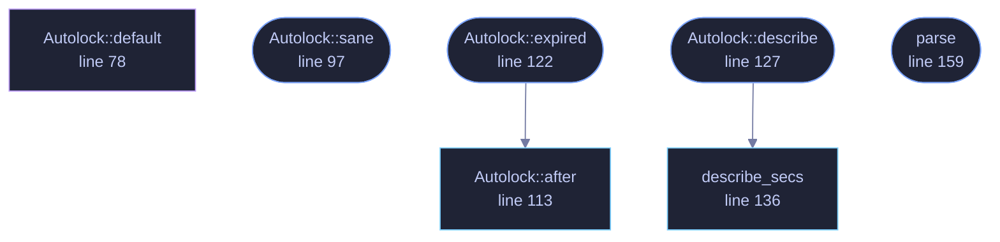

<!-- GENERATED by tools/docs/generate.py from the doc comments in the source. Do not edit: edit the .rs file and run the generator. -->

# `crates/veilvoice-gui/src/autolock.rs`

[[veilvoice-gui|Crate-veilvoice-gui]] &middot; 326 lines &middot; [read the source](https://github.com/tilas01/veilvoice/blob/main/crates/veilvoice-gui/src/autolock.rs)

## Contents

- [Why it is off by default](#why-it-is-off-by-default)
- [What counts as use](#what-counts-as-use)
- [In plain words](#in-plain-words)
  - [What calls what](#what-calls-what)
  - [Items](#items)

Locking the window again after a period of no use.

**Marker 92.** Off unless somebody turns it on, and when it is on the delay
is theirs to choose: anything from five minutes to forty eight hours from a
list, a number typed in if none of those fit, and the ends of that range
movable by anybody who wants a shorter or longer one.

# Why it is off by default

Because a lock that engages while somebody is part way through a recording
is a lock that gets removed. This project's app lock already carries the
honest note that it protects a session rather than a disk, and an autolock
is the same bargain in miniature: it helps the person who walks away from
their machine and it costs the person who leaves a job running. Which of
those a user is, VeilVoice cannot know, so it asks rather than assuming.

# What counts as use

Any keystroke, click, scroll or pointer movement over the window, which is
what egui reports as input. Deliberately **not** the passage of a job:
somebody who starts a long render and leaves the room has left the room,
and the recording they are producing is the thing worth locking away.

The clock is egui's own frame time rather than the system clock, so moving
the machine's clock does not bring the lock forward or push it back. It also
means the countdown only advances while the window is being drawn, which is
the honest limit of this: a window nobody is drawing is a window nobody is
looking at, and it locks the moment it is looked at again.

# In plain words

Locks the window again if you have not touched it for a while.

Off until you switch it on. When you do, you pick how long, from five
minutes up to two days, or type your own. Starting a long job does not count
as using it: if you walk away while something is rendering, that is exactly
when you would want it locked.

## What this file contains

326 lines defining **7 functions** (6 public), **1 type** and **3 constants**. Everything below is read out of the source, so it cannot disagree with the code.

**The types it owns.**

- `struct Autolock` (line 66) -- How the autolock is configured.

**What happens when it runs.** These are the ways in: public, and nothing else in this file calls them, so they are what an outside caller reaches first.

- `Autolock::sane` (line 97) -- Bring every field into a state that can be offered and obeyed.
- `Autolock::expired` (line 122) -- Whether idle has reached the delay.
  - reaches: `after`
- `Autolock::describe` (line 127) -- The delay in the words a person uses for it.
  - reaches: `describe_secs`
- `parse` (line 159) -- Read a delay somebody typed.

## What calls what

_Colour key: **entry** -- a way in: public, and nothing in this file calls it; **api** -- public, and also used inside this file; **helper** -- private to this file._

  

The same graph as Mermaid source

## Items

| Item | Line | Documentation |
|---|---:|---|
| `FLOOR_SECS` pub const | [43](https://github.com/tilas01/veilvoice/blob/main/crates/veilvoice-gui/src/autolock.rs#L43) | The shortest delay the list offers, in seconds. |
| `CEILING_SECS` pub const | [45](https://github.com/tilas01/veilvoice/blob/main/crates/veilvoice-gui/src/autolock.rs#L45) | The longest, in seconds. |
| `CHOICES` pub const | [51](https://github.com/tilas01/veilvoice/blob/main/crates/veilvoice-gui/src/autolock.rs#L51) | The delays offered without typing anything, in seconds. |
| `Autolock` pub struct | [66](https://github.com/tilas01/veilvoice/blob/main/crates/veilvoice-gui/src/autolock.rs#L66) | How the autolock is configured. |
| `Autolock::default` fn | [78](https://github.com/tilas01/veilvoice/blob/main/crates/veilvoice-gui/src/autolock.rs#L78) |  |
| `Autolock::sane` pub fn | [97](https://github.com/tilas01/veilvoice/blob/main/crates/veilvoice-gui/src/autolock.rs#L97) | Bring every field into a state that can be offered and obeyed. |
| `Autolock::after` pub fn | [113](https://github.com/tilas01/veilvoice/blob/main/crates/veilvoice-gui/src/autolock.rs#L113) | The delay as a Duration. |
| `Autolock::expired` pub fn | [122](https://github.com/tilas01/veilvoice/blob/main/crates/veilvoice-gui/src/autolock.rs#L122) | Whether idle has reached the delay. |
| `Autolock::describe` pub fn | [127](https://github.com/tilas01/veilvoice/blob/main/crates/veilvoice-gui/src/autolock.rs#L127) | The delay in the words a person uses for it. |
| `describe_secs` pub fn | [136](https://github.com/tilas01/veilvoice/blob/main/crates/veilvoice-gui/src/autolock.rs#L136) | A number of seconds as a phrase. |
| `parse` pub fn | [159](https://github.com/tilas01/veilvoice/blob/main/crates/veilvoice-gui/src/autolock.rs#L159) | Read a delay somebody typed. |
