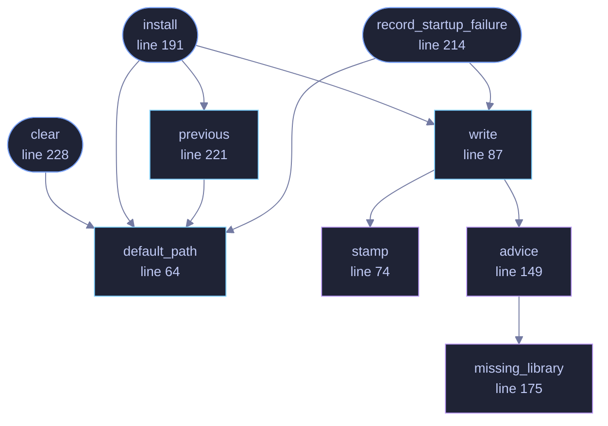

<!-- GENERATED by tools/docs/generate.py from the doc comments in the source. Do not edit: edit the .rs file and run the generator. -->

# `crates/veilvoice-gui/src/crashlog.rs`

[[veilvoice-gui|Crate-veilvoice-gui]] &middot; 365 lines &middot; [read the source](https://github.com/tilas01/veilvoice/blob/main/crates/veilvoice-gui/src/crashlog.rs)

## Contents

- [The problem this exists for](#the-problem-this-exists-for)
- [What this does about it](#what-this-does-about-it)
- [What it deliberately does not do](#what-it-deliberately-does-not-do)
- [In plain words](#in-plain-words)
  - [What calls what](#what-calls-what)
  - [Items](#items)

Make a failure that produces no output produce some.

# The problem this exists for

`veilvoice-gui` is built with `windows_subsystem = "windows"`, so it has no
console, and the workspace builds with `panic = "abort"`, so a panic does
not unwind into anything that could report it. Put together, **every way
this application can fail on Windows produces exactly nothing**: no message,
no dialog, no log. The window appears or it does not.

That is not hypothetical. A release shipped and the report was "it flashes a
command prompt, loads in an unusable state, and crashes" -- which is all a
user *can* report, because the program tells them nothing. The console flash
turned out to be subprocesses (see `no_window` in `crate::reduced_motion`),
and the crash could not be diagnosed at all from what was observable.

# What this does about it

Two failures are caught and written to a file beside the preferences:

* **A panic**, through a hook. The hook runs before `abort` even under
`panic = "abort"`, so there is a window in which to write.
* **A startup failure from `eframe`**, which is a returned `Err` rather than
a panic and is otherwise printed to a stderr nobody can see.

The second is the one worth expecting. This application renders through
**glow**, which is OpenGL, and creating a GL context depends on the graphics
driver. In a virtual machine, over a remote desktop session, or on a laptop
whose hybrid graphics hand the process the wrong adapter, that call fails --
and the honest answer to "why did nothing happen?" needs to survive the
process exiting.

# What it deliberately does not do

**It does not report anything anywhere.** The file is written next to the
preferences, on the user's own disk, and stays there until they delete it or
the application clears it. A privacy tool that phones home about its own
crashes would be exactly the thing this project spends its documentation
refusing to be, and there is no network code in the dependency graph to do
it with even if that changed.

**It records no user content.** A panic message, a source location, the
version and a timestamp. Not the file being processed, not a path the user
chose, not a passphrase -- nothing that is theirs.

# In plain words

Makes sure that if VeilVoice falls over, it leaves something behind saying so.

A windowed program on Windows has nowhere to print to. Without this, a failure
at startup produces a window that never appears and no message anywhere, and
the only thing anybody can report is "it crashed", which is exactly the report
that arrived once.

So the reason is written to a file, and the file is shown to you next time the
application opens. It stays on your machine and is never sent anywhere.

## What this file contains

365 lines defining **9 functions** (6 public), **0 types** and **0 constants**. Everything below is read out of the source, so it cannot disagree with the code.

**What happens when it runs.** These are the ways in: public, and nothing else in this file calls them, so they are what an outside caller reaches first.

- `install` (line 191) -- Install the panic hook.
  - reaches: `default_path`, `previous`, `write`, `advice`, `stamp`, `missing_library`
- `record_startup_failure` (line 214) -- Record a startup failure that eframe returned rather than panicked.
  - reaches: `default_path`, `write`, `advice`, `stamp`, `missing_library`
- `clear` (line 228) -- Forget a previous report.
  - reaches: `default_path`

## What calls what

_Colour key: **entry** -- a way in: public, and nothing in this file calls it; **api** -- public, and also used inside this file; **helper** -- private to this file._

  

The same graph as Mermaid source

## Items

| Item | Line | Documentation |
|---|---:|---|
| `default_path` pub fn | [64](https://github.com/tilas01/veilvoice/blob/main/crates/veilvoice-gui/src/crashlog.rs#L64) | The file a failure is written to, beside the preferences. |
| `stamp` fn | [74](https://github.com/tilas01/veilvoice/blob/main/crates/veilvoice-gui/src/crashlog.rs#L74) | Seconds since the Unix epoch, or 0 if the clock is unreadable. |
| `write` pub fn | [87](https://github.com/tilas01/veilvoice/blob/main/crates/veilvoice-gui/src/crashlog.rs#L87) | Write one failure report. |
| `advice` fn | [149](https://github.com/tilas01/veilvoice/blob/main/crates/veilvoice-gui/src/crashlog.rs#L149) | The paragraph that tries to be useful about *this* failure. |
| `missing_library` fn | [175](https://github.com/tilas01/veilvoice/blob/main/crates/veilvoice-gui/src/crashlog.rs#L175) | The name of the shared library a panic message says could not be loaded. |
| `install` pub fn | [191](https://github.com/tilas01/veilvoice/blob/main/crates/veilvoice-gui/src/crashlog.rs#L191) | Install the panic hook. |
| `record_startup_failure` pub fn | [214](https://github.com/tilas01/veilvoice/blob/main/crates/veilvoice-gui/src/crashlog.rs#L214) | Record a startup failure that eframe returned rather than panicked. |
| `previous` pub fn | [221](https://github.com/tilas01/veilvoice/blob/main/crates/veilvoice-gui/src/crashlog.rs#L221) | Read a previous report, if one is there, so the interface can mention it. |
| `clear` pub fn | [228](https://github.com/tilas01/veilvoice/blob/main/crates/veilvoice-gui/src/crashlog.rs#L228) | Forget a previous report. |
