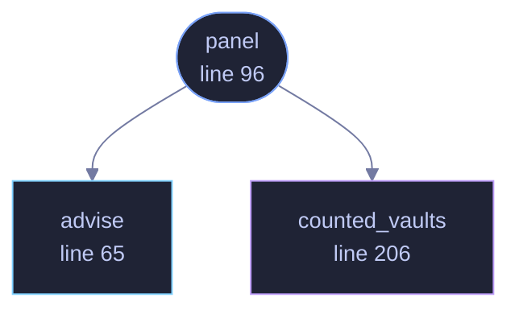

<!-- GENERATED by tools/docs/generate.py from the doc comments in the source. Do not edit: edit the .rs file and run the generator. -->

# `crates/veilvoice-gui/src/decoys.rs`

[[veilvoice-gui|Crate-veilvoice-gui]] &middot; 216 lines &middot; [read the source](https://github.com/tilas01/veilvoice/blob/main/crates/veilvoice-gui/src/decoys.rs)

## Contents

- [What a decoy is worth, said plainly](#what-a-decoy-is-worth-said-plainly)
- [Why the count is measured](#why-the-count-is-measured)
  - [What calls what](#what-calls-what)
  - [Items](#items)

Decoy vaults: how many there is room for, and the panel that offers them.

# What a decoy is worth, said plainly

A decoy is a directory that is the same shape as the real vault, holding
encrypted nonsense under a key that was thrown away the moment it was
written. Somebody who takes the disk sees several vaults and cannot tell
which one holds anything: the names say nothing, the sizes are the same, and
cracking one yields bytes that parse as nothing, which looks exactly like a
wrong passphrase.

What that buys is the cost of searching. It does **not** hide the real vault
from somebody watching the screen while it is opened, from somebody who has
already got into the running program, or from a backup taken before the
decoys were made. The panel says all three where the button is, because a
defence somebody misjudges is worse than one they do not have.

# Why the count is measured

A number chosen here would be a guess dressed as advice: nine decoys is
careless on a nearly full laptop and timid on a four-terabyte disk. So the
count comes from the room actually free where the vault lives, and where the
system will not say how much that is, the panel says so instead of quietly
inventing a figure.

## What this file contains

216 lines defining **3 functions** (2 public), **1 type** and **2 constants**. Everything below is read out of the source, so it cannot disagree with the code.

**The types it owns.**

- `struct Advice` (line 48) -- What to offer, and on what evidence.

**What happens when it runs.** These are the ways in: public, and nothing else in this file calls them, so they are what an outside caller reaches first.

- `panel` (line 96) -- The panel, under the listing in the Browser.
  - reaches: `advise`, `counted_vaults`

## What calls what

_Colour key: **entry** -- a way in: public, and nothing in this file calls it; **api** -- public, and also used inside this file; **helper** -- private to this file._

  

The same graph as Mermaid source

## Items

| Item | Line | Documentation |
|---|---:|---|
| `SHARE` const | [37](https://github.com/tilas01/veilvoice/blob/main/crates/veilvoice-gui/src/decoys.rs#L37) | Never more than this share of what is free. |
| `MOST` const | [44](https://github.com/tilas01/veilvoice/blob/main/crates/veilvoice-gui/src/decoys.rs#L44) | Never more than this many, however much room there is. |
| `Advice` pub struct | [48](https://github.com/tilas01/veilvoice/blob/main/crates/veilvoice-gui/src/decoys.rs#L48) | What to offer, and on what evidence. |
| `advise` pub fn | [65](https://github.com/tilas01/veilvoice/blob/main/crates/veilvoice-gui/src/decoys.rs#L65) | Work out what to offer from the vault's shape and whatever the disk says. |
| `panel` pub fn | [96](https://github.com/tilas01/veilvoice/blob/main/crates/veilvoice-gui/src/decoys.rs#L96) | The panel, under the listing in the Browser. |
| `counted_vaults` fn | [206](https://github.com/tilas01/veilvoice/blob/main/crates/veilvoice-gui/src/decoys.rs#L206) | "one vault" or "four vaults", so the panel does not say "1 vaults". |
