<!-- GENERATED by tools/docs/generate.py from the doc comments in the source. Do not edit: edit the .rs file and run the generator. -->

# `crates/veilvoice-gui/src/firstrun.rs`

[[veilvoice-gui|Crate-veilvoice-gui]] &middot; 706 lines &middot; [read the source](https://github.com/tilas01/veilvoice/blob/main/crates/veilvoice-gui/src/firstrun.rs)

## Contents

- [What this replaced](#what-this-replaced)
- [What it asks, and what it will not do](#what-it-asks-and-what-it-will-not-do)
- [In plain words](#in-plain-words)
  - [What calls what](#what-calls-what)
  - [Items](#items)

The first run: the four things worth deciding before anything else.

# What this replaced

Two checkboxes about animation. Everything that actually matters -- the app
lock, the passphrase recordings are encrypted with, whether the window locks
itself -- was left to be discovered on a tab most people never opened.

That is a defensible choice for a preference and a bad one for a
protection. A default nobody is shown is not a question, it is an answer,
and for a privacy tool the answer it was quietly giving was "none of it".

# What it asks, and what it will not do

Four cards, each skippable, each stating what it buys before asking for
anything:

1. **Appearance.** The two animation choices, kept from the old panel.
2. **The app lock.** A passphrase for the window, and -- since 0.1.18 --
the key that names and encrypts VeilVoice's own files. The card says
both, and says the sentence that has to be said out loud: forget it and
those files are gone.
3. **The recording passphrase.** What veiled recordings are encrypted
with. Separate from the app lock by default, with the option to use one
passphrase for both and a plain statement of what that trades.
4. **Locking itself.** On at half an hour, with the delay and the off
switch right there.

**Nothing here is a gate.** Every card has a way past it, and skipping all
four leaves VeilVoice exactly as it was before this module existed. A setup
flow that will not let somebody reach the program is a setup flow they
resent; this one is a set of offers made at the moment they make sense.

The tour runs after it, so a person meets the decisions first and the tabs
second, which is the order they matter in.

# In plain words

The first time you open VeilVoice it offers you a password for the app, a
password for your recordings, and a timer that locks the window when you
walk away. You can skip any of them and set them later.

## What this file contains

706 lines defining **13 functions** (1 public), **3 types** and **1 constant**. Everything below is read out of the source, so it cannot disagree with the code.

**The types it owns.**

- `enum Step` (line 49) -- Which card is showing.
- `struct FirstRun` (line 99) -- What the setup is holding while it runs.
- `enum Outcome` (line 116) -- What the panel wants the application to do after drawing.

**What happens when it runs.** These are the ways in: public, and nothing else in this file calls them, so they are what an outside caller reaches first.

- `FirstRun::panel` (line 130) -- Draw the current card.
  - reaches: `app_lock`, `appearance`, `autolock`, `machine`, `recording`, `should_skip`, `buttons`, `card`, `field`, `device_counts`

## What calls what

_Colour key: **entry** -- a way in: public, and nothing in this file calls it; **helper** -- private to this file._

  

The same graph as Mermaid source

```mermaid
%%{init: {"theme":"base","themeVariables":{"background":"#1a1b26","primaryColor":"#1f2335","primaryTextColor":"#c0caf5","primaryBorderColor":"#7aa2f7","secondaryColor":"#16161e","tertiaryColor":"#16161e","lineColor":"#737aa2","textColor":"#c0caf5","mainBkg":"#1f2335","nodeBorder":"#7aa2f7","clusterBkg":"#16161e","clusterBorder":"#2f3549","fontFamily":"ui-monospace, SFMono-Regular, Consolas, monospace","fontSize":"14px"}}}%%
flowchart TD
    n_next["Step::next<br/>line 73"]
    n_position["Step::position<br/>line 84"]
    n_panel(["FirstRun::panel<br/>line 130"])
    n_should_skip["FirstRun::should_skip<br/>line 192"]
    n_appearance["FirstRun::appearance<br/>line 201"]
    n_app_lock["FirstRun::app_lock<br/>line 218"]
    n_recording["FirstRun::recording<br/>line 290"]
    n_machine["FirstRun::machine<br/>line 373"]
    n_autolock["FirstRun::autolock<br/>line 490"]
    n_card["card<br/>line 514"]
    n_device_counts["device_counts<br/>line 547"]
    n_field["field<br/>line 560"]
    n_buttons["buttons<br/>line 572"]
    n_app_lock --> n_buttons
    n_app_lock --> n_card
    n_app_lock --> n_field
    n_appearance --> n_buttons
    n_appearance --> n_card
    n_autolock --> n_buttons
    n_autolock --> n_card
    n_machine --> n_buttons
    n_machine --> n_card
    n_machine --> n_device_counts
    n_panel --> n_app_lock
    n_panel --> n_appearance
    n_panel --> n_autolock
    n_panel --> n_machine
    n_panel --> n_recording
    n_panel --> n_should_skip
    n_recording --> n_buttons
    n_recording --> n_card
    n_recording --> n_field
    click n_next href "https://github.com/tilas01/veilvoice/blob/main/crates/veilvoice-gui/src/firstrun.rs#L73" "open the source"
    click n_position href "https://github.com/tilas01/veilvoice/blob/main/crates/veilvoice-gui/src/firstrun.rs#L84" "open the source"
    click n_panel href "https://github.com/tilas01/veilvoice/blob/main/crates/veilvoice-gui/src/firstrun.rs#L130" "open the source"
    click n_should_skip href "https://github.com/tilas01/veilvoice/blob/main/crates/veilvoice-gui/src/firstrun.rs#L192" "open the source"
    click n_appearance href "https://github.com/tilas01/veilvoice/blob/main/crates/veilvoice-gui/src/firstrun.rs#L201" "open the source"
    click n_app_lock href "https://github.com/tilas01/veilvoice/blob/main/crates/veilvoice-gui/src/firstrun.rs#L218" "open the source"
    click n_recording href "https://github.com/tilas01/veilvoice/blob/main/crates/veilvoice-gui/src/firstrun.rs#L290" "open the source"
    click n_machine href "https://github.com/tilas01/veilvoice/blob/main/crates/veilvoice-gui/src/firstrun.rs#L373" "open the source"
    click n_autolock href "https://github.com/tilas01/veilvoice/blob/main/crates/veilvoice-gui/src/firstrun.rs#L490" "open the source"
    click n_card href "https://github.com/tilas01/veilvoice/blob/main/crates/veilvoice-gui/src/firstrun.rs#L514" "open the source"
    click n_device_counts href "https://github.com/tilas01/veilvoice/blob/main/crates/veilvoice-gui/src/firstrun.rs#L547" "open the source"
    click n_field href "https://github.com/tilas01/veilvoice/blob/main/crates/veilvoice-gui/src/firstrun.rs#L560" "open the source"
    click n_buttons href "https://github.com/tilas01/veilvoice/blob/main/crates/veilvoice-gui/src/firstrun.rs#L572" "open the source"
    classDef entry fill:#1f2335,stroke:#7aa2f7,color:#c0caf5
    class n_panel entry
    classDef helper fill:#1f2335,stroke:#bb9af7,color:#c0caf5
    class n_next,n_position,n_should_skip,n_appearance,n_app_lock,n_recording,n_machine,n_autolock,n_card,n_device_counts,n_field,n_buttons helper
```

## Items

| Item | Line | Documentation |
|---|---:|---|
| `Step` pub enum | [49](https://github.com/tilas01/veilvoice/blob/main/crates/veilvoice-gui/src/firstrun.rs#L49) | Which card is showing. |
| `Step::next` fn | [73](https://github.com/tilas01/veilvoice/blob/main/crates/veilvoice-gui/src/firstrun.rs#L73) | The step after this one, or None at the end of the tour. |
| `Step::position` fn | [84](https://github.com/tilas01/veilvoice/blob/main/crates/veilvoice-gui/src/firstrun.rs#L84) | One-based position, for "step 2 of 4". |
| `Step::COUNT` const | [94](https://github.com/tilas01/veilvoice/blob/main/crates/veilvoice-gui/src/firstrun.rs#L94) |  |
| `FirstRun` pub struct | [99](https://github.com/tilas01/veilvoice/blob/main/crates/veilvoice-gui/src/firstrun.rs#L99) | What the setup is holding while it runs. |
| `Outcome` pub enum | [116](https://github.com/tilas01/veilvoice/blob/main/crates/veilvoice-gui/src/firstrun.rs#L116) | What the panel wants the application to do after drawing. |
| `FirstRun::panel` pub fn | [130](https://github.com/tilas01/veilvoice/blob/main/crates/veilvoice-gui/src/firstrun.rs#L130) | Draw the current card. |
| `FirstRun::should_skip` fn | [192](https://github.com/tilas01/veilvoice/blob/main/crates/veilvoice-gui/src/firstrun.rs#L192) | Whether a card has nothing left to ask. |
| `FirstRun::appearance` fn | [201](https://github.com/tilas01/veilvoice/blob/main/crates/veilvoice-gui/src/firstrun.rs#L201) | The appearance step: pick a palette and see it applied immediately. |
| `FirstRun::app_lock` fn | [218](https://github.com/tilas01/veilvoice/blob/main/crates/veilvoice-gui/src/firstrun.rs#L218) | The app-lock step: set a passphrase for VeilVoice itself, or decline it. |
| `FirstRun::recording` fn | [290](https://github.com/tilas01/veilvoice/blob/main/crates/veilvoice-gui/src/firstrun.rs#L290) | The recording step: the at-rest passphrase, and what it is separate from. |
| `FirstRun::machine` fn | [373](https://github.com/tilas01/veilvoice/blob/main/crates/veilvoice-gui/src/firstrun.rs#L373) | What this machine says about itself, and the one choice that follows. |
| `FirstRun::autolock` fn | [490](https://github.com/tilas01/veilvoice/blob/main/crates/veilvoice-gui/src/firstrun.rs#L490) | The auto-lock step: how long idle before the window locks itself. |
| `card` fn | [514](https://github.com/tilas01/veilvoice/blob/main/crates/veilvoice-gui/src/firstrun.rs#L514) | A bordered card, so each step reads as one thing rather than a page of text. |
| `device_counts` fn | [547](https://github.com/tilas01/veilvoice/blob/main/crates/veilvoice-gui/src/firstrun.rs#L547) | How many recording and playback devices this machine has. |
| `field` fn | [560](https://github.com/tilas01/veilvoice/blob/main/crates/veilvoice-gui/src/firstrun.rs#L560) | A password field with its label, laid out like the rest of the application. |
| `buttons` fn | [572](https://github.com/tilas01/veilvoice/blob/main/crates/veilvoice-gui/src/firstrun.rs#L572) | The row that moves on. |
