<!-- GENERATED by tools/docs/generate.py from the doc comments in the source. Do not edit: edit the .rs file and run the generator. -->

# `crates/veilvoice-gui/src/graphics.rs`

[[veilvoice-gui|Crate-veilvoice-gui]] &middot; 158 lines &middot; [read the source](https://github.com/tilas01/veilvoice/blob/main/crates/veilvoice-gui/src/graphics.rs)

## Contents

- [Why this is not left to a default](#why-this-is-not-left-to-a-default)
- [Hardware acceleration is preferred, not required](#hardware-acceleration-is-preferred-not-required)
- [What is actually reported](#what-is-actually-reported)
  - [What calls what](#what-calls-what)
  - [Items](#items)

What the window is drawn with, asked for explicitly and then reported.

# Why this is not left to a default

Drawing went through whatever `eframe::NativeOptions::default()` happened
to choose. That was the right backend by luck rather than by decision: the
defaults are a property of the version of `eframe` in `Cargo.lock`, and an
upgrade can move them without a single line of this project changing. A
release that silently stopped using the GPU would look exactly like a
release that got slower for no reason.

So the four choices that decide how a frame reaches the screen are named
here, with the reasoning beside each one, and a test asserts the values
rather than trusting them to stay put.

# Hardware acceleration is preferred, not required

`Preferred` asks the platform for a GPU context and accepts a software one
if it cannot give you a GPU. `Required` refuses to start without hardware.

Required is the wrong choice here and it is worth saying why, because it
sounds like the stronger setting. A virtual machine, a remote desktop
session, a server with no graphics card and a laptop that has handed the
wrong adapter to a hybrid-graphics driver all refuse a hardware context.
On `Required` every one of those becomes a program that does not open at
all. A privacy tool that will not run is not more private, and somebody
anonymising a recording over SSH with X forwarding has a real reason to be
doing it there. Software rendering is slower and it works.

# What is actually reported

`describe` reads the context that was really created, not the request. It
uses `glow`'s parsed version, which is a safe call: this crate forbids
unsafe code and nothing here is worth making an exception for. The vendor
string it returns comes from the driver, so somebody reporting a slow
window can say which driver produced it, and 3.3 on Mesa and 4.6 on a
discrete card are different conversations.

## What this file contains

158 lines defining **2 functions** (2 public), **0 types** and **3 constants**. Everything below is read out of the source, so it cannot disagree with the code.

**What happens when it runs.** These are the ways in: public, and nothing else in this file calls them, so they are what an outside caller reaches first.

- `describe` (line 68) -- One line for the About tab, and for a bug report.
- `options` (line 94) -- The options the window is created with.

## What calls what

_Colour key: **entry** -- a way in: public, and nothing in this file calls it._

  

The same graph as Mermaid source

```mermaid
%%{init: {"theme":"base","themeVariables":{"background":"#1a1b26","primaryColor":"#1f2335","primaryTextColor":"#c0caf5","primaryBorderColor":"#7aa2f7","secondaryColor":"#16161e","tertiaryColor":"#16161e","lineColor":"#737aa2","textColor":"#c0caf5","mainBkg":"#1f2335","nodeBorder":"#7aa2f7","clusterBkg":"#16161e","clusterBorder":"#2f3549","fontFamily":"ui-monospace, SFMono-Regular, Consolas, monospace","fontSize":"14px"}}}%%
flowchart TD
    n_describe(["describe<br/>line 68"])
    n_options(["options<br/>line 94"])
    click n_describe href "https://github.com/tilas01/veilvoice/blob/main/crates/veilvoice-gui/src/graphics.rs#L68" "open the source"
    click n_options href "https://github.com/tilas01/veilvoice/blob/main/crates/veilvoice-gui/src/graphics.rs#L94" "open the source"
    classDef entry fill:#1f2335,stroke:#7aa2f7,color:#c0caf5
    class n_describe,n_options entry
```

## Items

| Item | Line | Documentation |
|---|---:|---|
| `BACKEND` pub const | [47](https://github.com/tilas01/veilvoice/blob/main/crates/veilvoice-gui/src/graphics.rs#L47) | The rendering backend. |
| `VSYNC` pub const | [54](https://github.com/tilas01/veilvoice/blob/main/crates/veilvoice-gui/src/graphics.rs#L54) | Whether frames wait for the display. |
| `MULTISAMPLING` pub const | [61](https://github.com/tilas01/veilvoice/blob/main/crates/veilvoice-gui/src/graphics.rs#L61) | Multisampling, off. |
| `describe` pub fn | [68](https://github.com/tilas01/veilvoice/blob/main/crates/veilvoice-gui/src/graphics.rs#L68) | One line for the About tab, and for a bug report. |
| `options` pub fn | [94](https://github.com/tilas01/veilvoice/blob/main/crates/veilvoice-gui/src/graphics.rs#L94) | The options the window is created with. |
