<!-- GENERATED by tools/docs/generate.py from the doc comments in the source. Do not edit: edit the .rs file and run the generator. -->

# `crates/veilvoice-gui/src/group.rs`

[[veilvoice-gui|Crate-veilvoice-gui]] &middot; 2107 lines &middot; [read the source](https://github.com/tilas01/veilvoice/blob/main/crates/veilvoice-gui/src/group.rs)

## Contents

- [The toggle does not persist, and the tick that makes it persist is separate](#the-toggle-does-not-persist-and-the-tick-that-makes-it-persist-is-separate)
- [Colour is assigned, never guessed from the voice](#colour-is-assigned-never-guessed-from-the-voice)
- [Colour is never the only signal](#colour-is-never-the-only-signal)
- [In plain words](#in-plain-words)
  - [What calls what](#what-calls-what)
  - [Items](#items)

Group mode: several people in one recording, each with a name and a colour.

The engine has handled several speakers since `veilvoice-conversation`
existed. This is the part of it a person can see: who is in the recording,
what each of them is called, what colour each is drawn in, and which
destination voice each becomes.

# The toggle does not persist, and the tick that makes it persist is separate

Group mode changes what a recording is *treated as*. A mode that survives a
restart is a mode somebody eventually forgets is on, and for this tool that
means a single-speaker recording rendered against a plan that does not
describe it, which silences everything the plan does not claim. So the
toggle is per-run and off by default, and there is a second, explicit tick
for "always start in group mode" which is the only thing written to disk.

Two controls where one would do, deliberately. They answer two different
questions: *is this recording a group recording* and *are most of my
recordings group recordings*.

# Colour is assigned, never guessed from the voice

A speaker's colour is a function of their **slot**, exactly as their
destination voice is, and for the same reason: anything chosen by measuring
the input would make an output property a function of the input speaker,
which is the linkage this whole project exists to destroy. Slot 0 and slot 1
are the furthest-apart pair in the table because two people is the common
case; every slot after that is the colour whose nearest neighbour among the
ones already used is furthest away. That order was computed rather than
judged. See `veilvoice_video::palette`.

A colour can be **overridden** per speaker, from any colour in any of the
nine palettes the website offers. An override is a person's choice about
their own recording, made after the fact, and carries none of the linkage
problem above.

# Colour is never the only signal

The name is drawn beside every circle, in the list, and in the subtitles.
Somebody who cannot separate two of these colours has the name, everywhere.
A panel that distinguished speakers by colour alone would be one about eight
per cent of men could not use.

# In plain words

The panel for a recording with several people in it.

Each person gets a name and a colour, so you can see at a glance who is who.
The colours are chosen to be as different from each other as possible, and you
can pick your own from any of the palettes the website offers.

Group mode is off when the application opens unless you have said otherwise,
and turning it on lasts only for that run. A mode that quietly survived a
restart is a mode somebody eventually forgets is on.

## What this file contains

2107 lines defining **41 functions** (17 public), **4 types** and **0 constants**. Everything below is read out of the source, so it cannot disagree with the code.

**The types it owns.**

- `struct Person` (line 71) -- One person, as the panel holds them.
- `struct Outputs` (line 94) -- What comes out of a group render.
- `struct Group` (line 172) -- The group-mode panel's state.
- `struct Job` (line 1276) -- Everything one render needs, taken from the panel at the moment the button was pressed.

**What happens when it runs.** These are the ways in: public, and nothing else in this file calls them, so they are what an outside caller reaches first.

- `Outputs::any` (line 124) -- Whether anything at all would be written.
- `Outputs::names` (line 129) -- The ticked ones, by name, for a project file.
- `Group::start_from` (line 277) -- The panel as it should open, given the saved preference.
  - reaches: `default`
- `Group::len` (line 285) -- How many people are in the recording.
- `Group::is_empty` (line 290) -- Whether there is nobody in it.
- `Group::to_plan` (line 343) -- Build a plan from the panel: names in slot order, no turns.
- `Group::tab` (line 359) -- The whole panel.
  - reaches: `body`, `collect_dialogs`, `files_and_theme`, `mode_controls`, `output_controls`, `people_list`, `profile_controls`, `render_controls`, `strip`, `voice_mode_controls`, `from_workspace`, `to_workspace`
- `Group::drain` (line 1004) -- Take the worker's answer if it has one.

## What calls what

_22 of 40 functions are drawn; the diagram is bounded at 22 so it stays readable._

_Colour key: **entry** -- a way in: public, and nothing in this file calls it; **api** -- public, and also used inside this file; **helper** -- private to this file._

  

The same graph as Mermaid source

```mermaid
%%{init: {"theme":"base","themeVariables":{"background":"#1a1b26","primaryColor":"#1f2335","primaryTextColor":"#c0caf5","primaryBorderColor":"#7aa2f7","secondaryColor":"#16161e","tertiaryColor":"#16161e","lineColor":"#737aa2","textColor":"#c0caf5","mainBkg":"#1f2335","nodeBorder":"#7aa2f7","clusterBkg":"#16161e","clusterBorder":"#2f3549","fontFamily":"ui-monospace, SFMono-Regular, Consolas, monospace","fontSize":"14px"}}}%%
flowchart TD
    n_at["Person::at<br/>line 80"]
    n_default["Outputs::default<br/>line 112"]
    n_from_names["Outputs::from_names<br/>line 151"]
    n_default["Group::default<br/>line 242"]
    n_start_from(["Group::start_from<br/>line 277"])
    n_colour["Group::colour<br/>line 295"]
    n_add["Group::add<br/>line 308"]
    n_limit["Group::limit<br/>line 321"]
    n_remove["Group::remove<br/>line 329"]
    n_tab(["Group::tab<br/>line 359"])
    n_collect_dialogs["Group::collect_dialogs<br/>line 376"]
    n_body["Group::body<br/>line 404"]
    n_profile_controls["Group::profile_controls<br/>line 479"]
    n_apply_profile["Group::apply_profile<br/>line 546"]
    n_mode_controls["Group::mode_controls<br/>line 567"]
    n_voice_mode_controls["Group::voice_mode_controls<br/>line 624"]
    n_strip["Group::strip<br/>line 725"]
    n_people_list["Group::people_list<br/>line 760"]
    n_to_workspace["Group::to_workspace<br/>line 921"]
    n_from_workspace["Group::from_workspace<br/>line 947"]
    n_is_busy["Group::is_busy<br/>line 999"]
    n_assigned_colour["assigned_colour<br/>line 1496"]
    n_add --> n_at
    n_body --> n_collect_dialogs
    n_body --> n_mode_controls
    n_body --> n_people_list
    n_body --> n_profile_controls
    n_body --> n_strip
    n_body --> n_voice_mode_controls
    n_collect_dialogs --> n_from_workspace
    n_collect_dialogs --> n_to_workspace
    n_colour --> n_assigned_colour
    n_from_workspace --> n_from_names
    n_people_list --> n_add
    n_people_list --> n_colour
    n_people_list --> n_limit
    n_people_list --> n_remove
    n_profile_controls --> n_apply_profile
    n_start_from --> n_default
    n_strip --> n_colour
    n_tab --> n_body
    click n_at href "https://github.com/tilas01/veilvoice/blob/main/crates/veilvoice-gui/src/group.rs#L80" "open the source"
    click n_default href "https://github.com/tilas01/veilvoice/blob/main/crates/veilvoice-gui/src/group.rs#L112" "open the source"
    click n_from_names href "https://github.com/tilas01/veilvoice/blob/main/crates/veilvoice-gui/src/group.rs#L151" "open the source"
    click n_default href "https://github.com/tilas01/veilvoice/blob/main/crates/veilvoice-gui/src/group.rs#L242" "open the source"
    click n_start_from href "https://github.com/tilas01/veilvoice/blob/main/crates/veilvoice-gui/src/group.rs#L277" "open the source"
    click n_colour href "https://github.com/tilas01/veilvoice/blob/main/crates/veilvoice-gui/src/group.rs#L295" "open the source"
    click n_add href "https://github.com/tilas01/veilvoice/blob/main/crates/veilvoice-gui/src/group.rs#L308" "open the source"
    click n_limit href "https://github.com/tilas01/veilvoice/blob/main/crates/veilvoice-gui/src/group.rs#L321" "open the source"
    click n_remove href "https://github.com/tilas01/veilvoice/blob/main/crates/veilvoice-gui/src/group.rs#L329" "open the source"
    click n_tab href "https://github.com/tilas01/veilvoice/blob/main/crates/veilvoice-gui/src/group.rs#L359" "open the source"
    click n_collect_dialogs href "https://github.com/tilas01/veilvoice/blob/main/crates/veilvoice-gui/src/group.rs#L376" "open the source"
    click n_body href "https://github.com/tilas01/veilvoice/blob/main/crates/veilvoice-gui/src/group.rs#L404" "open the source"
    click n_profile_controls href "https://github.com/tilas01/veilvoice/blob/main/crates/veilvoice-gui/src/group.rs#L479" "open the source"
    click n_apply_profile href "https://github.com/tilas01/veilvoice/blob/main/crates/veilvoice-gui/src/group.rs#L546" "open the source"
    click n_mode_controls href "https://github.com/tilas01/veilvoice/blob/main/crates/veilvoice-gui/src/group.rs#L567" "open the source"
    click n_voice_mode_controls href "https://github.com/tilas01/veilvoice/blob/main/crates/veilvoice-gui/src/group.rs#L624" "open the source"
    click n_strip href "https://github.com/tilas01/veilvoice/blob/main/crates/veilvoice-gui/src/group.rs#L725" "open the source"
    click n_people_list href "https://github.com/tilas01/veilvoice/blob/main/crates/veilvoice-gui/src/group.rs#L760" "open the source"
    click n_to_workspace href "https://github.com/tilas01/veilvoice/blob/main/crates/veilvoice-gui/src/group.rs#L921" "open the source"
    click n_from_workspace href "https://github.com/tilas01/veilvoice/blob/main/crates/veilvoice-gui/src/group.rs#L947" "open the source"
    click n_is_busy href "https://github.com/tilas01/veilvoice/blob/main/crates/veilvoice-gui/src/group.rs#L999" "open the source"
    click n_assigned_colour href "https://github.com/tilas01/veilvoice/blob/main/crates/veilvoice-gui/src/group.rs#L1496" "open the source"
    classDef entry fill:#1f2335,stroke:#7aa2f7,color:#c0caf5
    class n_start_from,n_tab entry
    classDef api fill:#1f2335,stroke:#7dcfff,color:#c0caf5
    class n_from_names,n_colour,n_add,n_limit,n_remove,n_to_workspace,n_from_workspace,n_is_busy,n_assigned_colour api
    classDef helper fill:#1f2335,stroke:#bb9af7,color:#c0caf5
    class n_at,n_default,n_default,n_collect_dialogs,n_body,n_profile_controls,n_apply_profile,n_mode_controls,n_voice_mode_controls,n_strip,n_people_list helper
```

## Items

| Item | Line | Documentation |
|---|---:|---|
| `Person` pub struct | [71](https://github.com/tilas01/veilvoice/blob/main/crates/veilvoice-gui/src/group.rs#L71) | One person, as the panel holds them. |
| `Person::at` fn | [80](https://github.com/tilas01/veilvoice/blob/main/crates/veilvoice-gui/src/group.rs#L80) | A person with the default name for their slot. |
| `Outputs` pub struct | [94](https://github.com/tilas01/veilvoice/blob/main/crates/veilvoice-gui/src/group.rs#L94) | What comes out of a group render. |
| `Outputs::default` fn | [112](https://github.com/tilas01/veilvoice/blob/main/crates/veilvoice-gui/src/group.rs#L112) |  |
| `Outputs::any` pub fn | [124](https://github.com/tilas01/veilvoice/blob/main/crates/veilvoice-gui/src/group.rs#L124) | Whether anything at all would be written. |
| `Outputs::names` pub fn | [129](https://github.com/tilas01/veilvoice/blob/main/crates/veilvoice-gui/src/group.rs#L129) | The ticked ones, by name, for a project file. |
| `Outputs::from_names` pub fn | [151](https://github.com/tilas01/veilvoice/blob/main/crates/veilvoice-gui/src/group.rs#L151) | Read back from a project file. |
| `hex_of` fn | [162](https://github.com/tilas01/veilvoice/blob/main/crates/veilvoice-gui/src/group.rs#L162) | An egui colour as #rrggbb. |
| `colour_of` fn | [167](https://github.com/tilas01/veilvoice/blob/main/crates/veilvoice-gui/src/group.rs#L167) | #rrggbb as an egui colour, or None for anything that is not one. |
| `Group` pub struct | [172](https://github.com/tilas01/veilvoice/blob/main/crates/veilvoice-gui/src/group.rs#L172) | The group-mode panel's state. |
| `Group::default` fn | [242](https://github.com/tilas01/veilvoice/blob/main/crates/veilvoice-gui/src/group.rs#L242) |  |
| `Group::start_from` pub fn | [277](https://github.com/tilas01/veilvoice/blob/main/crates/veilvoice-gui/src/group.rs#L277) | The panel as it should open, given the saved preference. |
| `Group::len` pub fn | [285](https://github.com/tilas01/veilvoice/blob/main/crates/veilvoice-gui/src/group.rs#L285) | How many people are in the recording. |
| `Group::is_empty` pub fn | [290](https://github.com/tilas01/veilvoice/blob/main/crates/veilvoice-gui/src/group.rs#L290) | Whether there is nobody in it. |
| `Group::colour` pub fn | [295](https://github.com/tilas01/veilvoice/blob/main/crates/veilvoice-gui/src/group.rs#L295) | The colour a slot is drawn in: the override, or the one it is given. |
| `Group::add` pub fn | [308](https://github.com/tilas01/veilvoice/blob/main/crates/veilvoice-gui/src/group.rs#L308) | Add a person, if there is room for one. |
| `Group::limit` pub fn | [321](https://github.com/tilas01/veilvoice/blob/main/crates/veilvoice-gui/src/group.rs#L321) | How many people this panel can hold in its current mode. |
| `Group::remove` pub fn | [329](https://github.com/tilas01/veilvoice/blob/main/crates/veilvoice-gui/src/group.rs#L329) | Remove one person, keeping at least two. |
| `Group::to_plan` pub fn | [343](https://github.com/tilas01/veilvoice/blob/main/crates/veilvoice-gui/src/group.rs#L343) | Build a plan from the panel: names in slot order, no turns. |
| `Group::tab` pub fn | [359](https://github.com/tilas01/veilvoice/blob/main/crates/veilvoice-gui/src/group.rs#L359) | The whole panel. |
| `Group::collect_dialogs` fn | [376](https://github.com/tilas01/veilvoice/blob/main/crates/veilvoice-gui/src/group.rs#L376) | Collect whatever the open pickers have answered. |
| `Group::body` fn | [404](https://github.com/tilas01/veilvoice/blob/main/crates/veilvoice-gui/src/group.rs#L404) | Everything inside the scroller. |
| `Group::profile_controls` fn | [479](https://github.com/tilas01/veilvoice/blob/main/crates/veilvoice-gui/src/group.rs#L479) | The named ways of working, and the project this panel came from. |
| `Group::apply_profile` fn | [546](https://github.com/tilas01/veilvoice/blob/main/crates/veilvoice-gui/src/group.rs#L546) | Set the controls this profile names, and change nothing else. |
| `Group::mode_controls` fn | [567](https://github.com/tilas01/veilvoice/blob/main/crates/veilvoice-gui/src/group.rs#L567) | The two controls that decide whether group mode is on. |
| `Group::voice_mode_controls` fn | [624](https://github.com/tilas01/veilvoice/blob/main/crates/veilvoice-gui/src/group.rs#L624) | A voice each, or one voice between everybody. |
| `Group::strip` fn | [725](https://github.com/tilas01/veilvoice/blob/main/crates/veilvoice-gui/src/group.rs#L725) | The picture: a circle per person, in their colour, with their name. |
| `Group::people_list` fn | [760](https://github.com/tilas01/veilvoice/blob/main/crates/veilvoice-gui/src/group.rs#L760) | One row per person: colour, name, and a way to remove them. |
| `Group::palette_picker` fn | [832](https://github.com/tilas01/veilvoice/blob/main/crates/veilvoice-gui/src/group.rs#L832) | Every colour in every palette, as swatches. |
| `Group::swatch` fn | [871](https://github.com/tilas01/veilvoice/blob/main/crates/veilvoice-gui/src/group.rs#L871) | One clickable colour. |
| `Group::output_controls` fn | [894](https://github.com/tilas01/veilvoice/blob/main/crates/veilvoice-gui/src/group.rs#L894) | What a render writes. |
| `Group::to_workspace` pub fn | [921](https://github.com/tilas01/veilvoice/blob/main/crates/veilvoice-gui/src/group.rs#L921) | This panel as a saveable project. |
| `Group::from_workspace` pub fn | [947](https://github.com/tilas01/veilvoice/blob/main/crates/veilvoice-gui/src/group.rs#L947) | Put a saved project back. |
| `Group::is_busy` pub fn | [999](https://github.com/tilas01/veilvoice/blob/main/crates/veilvoice-gui/src/group.rs#L999) | Whether a render is running, so the window keeps repainting. |
| `Group::drain` pub fn | [1004](https://github.com/tilas01/veilvoice/blob/main/crates/veilvoice-gui/src/group.rs#L1004) | Take the worker's answer if it has one. |
| `Group::files_and_theme` fn | [1026](https://github.com/tilas01/veilvoice/blob/main/crates/veilvoice-gui/src/group.rs#L1026) | The recording, the plan, the title and the palette. |
| `Group::render_controls` fn | [1116](https://github.com/tilas01/veilvoice/blob/main/crates/veilvoice-gui/src/group.rs#L1116) | The button, and what came of pressing it. |
| `Group::start` fn | [1222](https://github.com/tilas01/veilvoice/blob/main/crates/veilvoice-gui/src/group.rs#L1222) | Start a render on a thread of its own. |
| `file_name` fn | [1264](https://github.com/tilas01/veilvoice/blob/main/crates/veilvoice-gui/src/group.rs#L1264) | The last component of a path, for showing beside a button. |
| `Job` struct | [1276](https://github.com/tilas01/veilvoice/blob/main/crates/veilvoice-gui/src/group.rs#L1276) | Everything one render needs, taken from the panel at the moment the button was pressed. |
| `render_now` fn | [1296](https://github.com/tilas01/veilvoice/blob/main/crates/veilvoice-gui/src/group.rs#L1296) | Do the render. |
| `render_video` fn | [1416](https://github.com/tilas01/veilvoice/blob/main/crates/veilvoice-gui/src/group.rs#L1416) | Marker 139. |
| `write_private` fn | [1479](https://github.com/tilas01/veilvoice/blob/main/crates/veilvoice-gui/src/group.rs#L1479) | Replace the last extension, keeping any .veiled before it. |
| `with_extension` fn | [1484](https://github.com/tilas01/veilvoice/blob/main/crates/veilvoice-gui/src/group.rs#L1484) |  |
| `assigned_colour` pub fn | [1496](https://github.com/tilas01/veilvoice/blob/main/crates/veilvoice-gui/src/group.rs#L1496) | The colour a slot is given, as an egui colour. |
