<!-- GENERATED by tools/docs/generate.py from the doc comments in the source. Do not edit: edit the .rs file and run the generator. -->


# `crates/veilvoice-gui/src/layout.rs`

[[veilvoice-gui|Crate-veilvoice-gui]] &middot; 242 lines &middot; [read the source](https://github.com/tilas01/veilvoice/blob/main/crates/veilvoice-gui/src/layout.rs)

## Contents

- [The defect this exists to fix](#the-defect-this-exists-to-fix)
- [Measured last frame, drawn this frame](#measured-last-frame-drawn-this-frame)
  - [What calls what](#what-calls-what)
  - [Items](#items)

Centring a row of widgets, which egui does not do by nesting.

# The defect this exists to fix

The unlock screen drew its mark, its name and the word "locked" inside
`egui::Ui::vertical_centered`, and then drew the password field, the
unlock button and the status line underneath in a plain row. The heading
sat in the middle of the window and the controls sat against the left edge.
The same shape turns up wherever a row is drawn only after setup rather
than at launch, because those rows tend to be written later and separately
from the ones they end up beside.

The obvious repair does not work, and it is worth writing down why, because
it looks like it should. Wrapping the row in `vertical_centered` puts it in
a `Layout::top_down(Align::Center)`, which centres each child *narrower
than the available width*. `Ui::horizontal` is never narrower: it allocates

```text
let initial_size = vec2(
self.available_size_before_wrap().x,   // the whole width
self.spacing().interact_size.y,
);
```

so the row's box is already full width, there is nothing left to centre it
within, and its contents start at that box's left edge. A centred layout
inside a centred layout changes nothing. `Layout::left_to_right` carries
`main_align: Align::Center` and does not help for the same reason.

# Measured last frame, drawn this frame

The row is drawn once, with a space in front of it worked out from how wide
the same row turned out to be on the previous frame, remembered in egui's
own temporary memory.

**The closure is called once, and that is the whole design constraint.**
The tidier-looking approach is `egui::UiBuilder::sizing_pass`: lay the
row out invisibly, measure it, then lay it out again for real. That needs
the closure twice, and these closures are not pure. The unlock row spawns
a key derivation when its button reports a click, and a sizing pass runs
the body rather than skipping it, so measuring that way would risk
spawning the work twice from one press. A row of widgets is not worth a
double unlock, so the width comes from the last frame instead.

The cost is that the first frame a row appears on is drawn left-aligned,
for as long as it takes to ask for another frame, which is done here
immediately. Nobody sees a single frame at sixty of them a second; and if
it were ever visible, being briefly left-aligned is what the defect looked
like permanently.

## What this file contains

242 lines defining **1 function** (1 public), **0 types** and **0 constants**. Everything below is read out of the source, so it cannot disagree with the code.

**What happens when it runs.** These are the ways in: public, and nothing else in this file calls them, so they are what an outside caller reaches first.

- `centred_row` (line 60) -- Draw a row of widgets centred in the width available.

## What calls what

_Colour key: **entry** -- a way in: public, and nothing in this file calls it._

<p align="center">
  
</p>

<details>
<summary>The same graph as Mermaid source</summary>



</details>

```mermaid
%%{init: {"theme":"base","themeVariables":{"background":"#1a1b26","primaryColor":"#1f2335","primaryTextColor":"#c0caf5","primaryBorderColor":"#7aa2f7","secondaryColor":"#16161e","tertiaryColor":"#16161e","lineColor":"#737aa2","textColor":"#c0caf5","mainBkg":"#1f2335","nodeBorder":"#7aa2f7","clusterBkg":"#16161e","clusterBorder":"#2f3549","fontFamily":"ui-monospace, SFMono-Regular, Consolas, monospace","fontSize":"14px"}}}%%
flowchart TD
    n_centred_row(["centred_row<br/>line 60"])
    click n_centred_row href "https://github.com/tilas01/veilvoice/blob/main/crates/veilvoice-gui/src/layout.rs#L60" "open the source"
    classDef entry fill:#1f2335,stroke:#7aa2f7,color:#c0caf5
    class n_centred_row entry
```

## Items

| Item | Line | Documentation |
|---|---:|---|
| `centred_row` <sub>pub fn</sub> | [60](https://github.com/tilas01/veilvoice/blob/main/crates/veilvoice-gui/src/layout.rs#L60) | Draw a row of widgets centred in the width available. |
